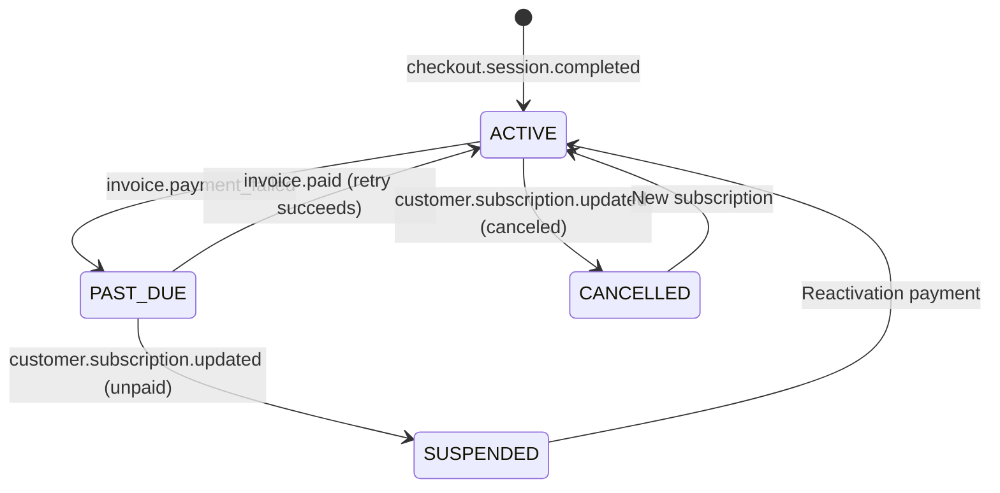

## Overview

The Subscription Module implements a **freemium SaaS billing system** for PropWise CRM. Every organization has a subscription tied to one of four plan tiers. The module handles:

- **Plan-based feature gating** — binary feature flags per tier
- **Resource limits** — caps on leads, contacts, deals, companies, and storage
- **Credit-based metering** — monthly AI and messaging allowances with purchasable top-ups
- **Dual seat types** — manager seats and agent seats with per-tier pricing; every user consumes a seat
- **Stripe integration** — checkout, subscription management, mid-cycle plan changes, webhooks, billing portal
- **Proration** — mid-cycle upgrades, downgrades, and seat changes are prorated to the day
- **Suspension flow** — 2-day grace period on payment failure, then org goes read-only

<Note>
**Status:** Active — fully implemented  
**Module Path:** `src/modules/subscription/`  
**Payment Gateway:** Stripe
</Note>

### Design Principles

| Principle | Decision |
|---|---|
| Freemium model | Free plan with limited features; paid tiers unlock progressively |
| Per-org billing | Billing is per organization; developer portal is free |
| Dual seat types | Manager seats (Owner, Admin) and agent seats (Basic, custom roles); every user consumes a seat |
| Seat type derived from role | No explicit seat assignment — seat type is automatically determined by the user's RBAC role |
| Feature flags over tier checks | Gating uses `@RequiresFeature('flag')` on plan JSONB — changing what a tier includes requires only a seeder update, not code changes |
| Service-layer limit enforcement | Resource limits and credit consumption are checked in service methods, not guards, because they need entity counts |
| Stripe as source of truth for payments | Webhook-driven lifecycle: the app reacts to Stripe events rather than polling |
| Prorated plan changes | All mid-cycle changes (upgrade, downgrade, add/remove seats) use `proration_behavior: 'create_prorations'` — charges are fair to the day |
| Checkout vs. change-plan separation | `POST /checkout` is for first-time subscription (Free → Paid); `POST /change-plan` is for switching between paid tiers |
| Idempotent webhooks | Every Stripe event is logged in `BillingEvent` with a unique `stripeEventId` to prevent duplicate processing |
| Graceful degradation | If `STRIPE_SECRET_KEY` is not set, billing features are unavailable but the app still starts |

## Architecture

### High-Level Diagram

```
┌─────────────────────────────────────────────────────────────────────┐
│                        API Layer (Controllers)                       │
│  SubscriptionController            │  StripeWebhookController        │
│  (authenticated, /v1/subscriptions)│  (public, /webhooks/stripe)     │
└──────────────┬─────────────────────┴────────────┬───────────────────┘
               │                                  │
┌──────────────▼──────────────────────────────────▼───────────────────┐
│  Service Layer                                                       │
│  ┌──────────────────┐  ┌──────────────────┐  ┌───────────────────┐  │
│  │ SubscriptionSvc  │  │  CreditService   │  │  StripeService    │  │
│  │ • lifecycle      │  │  • consume FIFO  │  │  • SDK wrapper    │  │
│  │ • plan changes   │  │  • balance query │  │  • checkout       │  │
│  │ • seat mgmt      │  │  • record packs  │  │  • subscriptions  │  │
│  │ • resource limits│  │                  │  │  • price swaps    │  │
│  │ • feature checks │  │                  │  │  • webhooks       │  │
│  └──────────────────┘  └──────────────────┘  └───────────────────┘  │
└──────────────┬──────────────────────────────────────────────────────┘
               │
┌──────────────▼──────────────────────────────────────────────────────┐
│  Data Layer (MikroORM / PostgreSQL)                                  │
│  SubscriptionPlan │ Subscription │ SubscriptionUsage                 │
│  CreditPurchase   │ BillingEvent │ Organization.stripeCustomerId     │
└─────────────────────────────────────────────────────────────────────┘
```

### Data Flow Examples

<Tabs>
  <Tab title="First-time Checkout">
    ```
    Frontend "Upgrade" button
      → POST /v1/subscriptions/checkout
        → Rejects if org already has a Stripe subscription (use change-plan instead)
        → SubscriptionService.createCheckoutSession()
          → StripeService.createCheckoutSession()
            → Returns Stripe Checkout URL
              → User pays on Stripe's hosted page
                → Stripe fires checkout.session.completed webhook
                  → StripeWebhookController receives + verifies signature
                    → SubscriptionService.activateSubscription()
                      → Subscription entity updated to ACTIVE
    ```
  </Tab>
  
  <Tab title="Plan Change">
    ```
    Frontend "Change Plan" button
      → POST /v1/subscriptions/change-plan
        → SubscriptionService.changePlan()
          → Validates seat overflow (blocks if current users exceed new plan capacity)
          → StripeService.swapSubscriptionPrice() — prorated
          → Reconciles seat line items (old tier price → new tier price)
          → Updates local Subscription entity
          → Returns updated subscription immediately
    ```
  </Tab>
  
  <Tab title="Payment Failure">
    ```
    Stripe charges renewal invoice
      ├─ invoice.paid → handleInvoicePaid() → status stays ACTIVE, period updated
      └─ invoice.payment_failed → handleInvoicePaymentFailed() → status → PAST_DUE
           └─ Stripe retries for 2 days
                ├─ Payment succeeds → invoice.paid → back to ACTIVE
                └─ All retries fail → customer.subscription.updated (status: unpaid)
                     → handleSubscriptionUpdated() → status → SUSPENDED
                          → Org is read-only (SubscriptionActiveGuard blocks writes)
    ```
  </Tab>
</Tabs>

## Plan Tiers & Pricing

Four tiers, priced in USD cents:

| | **Free** | **Starter** | **Professional** | **Business** |
|---|---|---|---|---|
| Monthly price | $0 | $49 | $149 | $399 |
| Annual price | $0 | $470.40 (~20% off) | $1,430.40 | $3,830.40 |
| Manager seats included | 1 | 2 | 5 | 10 |
| Agent seats included | 0 | 3 | 15 | 40 |
| Extra manager seat | — | $25/mo | $20/mo | $18/mo |
| Extra agent seat | — | $12/mo | $10/mo | $8/mo |

### Resource Limits

| Resource | Free | Starter | Professional | Business |
|---|---|---|---|---|
| Leads | 50 | 1,000 | 10,000 | Unlimited |
| Contacts | 50 | 1,000 | 10,000 | Unlimited |
| Deals | 20 | 500 | 5,000 | Unlimited |
| Companies | 10 | 200 | 2,000 | Unlimited |
| Storage | 500 MB | 5 GB | 25 GB | 100 GB |

### Monthly Credits

| Credit type | Free | Starter | Professional | Business |
|---|---|---|---|---|
| AI credits | 20 | 200 | 1,000 | 5,000 |
| Messaging credits | 0 | 100 | 500 | 2,000 |

## Feature Gating Model

Features are gated using three distinct mechanisms:

### Type 1: Binary Feature Flags

Boolean flags stored in `SubscriptionPlan.features` (JSONB). Checked via `@RequiresFeature('flagName')` guard decorator or `SubscriptionService.checkFeature()`.

<AccordionGroup>
  <Accordion title="Feature flags by tier">
    | Feature flag | Free | Starter | Pro | Business |
    |---|---|---|---|---|
    | `customPipelineStages` | — | Yes | Yes | Yes |
    | `distributionEngine` | — | — | Yes | Yes |
    | `escalationEngine` | — | — | Yes | Yes |
    | `advancedAnalytics` | — | — | Yes | Yes |
    | `apiAccess` | — | — | Yes | Yes |
    | `commissionTracking` | — | — | Yes | Yes |
    | `teamsAndHierarchy` | — | — | Yes | Yes |
    | `customRoles` | — | — | — | Yes |
    | `whiteLabel` | — | — | — | Yes |
    | `maxMessagingChannels` | 0 | 1 | 3 | Unlimited (-1) |
    | `maxEmailIntegrations` | 0 | 1 | 3 | Unlimited (-1) |
    | `auditLogRetentionDays` | 0 | 0 | 30 | Unlimited (-1) |
  </Accordion>
</AccordionGroup>

### Type 2: Credit-Based (Monthly Allowance)

Features that are available on the tier but have a monthly budget that resets each billing cycle. Tracked in `SubscriptionUsage`. When exhausted, the org can purchase one-time top-up packs (`CreditPurchase`).

Consumption order: **monthly plan allowance first → purchased packs FIFO (oldest first)**.

### Type 3: Add-on Packs

| Add-on | Behavior | Stripe model |
|---|---|---|
| Storage pack (+10 GB) | Recurring, stacks | Subscription line item (per-unit) |
| AI credit pack (+500) | One-time, consumed then gone | Payment intent |
| Messaging credit pack (+500) | One-time, consumed then gone | Payment intent |

## Seat Management

### Seat Types

Every user in an organization consumes exactly one seat. The seat type is **derived from the user's RBAC role** — there is no separate seat assignment.

| Seat type | Roles that consume it | Price varies by tier |
|---|---|---|
| **Manager** | Owner, Admin | Yes |
| **Agent** | Basic, custom org roles | Yes |

<Info>
The mapping is defined in `subscription.service.ts`:

```typescript
const ROLE_SEAT_MAP: Record<string, SeatType> = {
  Owner: SeatType.MANAGER,
  Admin: SeatType.MANAGER,
};
// Any other role → SeatType.AGENT
```
</Info>

### Seat Counting

Seats are **derived from RBAC roles**, not tracked via a separate assignment table. The count is computed on-demand from active `UserOrgRole` records:

```
managerSeatsUsed = count of active users with Owner or Admin org role
agentSeatsUsed   = count of active users with any other org role
```

A seat is **not occupied** by a pending invitation — it only counts when the user has accepted and has an active `UserOrgRole`. This means:

<Steps>
  <Step title="Invitation sent">
    Admin sends invitation with role "Admin" — No seat occupied (availability is checked but not reserved)
  </Step>
  <Step title="User accepts">
    `UserOrgRole` created — Yes, seat is now occupied
  </Step>
  <Step title="User removed">
    Role soft-deleted — No, seat is freed
  </Step>
  <Step title="Role changed">
    User's role changed (Basic → Admin) — Swaps: frees one agent seat, occupies one manager seat
  </Step>
</Steps>

### Enforcement Points

Seat availability is checked at two integration points:

1. **`invitation.service.ts`** — before creating an invitation, the role determines the seat type and availability is checked
2. **`role-assignment-validation.service.ts`** — when changing a user's role (e.g. promoting Basic → Admin), checks that the target seat type has room; the old seat type is freed simultaneously

### Proration on Seat Changes

<Warning>
Adding or removing seats mid-cycle uses `proration_behavior: 'create_prorations'`
</Warning>

- **Adding a seat on April 15** (30-day month): prorated charge for 15 remaining days, billed on the next invoice
- **Removing a seat on April 15**: prorated credit for 15 remaining days, applied to the next invoice
- **Adding on April 4, removing on April 6**: net charge for 2 days only (charge for 26 days minus credit for 24 days)

### Stripe Billing

Extra seats are billed as subscription line items with `per_unit` pricing. A subscription for a Professional org with 7 managers and 20 agents would have:

| Line Item | Qty | Price |
|---|---|---|
| PropWise Professional | 1 | $149/mo |
| Extra Manager Seat (Pro) | 2 | $40/mo |
| Extra Agent Seat (Pro) | 5 | $50/mo |

## Credit System

### Consumption Flow

```typescript
SubscriptionService.consumeCredits(orgId, 'ai', 1)
  → CreditService.consumeCredits(subscription, AI, 1)
      1. Check monthly allowance: usage.aiCreditsUsed < usage.aiCreditsIncluded
      2. If allowance available: increment usage.aiCreditsUsed
      3. If allowance exhausted: consume from purchased packs (FIFO order)
      4. If no credits available: throw InsufficientCreditsError
```

### Credit Types

<Tabs>
  <Tab title="AI Credits">
    **Used for:** Content generation, email templates, analysis, chatbot responses

    **Consumption rate:** 1 credit per API call to AI service

    **Monthly reset:** Beginning of billing cycle
  </Tab>
  
  <Tab title="Messaging Credits">
    **Used for:** SMS, email campaigns, automated notifications

    **Consumption rate:** Varies by channel (SMS = 1 credit, Email = 0.1 credit)

    **Monthly reset:** Beginning of billing cycle
  </Tab>
</Tabs>

### Credit Purchase Flow

<Steps>
  <Step title="Check availability">
    Frontend calls `GET /v1/subscriptions/credits/balance` to display current usage
  </Step>
  <Step title="Purchase pack">
    User clicks "Buy Credits" → `POST /v1/subscriptions/credits/purchase`
  </Step>
  <Step title="Payment processing">
    Creates Stripe Payment Intent for one-time charge
  </Step>
  <Step title="Credit allocation">
    On `payment_intent.succeeded` webhook, `CreditPurchase` record created with credits
  </Step>
</Steps>

## Entity Specifications

### SubscriptionPlan

```sql
CREATE TABLE subscription_plans (
  id UUID PRIMARY KEY,
  name VARCHAR NOT NULL,           -- 'Free', 'Starter', 'Professional', 'Business'
  price_monthly INTEGER NOT NULL, -- USD cents
  price_annual INTEGER NOT NULL,  -- USD cents (with discount)
  features JSONB NOT NULL,        -- Feature flags: { "apiAccess": true, "customRoles": false }
  limits JSONB NOT NULL,          -- Resource limits: { "leads": 1000, "storage": 5368709120 }
  credits JSONB NOT NULL,         -- Monthly allowances: { "ai": 200, "messaging": 100 }
  seats JSONB NOT NULL,           -- Seat configuration
  stripe_price_id_monthly VARCHAR,
  stripe_price_id_annual VARCHAR,
  created_at TIMESTAMP DEFAULT NOW()
);
```

### Subscription

```sql
CREATE TABLE subscriptions (
  id UUID PRIMARY KEY,
  organization_id UUID REFERENCES organizations(id),
  plan_id UUID REFERENCES subscription_plans(id),
  status subscription_status_enum NOT NULL, -- 'ACTIVE', 'PAST_DUE', 'SUSPENDED', 'CANCELLED'
  stripe_subscription_id VARCHAR UNIQUE,
  billing_cycle subscription_cycle_enum,    -- 'MONTHLY', 'ANNUAL'
  current_period_start TIMESTAMP,
  current_period_end TIMESTAMP,
  trial_end TIMESTAMP,
  created_at TIMESTAMP DEFAULT NOW(),
  updated_at TIMESTAMP DEFAULT NOW()
);
```

### SubscriptionUsage

```sql
CREATE TABLE subscription_usage (
  id UUID PRIMARY KEY,
  subscription_id UUID REFERENCES subscriptions(id),
  period_start TIMESTAMP NOT NULL,
  period_end TIMESTAMP NOT NULL,
  ai_credits_included INTEGER DEFAULT 0,
  ai_credits_used INTEGER DEFAULT 0,
  messaging_credits_included INTEGER DEFAULT 0,
  messaging_credits_used INTEGER DEFAULT 0,
  storage_used BIGINT DEFAULT 0,
  created_at TIMESTAMP DEFAULT NOW(),
  updated_at TIMESTAMP DEFAULT NOW()
);
```

### CreditPurchase

```sql
CREATE TABLE credit_purchases (
  id UUID PRIMARY KEY,
  subscription_id UUID REFERENCES subscriptions(id),
  credit_type credit_type_enum NOT NULL, -- 'AI', 'MESSAGING'
  credits_purchased INTEGER NOT NULL,
  credits_remaining INTEGER NOT NULL,
  stripe_payment_intent_id VARCHAR UNIQUE,
  purchased_at TIMESTAMP DEFAULT NOW()
);
```

## Stripe Integration

### Webhook Events

<AccordionGroup>
  <Accordion title="checkout.session.completed">
    **Trigger:** Customer completes first-time subscription purchase

    **Handler:** `handleCheckoutSessionCompleted()`

    **Action:** Activates subscription, creates usage record, updates org billing
  </Accordion>
  
  <Accordion title="customer.subscription.updated">
    **Trigger:** Subscription status changes, plan changes, cancellations

    **Handler:** `handleSubscriptionUpdated()`

    **Action:** Updates subscription status, plan_id, billing cycle
  </Accordion>
  
  <Accordion title="invoice.paid">
    **Trigger:** Subscription renewal payment succeeds

    **Handler:** `handleInvoicePaid()`

    **Action:** Updates current period dates, resets monthly usage
  </Accordion>
  
  <Accordion title="invoice.payment_failed">
    **Trigger:** Subscription renewal payment fails

    **Handler:** `handleInvoicePaymentFailed()`

    **Action:** Sets status to PAST_DUE, starts grace period
  </Accordion>
  
  <Accordion title="payment_intent.succeeded">
    **Trigger:** One-time payment for credit packs succeeds

    **Handler:** `handlePaymentIntentSucceeded()`

    **Action:** Creates CreditPurchase record, allocates credits
  </Accordion>
</AccordionGroup>

### Webhook Security

```typescript
@Post('/webhooks/stripe')
async handleWebhook(
  @Body() rawBody: Buffer,
  @Headers('stripe-signature') signature: string,
) {
  const event = this.stripeService.constructWebhookEvent(rawBody, signature);
  
  // Idempotency check
  const existingEvent = await this.billingEventRepository.findOne({
    stripeEventId: event.id,
  });
  
  if (existingEvent) {
    return { received: true }; // Already processed
  }
  
  await this.processBillingEvent(event);
  return { received: true };
}
```

## Subscription Lifecycle

### States

| Status | Description | User Access | Billing |
|---|---|---|---|
| **ACTIVE** | Subscription is current and paid | Full access per plan | Normal billing cycle |
| **PAST_DUE** | Payment failed, within grace period | Full access (2 days) | Stripe retry attempts |
| **SUSPENDED** | Payment failed, grace period expired | Read-only access | Billing paused |
| **CANCELLED** | User cancelled subscription | Read-only access | No future billing |

### State Transitions



## Plan Changes (Upgrade / Downgrade)

### Validation Rules

<Warning>
Before allowing a plan change, the system validates:

1. **Seat overflow:** Current user count doesn't exceed new plan limits
2. **Feature dependencies:** No critical features are being removed that would break existing data
3. **Resource limits:** Current usage is within new plan limits
</Warning>

### Proration Logic

All plan changes use `proration_behavior: 'create_prorations'`:

1. **Immediate upgrade:** User gets new features immediately, pays prorated amount
2. **Immediate downgrade:** Features restricted immediately, receives prorated credit
3. **Seat adjustments:** Manager/agent seat changes are prorated to the day

### API Flow

```typescript
POST /v1/subscriptions/change-plan
{
  "planId": "uuid",
  "billingCycle": "MONTHLY" | "ANNUAL"
}

// Response
{
  "subscription": { ... },
  "changes": {
    "oldPlan": "Starter",
    "newPlan": "Professional", 
    "proration": {
      "amount": 6700, // $67.00 prorated charge
      "description": "Upgrade for remaining 15 days"
    }
  }
}
```

## API Endpoints

<CodeGroup>
  ```typescript GET /v1/subscriptions/current
  // Get organization's current subscription
  {
    "subscription": {
      "id": "uuid",
      "plan": { ... },
      "status": "ACTIVE",
      "currentPeriodEnd": "2024-02-01T00:00:00Z",
      "usage": { ... }
    },
    "billing": {
      "nextInvoiceAmount": 14900,
      "nextInvoiceDate": "2024-02-01"
    }
  }
  ```

  ```typescript POST /v1/subscriptions/checkout
  // Create first-time checkout session (Free → Paid)
  {
    "planId": "uuid",
    "billingCycle": "MONTHLY"
  }
  
  // Response
  {
    "checkoutUrl": "https://checkout.stripe.com/c/pay/..."
  }
  ```

  ```typescript POST /v1/subscriptions/change-plan
  // Change between paid plans
  {
    "planId": "uuid", 
    "billingCycle": "ANNUAL"
  }
  
  // Response
  {
    "subscription": { ... },
    "effectiveImmediately": true
  }
  ```

  ```typescript GET /v1/subscriptions/credits/balance
  // Get credit usage and remaining balance
  {
    "ai": {
      "monthlyAllowance": 1000,
      "used": 234,
      "purchased": 1500,
      "total": 2266
    },
    "messaging": {
      "monthlyAllowance": 500,
      "used": 89,
      "purchased": 0,
      "total": 411
    }
  }
  ```
</CodeGroup>

## Guards & Decorators

### Feature Guard

```typescript
@RequiresFeature('apiAccess')
@Get('/api-keys')
async getApiKeys() {
  // Only accessible if org's plan includes API access
}
```

### Subscription Status Guard

```typescript
@UseGuards(SubscriptionActiveGuard)
@Post('/leads')
async createLead() {
  // Blocked if subscription is SUSPENDED or CANCELLED
}
```

### Credit Check (Service Level)

```typescript
async generateAIContent(orgId: string, prompt: string) {
  await this.subscriptionService.consumeCredits(orgId, 'ai', 1);
  return this.aiService.generate(prompt);
}
```

## Enforcement Points

### Resource Limits

Resource limits are enforced at the service layer before entity creation:

```typescript
async createLead(orgId: string, leadData: CreateLeadDto) {
  await this.subscriptionService.checkResourceLimit(orgId, 'leads');
  return this.leadRepository.save(leadData);
}
```

### Storage Limits

File uploads check against storage quota:

```typescript
async uploadFile(orgId: string, file: Express.Multer.File) {
  const currentUsage = await this.subscriptionService.getStorageUsage(orgId);
  const limit = await this.subscriptionService.getStorageLimit(orgId);
  
  if (currentUsage + file.size > limit) {
    throw new StorageQuotaExceededError();
  }
  
  return this.fileService.upload(file);
}
```

## Plan Seeder

The subscription plans are initialized via database seeder:

```typescript
// src/database/seeders/subscription-plan.seeder.ts
export class SubscriptionPlanSeeder {
  async run() {
    const plans = [
      {
        name: 'Free',
        priceMonthly: 0,
        priceAnnual: 0,
        features: {
          customPipelineStages: false,
          distributionEngine: false,
          // ... other features
        },
        limits: {
          leads: 50,
          contacts: 50,
          deals: 20,
          companies: 10,
          storage: 524288000 // 500 MB
        },
        credits: {
          ai: 20,
          messaging: 0
        },
        seats: {
          managersIncluded: 1,
          agentsIncluded: 0,
          extraManagerPrice: 0,
          extraAgentPrice: 0
        }
      },
      // ... Starter, Professional, Business plans
    ];

    await this.subscriptionPlanRepository.save(plans);
  }
}
```

## Module Structure

```
src/modules/subscription/
├── controllers/
│   ├── subscription.controller.ts
│   └── stripe-webhook.controller.ts
├── services/
│   ├── subscription.service.ts
│   ├── credit.service.ts
│   └── stripe.service.ts
├── entities/
│   ├── subscription-plan.entity.ts
│   ├── subscription.entity.ts
│   ├── subscription-usage.entity.ts
│   ├── credit-purchase.entity.ts
│   └── billing-event.entity.ts
├── guards/
│   ├── subscription-active.guard.ts
│   └── requires-feature.guard.ts
├── decorators/
│   └── requires-feature.decorator.ts
├── dto/
│   ├── checkout-session.dto.ts
│   ├── change-plan.dto.ts
│   └── purchase-credits.dto.ts
├── enums/
│   ├── subscription-status.enum.ts
│   ├── billing-cycle.enum.ts
│   └── credit-type.enum.ts
├── exceptions/
│   ├── insufficient-credits.exception.ts
│   ├── seat-limit-exceeded.exception.ts
│   └── storage-quota-exceeded.exception.ts
└── subscription.module.ts
```

## Environment Configuration

<CodeGroup>
  ```env Required Stripe Variables
  STRIPE_SECRET_KEY=sk_live_...
  STRIPE_PUBLISHABLE_KEY=pk_live_...
  STRIPE_WEBHOOK_SECRET=whsec_...
  ```

  ```env Optional Configuration
  BILLING_GRACE_PERIOD_DAYS=2
  STRIPE_API_VERSION=2023-10-16
  BILLING_PORTAL_RETURN_URL=https://app.propwise.ai/settings/billing
  ```
</CodeGroup>

<Warning>
If `STRIPE_SECRET_KEY` is not configured, the subscription module will start in "mock mode" where all billing features are disabled but the application continues to function.
</Warning>

## Integration with Other Modules

### RBAC Module

- **Seat type determination:** User roles map to manager/agent seats
- **Feature enforcement:** Guards check subscription features before role-based permissions
- **Invitation validation:** Seat availability checked before sending invitations

### Storage Module

- **Quota enforcement:** File uploads check against plan storage limits
- **Usage tracking:** Storage consumption tracked in `SubscriptionUsage`

### AI Module

- **Credit consumption:** Each AI request consumes 1 credit
- **Rate limiting:** Requests blocked when credits exhausted

### Messaging Module

- **Credit consumption:** SMS/email campaigns consume messaging credits
- **Channel limits:** Number of connected channels limited by plan

<Tip>
The subscription module is designed as the central authorization layer for all paid features across PropWise CRM. Any new feature that should be gated by subscription tier should use the `@RequiresFeature()` decorator or service-level checks.
</Tip>