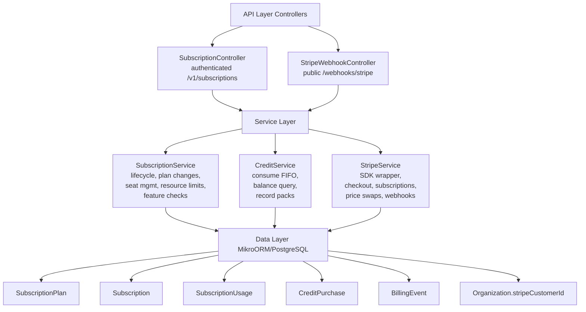

<Note>
**Status:** Active — fully implemented  
**Module Path:** `src/modules/subscription/`  
**Payment Gateway:** Stripe
</Note>

## Overview

The Subscription Module implements a **freemium SaaS billing system** for PropWise CRM. Every organization has a subscription tied to one of **three plan tiers** (Free / Pro / Business — Starter was removed; see §18). The module handles:

- **Plan-based feature gating** — binary feature flags per tier
- **Resource limits** — **source-aware** caps on leads, contacts, deals, companies (imports never count — §18.4), and storage
- **Unified AI-credit wallet** — one credit balance for Propilot, AI auto-reply, and unit valuation, with a per-action cost map, per-user ceilings, and personal credits (§18.5)
- **Single per-agent seat model** — one seat SKU per tier; Pro 5–10 seats (11th → upgrade to Business), Business 10+ with volume pricing (§18.3)
- **Stripe integration** — checkout, subscription management, mid-cycle plan changes, webhooks, billing portal, AED pricing, +25 GB storage packs, credit top-up packs
- **Evergreen 90-day trial** — Pro & Business signups get a card-upfront trial (§18.2)
- **Free organization ownership cap** — one user may own at most 2 active Free-plan organizations
- **Proration** — mid-cycle **tier** changes and seat changes are prorated to the day; **billing cycle** switches (Monthly ↔ Annual) are deferred to period end via Stripe Subscription Schedules
- **Suspension flow** — 2-day grace period on payment failure, then org goes read-only

<Warning>
**§18 (Subscription Packaging Rollout)** is the authoritative description of the current Free/Pro/Business AED model, the single-seat collapse, the unified credit wallet, source-aware caps, the evergreen trial, and connection caps. Where earlier sections (written for the legacy 4-tier / dual-seat / dual-credit model) conflict with §18, **§18 wins**.
</Warning>

### Design Principles

<AccordionGroup>
  <Accordion title="Freemium model">
    Free plan with limited features; paid tiers unlock progressively
  </Accordion>
  
  <Accordion title="Per-org billing">
    Billing is per organization; developer portal is free
  </Accordion>
  
  <Accordion title="Dual seat types">
    Manager seats (Owner, Admin) and agent seats (Basic, custom roles); every user consumes a seat
  </Accordion>
  
  <Accordion title="Seat type derived from role">
    No explicit seat assignment — seat type is automatically determined by the user's RBAC role
  </Accordion>
  
  <Accordion title="Feature flags over tier checks">
    Gating uses `@RequiresFeature('flag')` on plan JSONB — changing what a tier includes requires only a seeder update, not code changes
  </Accordion>
  
  <Accordion title="Service-layer limit enforcement">
    Resource limits and credit consumption are checked in service methods, not guards, because they need entity counts
  </Accordion>
  
  <Accordion title="Free-org creation protection">
    `POST /v1/organizations` locks the owner row, counts owned Free-plan orgs (missing subscription rows count as Free), and rejects the third active free workspace
  </Accordion>
  
  <Accordion title="Stripe as source of truth for payments">
    Webhook-driven lifecycle: the app reacts to Stripe events rather than polling
  </Accordion>
  
  <Accordion title="Billing cycle vs tier changes">
    **Tier changes** (Free → Pro, Pro → Business) are immediate and prorated. **Billing cycle switches** (Monthly ↔ Annual on same tier) are deferred to period end via Stripe Subscription Schedules with no proration. **Combined changes** (tier + cycle) are immediate and prorated with all line items re-priced atomically
  </Accordion>
  
  <Accordion title="Checkout vs. change-plan separation">
    `POST /checkout` is for first-time subscription (Free → Paid); `POST /change-plan` is for switching between paid tiers
  </Accordion>
  
  <Accordion title="Idempotent webhooks">
    Every Stripe event is logged in `BillingEvent` with a unique `stripeEventId` to prevent duplicate processing
  </Accordion>
  
  <Accordion title="Graceful degradation">
    If `app.stripe.secretKey` (`STRIPE_SECRET_KEY`) is not set, billing features are unavailable but the app still starts
  </Accordion>
</AccordionGroup>

## Architecture

### High-Level Diagram



### Data Flow

<Tabs>
  <Tab title="First-time Checkout (Free → Paid)">
    <Steps>
      <Step title="User initiates upgrade">
        Frontend "Upgrade" button triggers `POST /v1/subscriptions/checkout`
      </Step>
      
      <Step title="Validation">
        System rejects if org already has a Stripe subscription (must use change-plan instead)
      </Step>
      
      <Step title="Create Checkout Session">
        - `SubscriptionService.createCheckoutSession()`
        - `StripeService.createCheckoutSession()`
        - Returns Stripe Checkout URL
      </Step>
      
      <Step title="User completes payment">
        User pays on Stripe's hosted page
      </Step>
      
      <Step title="Success redirect">
        Stripe redirects to success URL with `session_id={CHECKOUT_SESSION_ID}`
      </Step>
      
      <Step title="Confirm checkout">
        Frontend calls `POST /v1/subscriptions/checkout/confirm { sessionId }`
        - `SubscriptionService.fulfillCheckoutSession()` (idempotent with webhook)
        - Subscription entity updated to ACTIVE (plan tier from session metadata)
      </Step>
      
      <Step title="Webhook confirmation">
        (Async) Stripe fires `checkout.session.completed` webhook
        - `StripeWebhookController` → `activateSubscription()` (same activation path)
      </Step>
    </Steps>
  </Tab>
  
  <Tab title="Mid-cycle Plan Change">
    <Steps>
      <Step title="Initiate plan change">
        Frontend "Change Plan" button triggers `POST /v1/subscriptions/change-plan`
      </Step>
      
      <Step title="Change plan processing">
        `SubscriptionService.changePlan()` executes:
        - Validates seat overflow (blocks if current users exceed new plan capacity)
        - `StripeService.swapSubscriptionPrice()` — prorated
        - Reconciles seat line items (old tier price → new tier price)
        - Updates local Subscription entity
      </Step>
      
      <Step title="Return updated subscription">
        Returns updated subscription immediately
      </Step>
    </Steps>
  </Tab>
  
  <Tab title="Renewal / Payment Failure">
    <Steps>
      <Step title="Stripe charges renewal">
        Stripe attempts to charge renewal invoice
      </Step>
      
      <Step title="Success path">
        `invoice.paid` webhook:
        - `handleInvoicePaid()` → status stays ACTIVE, period updated
      </Step>
      
      <Step title="Failure path - Initial">
        `invoice.payment_failed` webhook:
        - `handleInvoicePaymentFailed()` → status → PAST_DUE
      </Step>
      
      <Step title="Retry period">
        Stripe retries for 2 days:
        - Payment succeeds → `invoice.paid` → back to ACTIVE
        - All retries fail → `customer.subscription.updated` (status: unpaid)
      </Step>
      
      <Step title="Suspension">
        `handleSubscriptionUpdated()` → status → SUSPENDED
        - Org is read-only (SubscriptionActiveGuard blocks writes)
      </Step>
    </Steps>
  </Tab>
</Tabs>

## Plan Tiers & Pricing

<Warning>
Four tiers were originally defined, but **Starter was removed**. See §18 for the current Free/Pro/Business model.
</Warning>

### Legacy Tier Comparison (Pre-§18)

| Feature | **Free** | **Starter** | **Professional** | **Business** |
|---------|----------|-------------|------------------|--------------|
| Monthly price | $0 | $49 | $149 | $399 |
| Annual price | $0 | $470.40 (~20% off) | $1,430.40 | $3,830.40 |
| Manager seats included | 1 | 2 | 5 | 10 |
| Agent seats included | 0 | 3 | 10 | 25 |
| Extra manager seat | — | +$29/mo | +$29/mo | +$39/mo |
| Extra agent seat | — | +$19/mo | +$19/mo | +$29/mo |
| Max total users | 1 | 25 | 50 | Unlimited |
| Storage | 500 MB | 5 GB | 50 GB | 250 GB |
| Extra storage pack | — | +25 GB @ $15/mo | +25 GB @ $15/mo | +25 GB @ $15/mo |

### Stripe Price IDs (Environment Variables)

<CodeGroup>
```bash Free Tier
# No Stripe prices needed - free tier
```

```bash Starter Monthly
STRIPE_PRICE_STARTER_MONTHLY=price_starter_monthly
STRIPE_PRICE_STARTER_MANAGER_MONTHLY=price_starter_mgr_monthly
STRIPE_PRICE_STARTER_AGENT_MONTHLY=price_starter_agent_monthly
```

```bash Starter Annual
STRIPE_PRICE_STARTER_ANNUAL=price_starter_annual
STRIPE_PRICE_STARTER_MANAGER_ANNUAL=price_starter_mgr_annual
STRIPE_PRICE_STARTER_AGENT_ANNUAL=price_starter_agent_annual
```

```bash Professional Monthly
STRIPE_PRICE_PRO_MONTHLY=price_pro_monthly
STRIPE_PRICE_PRO_MANAGER_MONTHLY=price_pro_mgr_monthly
STRIPE_PRICE_PRO_AGENT_MONTHLY=price_pro_agent_monthly
```

```bash Professional Annual
STRIPE_PRICE_PRO_ANNUAL=price_pro_annual
STRIPE_PRICE_PRO_MANAGER_ANNUAL=price_pro_mgr_annual
STRIPE_PRICE_PRO_AGENT_ANNUAL=price_pro_agent_annual
```

```bash Business Monthly
STRIPE_PRICE_BIZ_MONTHLY=price_biz_monthly
STRIPE_PRICE_BIZ_MANAGER_MONTHLY=price_biz_mgr_monthly
STRIPE_PRICE_BIZ_AGENT_MONTHLY=price_biz_agent_monthly
```

```bash Business Annual
STRIPE_PRICE_BIZ_ANNUAL=price_biz_annual
STRIPE_PRICE_BIZ_MANAGER_ANNUAL=price_biz_mgr_annual
STRIPE_PRICE_BIZ_AGENT_ANNUAL=price_biz_agent_annual
```

```bash Add-ons
STRIPE_PRICE_STORAGE_PACK_MONTHLY=price_storage_monthly
STRIPE_PRICE_STORAGE_PACK_ANNUAL=price_storage_annual
STRIPE_PRICE_CREDIT_PACK_500=price_credits_500
STRIPE_PRICE_CREDIT_PACK_2000=price_credits_2000
STRIPE_PRICE_CREDIT_PACK_5000=price_credits_5000
```
</CodeGroup>

### §18 Current Model (Free/Pro/Business AED)

<Info>
The current implementation follows a simplified three-tier model with unified pricing in AED.
</Info>

<CardGroup cols={3}>
  <Card title="Free" icon="gift">
    **AED 0/month**
    - 5 agent seats
    - 100 leads/contacts
    - 2 GB storage
    - 50 AI credits/user/month
  </Card>
  
  <Card title="Pro" icon="star">
    **AED 199/user/month**
    - 5–10 agent seats
    - 5,000 manually-created records
    - 50 GB storage
    - 500 AI credits/user/month
    - 90-day trial
  </Card>
  
  <Card title="Business" icon="building">
    **AED 399/user/month (10+ seats)**
    **AED 349/user/month (21+ seats)**
    - 10+ agent seats
    - Unlimited records
    - 250 GB storage
    - 2,000 AI credits/user/month
    - 90-day trial
  </Card>
</CardGroup>

<Note>
- **Single seat SKU:** Only agent seats are billed; no separate manager/agent distinction in pricing
- **Import exclusion:** Imported records never count against caps
- **Volume discount:** Business tier gets AED 50/user discount at 21+ seats
- **Evergreen trial:** Pro and Business get 90-day trials with card upfront
</Note>

## Feature Gating Model

### Feature Flags (JSONB Column)

Each `SubscriptionPlan` entity has a `features` JSONB column containing boolean flags:

```typescript
export interface PlanFeatures {
  // Core CRM
  customFields: boolean;
  bulkOperations: boolean;
  advancedFilters: boolean;
  exportData: boolean;
  
  // Automation
  workflows: boolean;
  emailSequences: boolean;
  taskAutomation: boolean;
  
  // AI
  propilot: boolean;
  aiAutoReply: boolean;
  unitValuation: boolean;
  aiCreditsEnabled: boolean;
  
  // Integrations
  apiAccess: boolean;
  webhooks: boolean;
  bayut: boolean;
  propertyFinder: boolean;
  dubizzle: boolean;
  whatsapp: boolean;
  
  // Collaboration
  sharedInbox: boolean;
  teamChat: boolean;
  
  // Analytics
  advancedReports: boolean;
  dashboardCustomization: boolean;
  
  // Support
  prioritySupport: boolean;
  dedicatedManager: boolean;
}
```

### Guard Usage

<CodeGroup>
```typescript Controller Decorator
@Post('workflows')
@RequiresFeature('workflows')
async createWorkflow(@Body() dto: CreateWorkflowDto) {
  return this.workflowService.create(dto);
}
```

```typescript Guard Implementation
@Injectable()
export class FeatureGuard implements CanActivate {
  async canActivate(context: ExecutionContext): Promise<boolean> {
    const requiredFeature = this.reflector.get<string>(
      'requiredFeature',
      context.getHandler()
    );
    
    const request = context.switchToHttp().getRequest();
    const org = request.organization;
    
    const subscription = await this.em.findOne(Subscription, {
      organization: org.id
    }, { populate: ['plan'] });
    
    if (!subscription?.plan?.features[requiredFeature]) {
      throw new ForbiddenException(
        `Feature '${requiredFeature}' requires plan upgrade`
      );
    }
    
    return true;
  }
}
```
</CodeGroup>

### Feature Matrix by Tier

<Tabs>
  <Tab title="Free">
    ```json
    {
      "customFields": false,
      "bulkOperations": false,
      "advancedFilters": false,
      "exportData": true,
      "workflows": false,
      "emailSequences": false,
      "taskAutomation": false,
      "propilot": true,
      "aiAutoReply": false,
      "unitValuation": false,
      "aiCreditsEnabled": true,
      "apiAccess": false,
      "webhooks": false,
      "bayut": true,
      "propertyFinder": false,
      "dubizzle": false,
      "whatsapp": false,
      "sharedInbox": false,
      "teamChat": false,
      "advancedReports": false,
      "dashboardCustomization": false,
      "prioritySupport": false,
      "dedicatedManager": false
    }
    ```
  </Tab>
  
  <Tab title="Pro">
    ```json
    {
      "customFields": true,
      "bulkOperations": true,
      "advancedFilters": true,
      "exportData": true,
      "workflows": true,
      "emailSequences": true,
      "taskAutomation": true,
      "propilot": true,
      "aiAutoReply": true,
      "unitValuation": true,
      "aiCreditsEnabled": true,
      "apiAccess": true,
      "webhooks": true,
      "bayut": true,
      "propertyFinder": true,
      "dubizzle": true,
      "whatsapp": true,
      "sharedInbox": true,
      "teamChat": true,
      "advancedReports": true,
      "dashboardCustomization": true,
      "prioritySupport": true,
      "dedicatedManager": false
    }
    ```
  </Tab>
  
  <Tab title="Business">
    ```json
    {
      "customFields": true,
      "bulkOperations": true,
      "advancedFilters": true,
      "exportData": true,
      "workflows": true,
      "emailSequences": true,
      "taskAutomation": true,
      "propilot": true,
      "aiAutoReply": true,
      "unitValuation": true,
      "aiCreditsEnabled": true,
      "apiAccess": true,
      "webhooks": true,
      "bayut": true,
      "propertyFinder": true,
      "dubizzle": true,
      "whatsapp": true,
      "sharedInbox": true,
      "teamChat": true,
      "advancedReports": true,
      "dashboardCustomization": true,
      "prioritySupport": true,
      "dedicatedManager": true
    }
    ```
  </Tab>
</Tabs>

## Seat Management

### Seat Types

<CardGroup cols={2}>
  <Card title="Manager Seats" icon="user-tie">
    Consumed by users with roles:
    - Owner
    - Admin
    
    Higher price tier
  </Card>
  
  <Card title="Agent Seats" icon="user">
    Consumed by users with roles:
    - Basic
    - Custom roles
    
    Lower price tier
  </Card>
</CardGroup>

### Automatic Seat Assignment

<Info>
No explicit seat assignment UI — seat type is derived from RBAC role.
</Info>

```typescript
export class SubscriptionService {
  private getSeatType(role: OrganizationRole): 'manager' | 'agent' {
    return ['owner', 'admin'].includes(role.key) ? 'manager' : 'agent';
  }
  
  async validateSeatCapacity(
    orgId: string,
    newUserRole: string
  ): Promise<void> {
    const subscription = await this.getOrgSubscription(orgId);
    const seatType = this.getSeatType(newUserRole);
    
    const currentCount = await this.em.count(OrganizationMember, {
      organization: orgId,
      role: seatType === 'manager' 
        ? { key: { $in: ['owner', 'admin'] } }
        : { key: { $nin: ['owner', 'admin'] } }
    });
    
    const limit = seatType === 'manager' 
      ? subscription.plan.managerSeats 
      : subscription.plan.agentSeats;
    
    if (currentCount >= limit) {
      throw new ForbiddenException(
        `${seatType} seat limit (${limit}) reached. Please upgrade.`
      );
    }
  }
}
```

### Seat Billing Reconciliation

<Steps>
  <Step title="Count current seats">
    On subscription creation or plan change, count actual users by seat type
  </Step>
  
  <Step title="Calculate extra seats">
    - Extra managers = `max(0, actualManagers - plan.managerSeats)`
    - Extra agents = `max(0, actualAgents - plan.agentSeats)`
  </Step>
  
  <Step title="Add seat line items to Stripe">
    For each extra seat, add a subscription item with the appropriate price ID
  </Step>
  
  <Step title="Prorate charges">
    Stripe automatically prorates new seat charges to the current billing period
  </Step>
</Steps>

### §18 Single-Seat Model

<Warning>
**Current implementation:** Only agent seats are billed. No manager/agent distinction in pricing.
</Warning>

- **Pro:** 5–10 agent seats included; 11th user triggers Business upgrade
- **Business:** 10+ agent seats with volume pricing (21+ seats → AED 349/user)
- **Seat overflow handling:**
  ```typescript
  if (tier === 'pro' && seatCount > 10) {
    throw new ForbiddenException(
      'Pro tier supports max 10 seats. Please upgrade to Business.'
    );
  }
  ```

## Credit System

### Unified Credit Wallet (§18.5)

<Info>
One credit balance per organization funds **all** AI actions: Propilot, AI auto-reply, and unit valuation.
</Info>

#### Credit Cost Map

```typescript
export const AI_CREDIT_COSTS = {
  propilot_query: 1,           // Per Propilot message
  ai_auto_reply: 5,            // Per generated email reply
  unit_valuation: 10           // Per property valuation
};
```

#### Monthly Allowances (Per User)

| Tier | Credits/User/Month |
|------|-------------------|
| Free | 50 |
| Pro | 500 |
| Business | 2,000 |

<Note>
**Personal credits:** Each user gets their personal allowance. Organization-level top-ups are shared across all users.
</Note>

### Credit Purchase Packs

<CardGroup cols={3}>
  <Card title="Small Pack" icon="coins">
    **500 credits**
    
    Price: AED 50
    
    Stripe Price ID: `price_credits_500`
  </Card>
  
  <Card title="Medium Pack" icon="money-bill-wave">
    **2,000 credits**
    
    Price: AED 180 (10% discount)
    
    Stripe Price ID: `price_credits_2000`
  </Card>
  
  <Card title="Large Pack" icon="gem">
    **5,000 credits**
    
    Price: AED 400 (20% discount)
    
    Stripe Price ID: `price_credits_5000`
  </Card>
</CardGroup>

### FIFO Consumption Logic

```typescript
export class CreditService {
  async consumeCredits(
    orgId: string,
    userId: string,
    amount: number,
    action: string
  ): Promise<void> {
    // 1. Get all available credit pools (personal + org) ordered by expiry
    const pools = await this.em.find(CreditPurchase, {
      $or: [
        { organization: orgId, user: null },  // Org-wide
        { organization: orgId, user: userId } // Personal
      ],
      expiresAt: { $gt: new Date() },
      remainingCredits: { $gt: 0 }
    }, { orderBy: { expiresAt: 'ASC' } });
    
    let remaining = amount;
    const consumptionRecords = [];
    
    // 2. Consume from each pool (FIFO)
    for (const pool of pools) {
      if (remaining <= 0) break;
      
      const toConsume = Math.min(remaining, pool.remainingCredits);
      pool.remainingCredits -= toConsume;
      remaining -= toConsume;
      
      consumptionRecords.push({
        pool: pool.id,
        amount: toConsume,
        action
      });
    }
    
    // 3. Reject if insufficient
    if (remaining > 0) {
      throw new ForbiddenException(
        `Insufficient credits. Need ${amount}, available ${amount - remaining}.`
      );
    }
    
    // 4. Persist consumption
    await this.em.flush();
    await this.logConsumption(consumptionRecords);
  }
}
```

### Credit Balance Query

```typescript
GET /v1/subscriptions/credits

Response:
{
  "personal": {
    "balance": 450,
    "monthlyAllowance": 500,
    "expiresAt": "2025-02-01T00:00:00Z"
  },
  "organizational": {
    "balance": 1200,
    "purchases": [
      {
        "id": "cp_xyz",
        "amount": 2000,
        "remaining": 1200,
        "purchasedAt": "2025-01-15T10:00:00Z",
        "expiresAt": "2026-01-15T10:00:00Z"
      }
    ]
  },
  "totalAvailable": 1650
}
```

## Entity Specifications

### SubscriptionPlan

```typescript
@Entity()
export class SubscriptionPlan {
  @PrimaryKey({ type: 'uuid' })
  id: string = uuidv4();

  @Property()
  name: string; // 'Free', 'Starter', 'Professional', 'Business'

  @Property()
  displayName: string;

  @Property({ type: 'text', nullable: true })
  description?: string;

  @Property({ type: 'integer' })
  monthlyPriceCents: number; // USD cents

  @Property({ type: 'integer' })
  annualPriceCents: number;

  // Stripe price IDs
  @Property({ nullable: true })
  stripePriceMonthly?: string;

  @Property({ nullable: true })
  stripePriceAnnual?: string;

  @Property({ nullable: true })
  stripePriceManagerMonthly?: string;

  @Property({ nullable: true })
  stripePriceManagerAnnual?: string;

  @Property({ nullable: true })
  stripePriceAgentMonthly?: string;

  @Property({ nullable: true })
  stripePriceAgentAnnual?: string;

  // Seat limits
  @Property({ type: 'integer' })
  managerSeats: number;

  @Property({ type: 'integer' })
  agentSeats: number;

  @Property({ type: 'integer', nullable: true })
  maxTotalUsers?: number; // null = unlimited

  // Resource limits
  @Property({ type: 'integer', nullable: true })
  maxLeads?: number;

  @Property({ type: 'integer', nullable: true })
  maxContacts?: number;

  @Property({ type: 'integer', nullable: true })
  maxDeals?: number;

  @Property({ type: 'integer', nullable: true })
  maxCompanies?: number;

  @Property({ type: 'bigint' })
  storageBytes: bigint; // Base storage allocation

  // AI credits
  @Property({ type: 'integer' })
  aiCreditsPerUserPerMonth: number;

  @Property({ type: 'integer' })
  propilotCreditsPerUserPerMonth: number; // Legacy (pre-§18)

  // Feature flags
  @Property({ type: 'jsonb' })
  features: PlanFeatures;

  @Property({ type: 'boolean', default: true })
  isActive: boolean;

  @Property({ type: 'integer', default: 0 })
  sortOrder: number; // For UI display order

  @Property()
  createdAt: Date = new Date();

  @Property({ onUpdate: () => new Date() })
  updatedAt: Date = new Date();
}
```

### Subscription

```typescript
@Entity()
export class Subscription {
  @PrimaryKey({ type: 'uuid' })
  id: string = uuidv4();

  @ManyToOne(() => Organization)
  organization!: Organization;

  @ManyToOne(() => SubscriptionPlan)
  plan!: SubscriptionPlan;

  @Enum(() => SubscriptionStatus)
  status: SubscriptionStatus;

  @Enum(() => BillingCycle)
  billingCycle: BillingCycle; // 'MONTHLY' | 'ANNUAL'

  // Stripe IDs
  @Property({ nullable: true })
  stripeSubscriptionId?: string;

  @Property({ nullable: true })
  stripeCustomerId?: string;

  // Billing period
  @Property({ type: 'timestamptz', nullable: true })
  currentPeriodStart?: Date;

  @Property({ type: 'timestamptz', nullable: true })
  currentPeriodEnd?: Date;

  // Trial
  @Property({ type: 'timestamptz', nullable: true })
  trialEndsAt?: Date;

  @Property({ type: 'boolean', default: false })
  trialUsed: boolean;

  // Cancellation
  @Property({ type: 'boolean', default: false })
  cancelAtPeriodEnd: boolean;

  @Property({ type: 'timestamptz', nullable: true })
  canceledAt?: Date;

  @Property({ type: 'timestamptz', nullable: true })
  endedAt?: Date;

  // Metadata
  @Property({ type: 'jsonb', nullable: true })
  metadata?: Record<string, any>;

  @Property()
  createdAt: Date = new Date();

  @Property({ onUpdate: () => new Date() })
  updatedAt: Date = new Date();

  @OneToMany(() => CreditPurchase, cp => cp.subscription)
  creditPurchases = new Collection<CreditPurchase>(this);
}

export enum SubscriptionStatus {
  ACTIVE = 'active',
  TRIALING = 'trialing',
  PAST_DUE = 'past_due',
  CANCELED = 'canceled',
  SUSPENDED = 'suspended',
  INCOMPLETE = 'incomplete'
}

export enum BillingCycle {
  MONTHLY = 'monthly',
  ANNUAL = 'annual'
}
```

### SubscriptionUsage

```typescript
@Entity()
export class SubscriptionUsage {
  @PrimaryKey({ type: 'uuid' })
  id: string = uuidv4();

  @ManyToOne(() => Organization)
  organization!: Organization;

  @Property({ type: 'date' })
  periodStart: Date;

  @Property({ type: 'date' })
  periodEnd: Date;

  // Resource counts (manually created only, per §18.4)
  @Property({ type: 'integer', default: 0 })
  leadsUsed: number;

  @Property({ type: 'integer', default: 0 })
  contactsUsed: number;

  @Property({ type: 'integer', default: 0 })
  dealsUsed: number;

  @Property({ type: 'integer', default: 0 })
  companiesUsed: number;

  @Property({ type: 'bigint', default: 0 })
  storageUsed: bigint;

  // Seat counts
  @Property({ type: 'integer', default: 0 })
  managerSeatsUsed: number;

  @Property({ type: 'integer', default: 0 })
  agentSeatsUsed: number;

  // AI usage
  @Property({ type: 'integer', default: 0 })
  aiCreditsConsumed: number;

  @Property({ type: 'integer', default: 0 })
  propilotQueriesUsed: number; // Legacy

  @Property()
  createdAt: Date = new Date();

  @Property({ onUpdate: () => new Date() })
  updatedAt: Date = new Date();
}
```

### CreditPurchase

```typescript
@Entity()
export class CreditPurchase {
  @PrimaryKey({ type: 'uuid' })
  id: string = uuidv4();

  @ManyToOne(() => Organization)
  organization!: Organization;

  @ManyToOne(() => Subscription, { nullable: true })
  subscription?: Subscription;

  @ManyToOne(() => User, { nullable: true })
  user?: User; // null = org-wide; set = personal allowance

  @Enum(() => CreditType)
  type: CreditType; // 'MONTHLY_ALLOWANCE' | 'ONE_TIME_PURCHASE'

  @Property({ type: 'integer' })
  creditsGranted: number;

  @Property({ type: 'integer' })
  remainingCredits: number;

  @Property({ type: 'timestamptz' })
  expiresAt: Date; // Monthly allowances expire at month end

  @Property({ nullable: true })
  stripeInvoiceId?: string; // For one-time purchases

  @Property({ type: 'jsonb', nullable: true })
  metadata?: Record<string, any>;

  @Property()
  createdAt: Date = new Date();

  @Property({ onUpdate: () => new Date() })
  updatedAt: Date = new Date();
}

export enum CreditType {
  MONTHLY_ALLOWANCE = 'monthly_allowance',
  ONE_TIME_PURCHASE = 'one_time_purchase'
}
```

### BillingEvent

```typescript
@Entity()
export class BillingEvent {
  @PrimaryKey({ type: 'uuid' })
  id: string = uuidv4();

  @ManyToOne(() => Organization, { nullable: true })
  organization?: Organization;

  @Property({ unique: true })
  stripeEventId: string; // Idempotency key

  @Property()
  eventType: string; // e.g., 'invoice.paid'

  @Property({ type: 'jsonb' })
  payload: any; // Full Stripe event object

  @Property({ type: 'boolean', default: false })
  processed: boolean;

  @Property({ type: 'text', nullable: true })
  errorMessage?: string;

  @Property()
  createdAt: Date = new Date();

  @Property({ onUpdate: () => new Date() })
  processedAt?: Date;
}
```

## Stripe Integration

### Stripe Service

<CodeGroup>
```typescript Create Checkout Session
async createCheckoutSession(params: {
  organizationId: string;
  planId: string;
  billingCycle: BillingCycle;
  successUrl: string;
  cancelUrl: string;
}): Promise<Stripe.Checkout.Session> {
  const org = await this.em.findOneOrFail(Organization, params.organizationId);
  const plan = await this.em.findOneOrFail(SubscriptionPlan, params.planId);

  // Create or retrieve Stripe customer
  let customerId = org.stripeCustomerId;
  if (!customerId) {
    const customer = await this.stripe.customers.create({
      email: org.ownerEmail,
      metadata: { organizationId: org.id, organizationName: org.name }
    });
    org.stripeCustomerId = customerId = customer.id;
    await this.em.flush();
  }

  // Determine base price
  const priceId = params.billingCycle === BillingCycle.MONTHLY
    ? plan.stripePriceMonthly
    : plan.stripePriceAnnual;

  // Calculate current seat usage
  const { managers, agents } = await this.countSeats(params.organizationId);
  const extraManagers = Math.max(0, managers - plan.managerSeats);
  const extraAgents = Math.max(0, agents - plan.agentSeats);

  const lineItems: Stripe.Checkout.SessionCreateParams.LineItem[] = [
    { price: priceId, quantity: 1 } // Base plan
  ];

  // Add extra seat line items
  if (extraManagers > 0) {
    lineItems.push({
      price: params.billingCycle === BillingCycle.MONTHLY
        ? plan.stripePriceManagerMonthly
        : plan.stripePriceManagerAnnual,
      quantity: extraManagers
    });
  }
  if (extraAgents > 0) {
    lineItems.push({
      price: params.billingCycle === BillingCycle.MONTHLY
        ? plan.stripePriceAgentMonthly
        : plan.stripePriceAgentAnnual,
      quantity: extraAgents
    });
  }

  // §18.2: 90-day trial for Pro/Business
  const trialDays = ['pro', 'business'].includes(plan.name.toLowerCase()) ? 90 : 0;

  return this.stripe.checkout.sessions.create({
    customer: customerId,
    mode: 'subscription',
    line_items: lineItems,
    success_url: params.successUrl,
    cancel_url: params.cancelUrl,
    subscription_data: {
      trial_period_days: trialDays,
      metadata: {
        organizationId: org.id,
        planId: plan.id,
        billingCycle: params.billingCycle
      }
    }
  });
}
```

```typescript Swap Subscription Price
async swapSubscriptionPrice(params: {
  subscriptionId: string;
  newPlanId: string;
  newBillingCycle: BillingCycle;
}): Promise<Stripe.Subscription> {
  const subscription = await this.em.findOneOrFail(
    Subscription,
    { stripeSubscriptionId: params.subscriptionId },
    { populate: ['plan', 'organization'] }
  );

  const newPlan = await this.em.findOneOrFail(
    SubscriptionPlan,
    params.newPlanId
  );

  const stripeSubscription = await this.stripe.subscriptions.retrieve(
    params.subscriptionId
  );

  // Determine new base price
  const newPriceId = params.newBillingCycle === BillingCycle.MONTHLY
    ? newPlan.stripePriceMonthly
    : newPlan.stripePriceAnnual;

  // Build new items array
  const items: Stripe.SubscriptionUpdateParams.Item[] = [
    {
      id: stripeSubscription.items.data[0].id,
      price: newPriceId,
      quantity: 1
    }
  ];

  // Recalculate seat line items
  const { managers, agents } = await this.countSeats(
    subscription.organization.id
  );
  const extraManagers = Math.max(0, managers - newPlan.managerSeats);
  const extraAgents = Math.max(0, agents - newPlan.agentSeats);

  if (extraManagers > 0) {
    items.push({
      price: params.newBillingCycle === BillingCycle.MONTHLY
        ? newPlan.stripePriceManagerMonthly
        : newPlan.stripePriceManagerAnnual,
      quantity: extraManagers
    });
  }
  if (extraAgents > 0) {
    items.push({
      price: params.newBillingCycle === BillingCycle.MONTHLY
        ? newPlan.stripePriceAgentMonthly
        : newPlan.stripePriceAgentAnnual,
      quantity: extraAgents
    });
  }

  // Update subscription with proration
  return this.stripe.subscriptions.update(params.subscriptionId, {
    items,
    proration_behavior: 'always_invoice',
    billing_cycle_anchor: 'unchanged'
  });
}
```

```typescript Create Billing Portal Session
async createPortalSession(
  customerId: string,
  returnUrl: string
): Promise<Stripe.BillingPortal.Session> {
  return this.stripe.billingPortal.sessions.create({
    customer: customerId,
    return_url: returnUrl
  });
}
```

```typescript Purchase Credit Pack
async purchaseCredits(params: {
  organizationId: string;
  packSize: 500 | 2000 | 5000;
}): Promise<Stripe.PaymentIntent> {
  const org = await this.em.findOneOrFail(Organization, params.organizationId);
  
  const priceMap = {
    500: process.env.STRIPE_PRICE_CREDIT_PACK_500,
    2000: process.env.STRIPE_PRICE_CREDIT_PACK_2000,
    5000: process.env.STRIPE_PRICE_CREDIT_PACK_5000
  };

  const session = await this.stripe.checkout.sessions.create({
    customer: org.stripeCustomerId,
    mode: 'payment',
    line_items: [{ price: priceMap[params.packSize], quantity: 1 }],
    success_url: `${process.env.FRONTEND_URL}/billing/credits?success=true`,
    cancel_url: `${process.env.FRONTEND_URL}/billing/credits`,
    metadata: {
      organizationId: org.id,
      creditAmount: params.packSize
    }
  });

  return session;
}
```
</CodeGroup>

### Webhook Handler

```typescript
@Controller('webhooks/stripe')
export class StripeWebhookController {
  @Post()
  async handleWebhook(
    @Req() req: RawBodyRequest<Request>,
    @Headers('stripe-signature') signature: string
  ) {
    let event: Stripe.Event;

    try {
      event = this.stripe.webhooks.constructEvent(
        req.rawBody,
        signature,
        process.env.STRIPE_WEBHOOK_SECRET
      );
    } catch (err) {
      throw new BadRequestException(`Webhook signature verification failed`);
    }

    // Check idempotency
    const existing = await this.em.findOne(BillingEvent, {
      stripeEventId: event.id
    });
    if (existing) {
      return { received: true, message: 'Event already processed' };
    }

    // Log event
    const billingEvent = this.em.create(BillingEvent, {
      stripeEventId: event.id,
      eventType: event.type,
      payload: event,
      processed: false
    });
    await this.em.persistAndFlush(billingEvent);

    try {
      await this.processEvent(event, billingEvent);
      billingEvent.processed = true;
    } catch (error) {
      billingEvent.errorMessage = error.message;
      throw error;
    } finally {
      billingEvent.processedAt = new Date();
      await this.em.flush();
    }

    return { received: true };
  }

  private async processEvent(
    event: Stripe.Event,
    billingEvent: BillingEvent
  ) {
    switch (event.type) {
      case 'checkout.session.completed':
        await this.handleCheckoutCompleted(event.data.object as Stripe.Checkout.Session);
        break;
      case 'customer.subscription.updated':
        await this.handleSubscriptionUpdated(event.data.object as Stripe.Subscription);
        break;
      case 'customer.subscription.deleted':
        await this.handleSubscriptionDeleted(event.data.object as Stripe.Subscription);
        break;
      case 'invoice.paid':
        await this.handleInvoicePaid(event.data.object as Stripe.Invoice);
        break;
      case 'invoice.payment_failed':
        await this.handleInvoicePaymentFailed(event.data.object as Stripe.Invoice);
        break;
      case 'payment_intent.succeeded':
        await this.handlePaymentSucceeded(event.data.object as Stripe.PaymentIntent);
        break;
      default:
        this.logger.log(`Unhandled event type: ${event.type}`);
    }
  }
}
```

## Subscription Lifecycle

<Steps>
  <Step title="Organization Creation">
    - New org gets a Free plan subscription by default
    - No Stripe customer created yet
    - Monthly allowance credits granted (50 AI credits/user)
  </Step>
  
  <Step title="Upgrade Initiation">
    User clicks "Upgrade" → `POST /v1/subscriptions/checkout`
  </Step>
  
  <Step title="Checkout Session">
    - Stripe customer created if needed
    - Checkout session created with:
      - Base plan price
      - Extra seat line items (if current users > plan limits)
      - 90-day trial for Pro/Business (§18.2)
    - User redirected to Stripe Checkout
  </Step>
  
  <Step title="Payment & Activation">
    - User enters payment details
    - Stripe fires `checkout.session.completed` webhook
    - `SubscriptionService.fulfillCheckoutSession()`:
      - Updates subscription status to ACTIVE/TRIALING
      - Records `stripeSubscriptionId`
      - Sets billing period dates
      - Grants tier-appropriate monthly credits
  </Step>
  
  <Step title="Trial Period (if applicable)">
    - Status: TRIALING
    - Full feature access
    - No charges until trial ends
    - After 90 days → first invoice
  </Step>
  
  <Step title="Active Subscription">
    - Status: ACTIVE
    - Monthly/annual renewals automatic
    - `invoice.paid` webhook → period dates updated
    - Credits replenished monthly
  </Step>
  
  <Step title="Payment Failure">
    - `invoice.payment_failed` webhook → status PAST_DUE
    - 2-day grace period (Stripe Smart Retry)
    - If all retries fail → SUSPENDED
  </Step>
  
  <Step title="Suspension">
    - Organization becomes read-only
    - `SubscriptionActiveGuard` blocks write operations
    - Banner shown to admins/owner
    - To reactivate: update payment method in Billing Portal
  </Step>
  
  <Step title="Cancellation">
    - User clicks "Cancel" → `POST /v1/subscriptions/cancel`
    - `cancelAtPeriodEnd = true` in Stripe
    - Subscription remains active until period end
    - At period end → `customer.subscription.deleted` → status CANCELED
  </Step>
  
  <Step title="Downgrade to Free">
    - Subscription deleted in Stripe
    - Local subscription status → CANCELED
    - New Free-tier subscription created
    - Features/limits revert to Free tier
  </Step>
</Steps>

## Plan Changes (Upgrade / Downgrade)

### Tier Change (Same Billing Cycle)

<Info>
Immediate and prorated. Example: Pro Monthly → Business Monthly
</Info>

```typescript
POST /v1/subscriptions/change-plan
{
  "planId": "uuid-of-business-plan",
  "billingCycle": "monthly" // unchanged
}

Flow:
1. Validate seat capacity (current users must fit new tier limits)
2. Call Stripe: subscriptions.update()
   - Swap base price: Pro Monthly → Business Monthly
   - Recalculate seat line items with new tier prices
   - proration_behavior: 'always_invoice'
3. Stripe generates proration invoice immediately
4. Update local Subscription entity
5. Return updated subscription object
```

### Billing Cycle Change (Same Tier)

<Warning>
Deferred to period end via Subscription Schedules. No immediate proration.
</Warning>

```typescript
POST /v1/subscriptions/change-plan
{
  "planId": "uuid-of-same-plan",
  "billingCycle": "annual" // changed from monthly
}

Flow:
1. Create Stripe Subscription Schedule:
   phases: [
     {
       items: [current monthly items],
       end_date: current_period_end
     },
     {
       items: [new annual items],
       iterations: 1
     }
   ]
2. Schedule activates at period end
3. Local subscription record stays on monthly until then
4. Webhook customer.subscription.updated fires when schedule transitions
5. Update local entity to annual billing
```

### Combined Change (Tier + Cycle)

<Info>
Immediate and prorated. All line items re-priced atomically.
</Info>

```typescript
POST /v1/subscriptions/change-plan
{
  "planId": "uuid-of-business-plan",
  "billingCycle": "annual"
}

Flow:
1. Single Stripe subscriptions.update() call
2. Replace all items:
   - Old: Pro Monthly base + seats
   - New: Business Annual base + seats
3. Stripe prorates everything to current period
4. Invoice generated immediately
5. Local entity updated with new tier and cycle
```

### Seat Overflow Prevention

```typescript
async validateSeatCapacity(orgId: string, newPlanId: string): Promise<void> {
  const currentSeats = await this.countSeats(orgId);
  const newPlan = await this.em.findOneOrFail(SubscriptionPlan, newPlanId);

  if (currentSeats.managers > newPlan.managerSeats ||
      currentSeats.agents > newPlan.agentSeats ||
      (newPlan.maxTotalUsers && 
       currentSeats.total > newPlan.maxTotalUsers)) {
    throw new ForbiddenException(
      `Cannot downgrade: current user count (${currentSeats.total}) ` +
      `exceeds new plan limits (${newPlan.maxTotalUsers || 'unlimited'}). ` +
      `Please remove users first.`
    );
  }
}
```

## API Endpoints

<Tabs>
  <Tab title="Subscription Management">
    <AccordionGroup>
      <Accordion title="GET /v1/subscriptions/current">
        **Get Current Subscription**
        
        Returns the authenticated org's subscription details.
        
        ```typescript
        Response: {
          id: string;
          plan: {
            id: string;
            name: string;
            displayName: string;
            features: PlanFeatures;
            limits: { ... };
          };
          status: SubscriptionStatus;
          billingCycle: BillingCycle;
          currentPeriodEnd: string;
          cancelAtPeriodEnd: boolean;
          usage: {
            seats: { managers: number; agents: number; };
            resources: { leads: number; contacts: number; ... };
            storage: { used: number; limit: number; };
            credits: { available: number; consumed: number; };
          };
        }
        ```
      </Accordion>
      
      <Accordion title="GET /v1/subscriptions/plans">
        **List Available Plans**
        
        Returns all active subscription plans with pricing and features.
        
        ```typescript
        Response: SubscriptionPlan[]
        ```
      </Accordion>
      
      <Accordion title="POST /v1/subscriptions/checkout">
        **Create Checkout Session**
        
        Initiates first-time subscription (Free → Paid).
        
        ```typescript
        Body: {
          planId: string;
          billingCycle: 'monthly' | 'annual';
          successUrl: string;
          cancelUrl: string;
        }
        
        Response: {
          sessionId: string;
          url: string; // Redirect user here
        }
        ```
      </Accordion>
      
      <Accordion title="POST /v1/subscriptions/checkout/confirm">
        **Confirm Checkout**
        
        Idempotent fulfillment after Stripe redirect.
        
        ```typescript
        Body: {
          sessionId: string;
        }
        
        Response: {
          subscription: Subscription;
          success: true;
        }
        ```
      </Accordion>
      
      <Accordion title="POST /v1/subscriptions/change-plan">
        **Change Plan**
        
        Switch between paid tiers or billing cycles.
        
        ```typescript
        Body: {
          planId: string;
          billingCycle: 'monthly' | 'annual';
        }
        
        Response: {
          subscription: Subscription;
          prorationInvoice?: { ... };
        }
        ```
      </Accordion>
      
      <Accordion title="POST /v1/subscriptions/cancel">
        **Cancel Subscription**
        
        Schedules cancellation at period end.
        
        ```typescript
        Body: {
          reason?: string;
        }
        
        Response: {
          subscription: Subscription;
          effectiveDate: string;
        }
        ```
      </Accordion>
      
      <Accordion title="POST /v1/subscriptions/reactivate">
        **Reactivate Canceled Subscription**
        
        Un-cancels before period end.
        
        ```typescript
        Response: {
          subscription: Subscription;
        }
        ```
      </Accordion>
      
      <Accordion title="GET /v1/subscriptions/billing-portal">
        **Get Billing Portal Link**
        
        Returns Stripe-hosted billing management URL.
        
        ```typescript
        Response: {
          url: string;
        }
        ```
      </Accordion>
    </AccordionGroup>
  </Tab>
  
  <Tab title="Credits">
    <AccordionGroup>
      <Accordion title="GET /v1/subscriptions/credits">
        **Get Credit Balance**
        
        Returns personal and organizational credit pools.
        
        ```typescript
        Response: {
          personal: {
            balance: number;
            monthlyAllowance: number;
            expiresAt: string;
          };
          organizational: {
            balance: number;
            purchases: CreditPurchase[];
          };
          totalAvailable: number;
        }
        ```
      </Accordion>
      
      <Accordion title="POST /v1/subscriptions/credits/purchase">
        **Purchase Credit Pack**
        
        Creates Stripe checkout for one-time credit purchase.
        
        ```typescript
        Body: {
          packSize: 500 | 2000 | 5000;
        }
        
        Response: {
          sessionId: string;
          url: string;
        }
        ```
      </Accordion>
      
      <Accordion title="GET /v1/subscriptions/credits/history">
        **Credit Usage History**
        
        Returns consumption log.
        
        ```typescript
        Query: {
          startDate?: string;
          endDate?: string;
          action?: string;
        }
        
        Response: {
          items: Array<{
            id: string;
            action: string;
            amount: number;
            user: { id: string; name: string; };
            timestamp: string;
          }>;
          total: number;
        }
        ```
      </Accordion>
    </AccordionGroup>
  </Tab>
  
  <Tab title="Usage & Limits">
    <AccordionGroup>
      <Accordion title="GET /v1/subscriptions/usage">
        **Get Current Usage**
        
        Returns resource and feature usage vs limits.
        
        ```typescript
        Response: {
          period: { start: string; end: string; };
          resources: {
            leads: { used: number; limit: number; };
            contacts: { used: number; limit: number; };
            deals: { used: number; limit: number; };
            companies: { used: number; limit: number; };
            storage: { used: number; limit: number; };
          };
          seats: {
            managers: { used: number; limit: number; };
            agents: { used: number; limit: number; };
          };
          aiCredits: {
            consumed: number;
            remaining: number;
          };
        }
        ```
      </Accordion>
      
      <Accordion title="POST /v1/subscriptions/storage/add">
        **Add Storage Pack**
        
        Purchase +25 GB storage add-on.
        
        ```typescript
        Body: {
          billingCycle: 'monthly' | 'annual';
        }
        
        Response: {
          subscription: Subscription;
          newStorageLimit: number;
        }
        ```
      </Accordion>
    </AccordionGroup>
  </Tab>
</Tabs>

## Guards & Decorators

### Feature Guard

```typescript
import { SetMetadata } from '@nestjs/common';

export const REQUIRED_FEATURE_KEY = 'requiredFeature';
export const RequiresFeature = (feature: keyof PlanFeatures) =>
  SetMetadata(REQUIRED_FEATURE_KEY, feature);

@Injectable()
export class FeatureGuard implements CanActivate {
  constructor(
    private reflector: Reflector,
    private em: EntityManager
  ) {}

  async canActivate(context: ExecutionContext): Promise<boolean> {
    const requiredFeature = this.reflector.get<keyof PlanFeatures>(
      REQUIRED_FEATURE_KEY,
      context.getHandler()
    );

    if (!requiredFeature) return true;

    const request = context.switchToHttp().getRequest();
    const org = request.organization;

    const subscription = await this.em.findOne(
      Subscription,
      { organization: org.id },
      { populate: ['plan'] }
    );

    const hasFeature = subscription?.plan?.features[requiredFeature] === true;

    if (!hasFeature) {
      throw new ForbiddenException({
        message: `This feature requires a plan upgrade`,
        feature: requiredFeature,
        currentPlan: subscription?.plan?.name || 'Free',
        upgradeUrl: '/billing/plans'
      });
    }

    return true;
  }
}
```

### Subscription Active Guard

```typescript
@Injectable()
export class SubscriptionActiveGuard implements CanActivate {
  async canActivate(context: ExecutionContext): Promise<boolean> {
    const request = context.switchToHttp().getRequest();
    const org = request.organization;

    const subscription = await this.em.findOne(Subscription, {
      organization: org.id
    });

    // Free tier always active
    if (!subscription?.stripeSubscriptionId) return true;

    const isActive = [
      SubscriptionStatus.ACTIVE,
      SubscriptionStatus.TRIALING,
      SubscriptionStatus.PAST_DUE // 2-day grace
    ].includes(subscription.status);

    if (!isActive) {
      throw new ForbiddenException({
        message: 'Subscription is suspended. Please update payment method.',
        status: subscription.status,
        billingPortalUrl: '/billing/portal'
      });
    }

    return true;
  }
}
```

### Usage Examples

<CodeGroup>
```typescript Feature Gating
@Controller('workflows')
export class WorkflowController {
  @Post()
  @RequiresFeature('workflows')
  @UseGuards(FeatureGuard)
  async create(@Body() dto: CreateWorkflowDto) {
    return this.workflowService.create(dto);
  }
}
```

```typescript Subscription Check
@Controller('leads')
export class LeadController {
  @Post()
  @UseGuards(SubscriptionActiveGuard)
  async create(@Body() dto: CreateLeadDto) {
    // Will throw 403 if subscription is suspended
    return this.leadService.create(dto);
  }
}
```
</CodeGroup>

## Enforcement Points

### Resource Limit Checks (Service Layer)

<Warning>
Resource limits are enforced in service methods, not guards, because they require database queries.
</Warning>

```typescript
export class LeadService {
  async create(orgId: string, dto: CreateLeadDto): Promise<Lead> {
    // Check limit (§18.4: only manually-created count)
    await this.enforceResourceLimit(orgId, 'leads');
    
    const lead = this.em.create(Lead, {
      ...dto,
      organization: orgId,
      source: 'manual'
    });
    
    await this.em.persistAndFlush(lead);
    return lead;
  }

  private async enforceResourceLimit(
    orgId: string,
    resource: 'leads' | 'contacts' | 'deals' | 'companies'
  ): Promise<void> {
    const subscription = await this.em.findOne(
      Subscription,
      { organization: orgId },
      { populate: ['plan'] }
    );

    const limit = subscription?.plan?.[`max${capitalize(resource)}`];
    if (limit === null || limit === undefined) return; // Unlimited

    // §18.4: Count only manual/api sources, exclude 'import'
    const count = await this.em.count(Lead, {
      organization: orgId,
      source: { $ne: 'import' }
    });

    if (count >= limit) {
      throw new ForbiddenException({
        message: `${capitalize(resource)} limit reached (${limit})`,
        limit,
        current: count,
        upgradeUrl: '/billing/plans'
      });
    }
  }
}
```

### Storage Limit Check

```typescript
export class FileService {
  async upload(orgId: string, file: Express.Multer.File): Promise<File> {
    const subscription = await this.em.findOne(
      Subscription,
      { organization: orgId },
      { populate: ['plan'] }
    );

    const usage = await this.em.findOne(SubscriptionUsage, {
      organization: orgId,
      periodEnd: { $gte: new Date() }
    });

    const currentStorage = usage?.storageUsed || 0n;
    const storageLimit = subscription?.plan?.storageBytes || 500_000_000n; // 500 MB default

    if (currentStorage + BigInt(file.size) > storageLimit) {
      throw new ForbiddenException({
        message: 'Storage limit exceeded',
        used: currentStorage.toString(),
        limit: storageLimit.toString(),
        upgradeUrl: '/billing/plans'
      });
    }

    // Upload file...
    usage.storageUsed += BigInt(file.size);
    await this.em.flush();

    return uploadedFile;
  }
}
```

### Credit Consumption

```typescript
export class PropilotService {
  async query(userId: string, orgId: string, question: string): Promise<string> {
    // Consume 1 credit per query (§18.5)
    await this.creditService.consumeCredits(
      orgId,
      userId,
      AI_CREDIT_COSTS.propilot_query,
      'propilot_query'
    );

    // Generate response...
    const response = await this.llm.generateResponse(question);
    return response;
  }
}

export class EmailService {
  async generateAutoReply(emailId: string): Promise<string> {
    const email = await this.em.findOneOrFail(Email, emailId, {
      populate: ['organization', 'assignedUser']
    });

    // Consume 5 credits per auto-