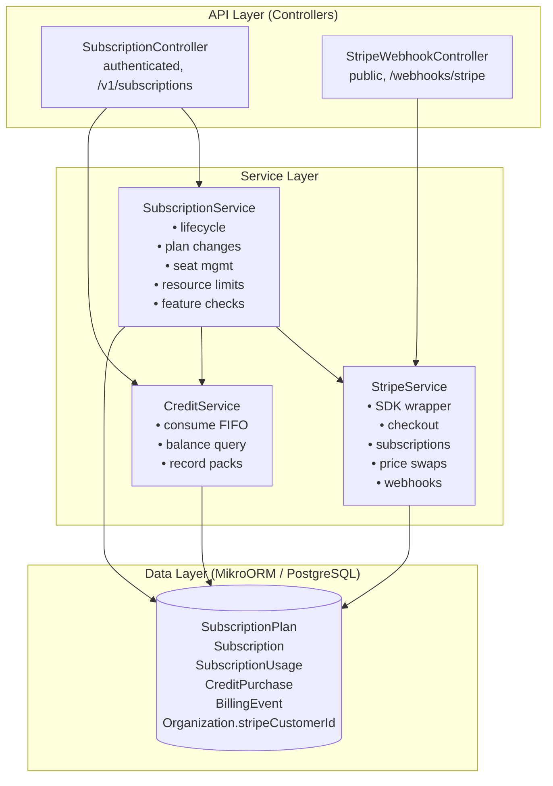
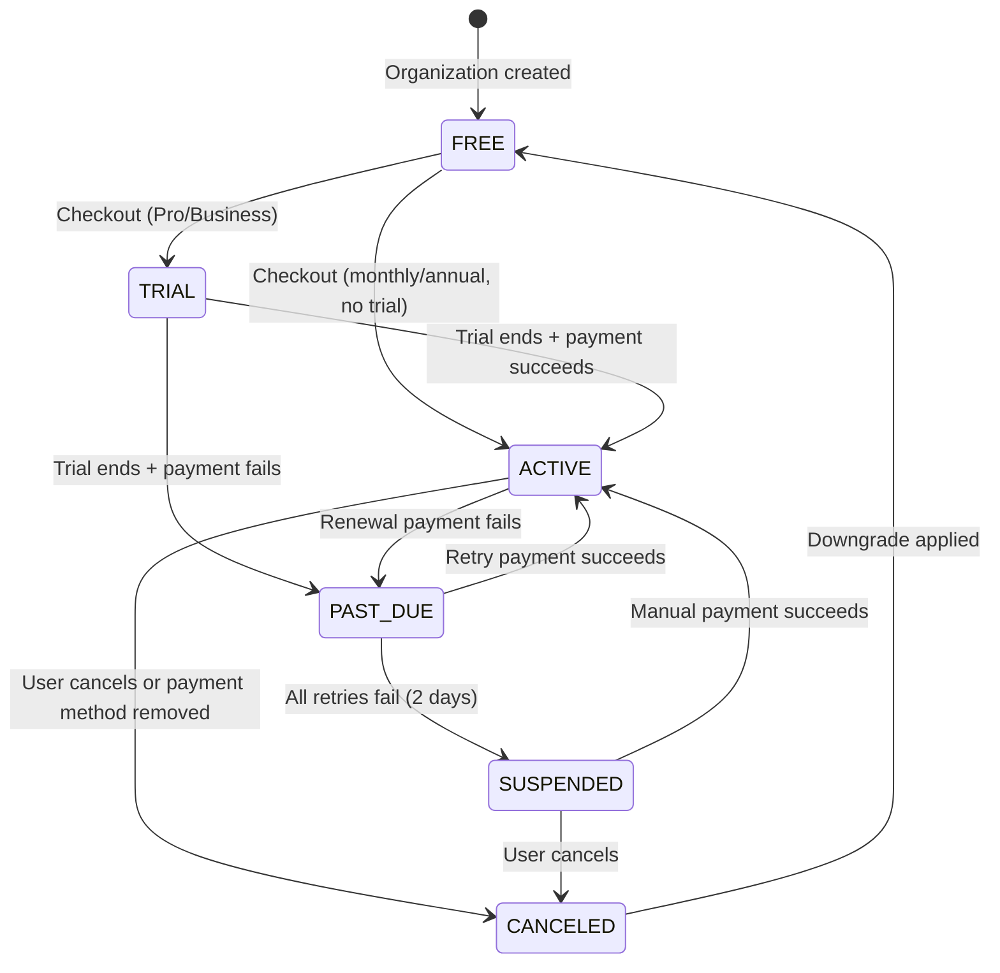

## Overview

The Subscription Module implements a **freemium SaaS billing system** for PropWise CRM. Every organization has a subscription tied to one of **three plan tiers** (Free / Pro / Business — Starter was removed; see §18). The module handles:

- **Plan-based feature gating** — binary feature flags per tier
- **Resource limits** — **source-aware** caps on leads, contacts, deals, companies (imports never count — §18.4), and storage
- **Unified AI-credit wallet** — one credit balance for Propilot, AI auto-reply, and unit valuation, with a per-action cost map, per-user ceilings, and personal credits (§18.5)
- **Single per-agent seat model** — one seat SKU per tier; Pro 5–10 seats (11th → upgrade to Business), Business 10+ with volume pricing (§18.3)
- **Stripe integration** — checkout, subscription management, mid-cycle plan changes, webhooks, billing portal, AED pricing, +25 GB storage packs, credit top-up packs
- **Evergreen 90-day trial** — Pro & Business signups get a card-upfront trial (§18.2)
- **Free organization ownership cap** — one user may own at most 2 active Free-plan organizations
- **Proration** — mid-cycle **tier** changes and seat changes are prorated to the day; **billing cycle** switches (Monthly ↔ Annual) are deferred to period end via Stripe Subscription Schedules
- **Suspension flow** — 2-day grace period on payment failure, then org goes read-only

<Warning>
**§18 (Subscription Packaging Rollout)** is the authoritative description of the current Free/Pro/Business AED model, the single-seat collapse, the unified credit wallet, source-aware caps, the evergreen trial, and connection caps. Where earlier sections (written for the legacy 4-tier / dual-seat / dual-credit model) conflict with §18, **§18 wins**.
</Warning>

### Design principles

<AccordionGroup>
  <Accordion title="Freemium model">
    Free plan with limited features; paid tiers unlock progressively
  </Accordion>

  <Accordion title="Per-org billing">
    Billing is per organization; developer portal is free
  </Accordion>

  <Accordion title="Dual seat types">
    Manager seats (Owner, Admin) and agent seats (Basic, custom roles); every user consumes a seat
  </Accordion>

  <Accordion title="Seat type derived from role">
    No explicit seat assignment — seat type is automatically determined by the user's RBAC role
  </Accordion>

  <Accordion title="Feature flags over tier checks">
    Gating uses `@RequiresFeature('flag')` on plan JSONB — changing what a tier includes requires only a seeder update, not code changes
  </Accordion>

  <Accordion title="Service-layer limit enforcement">
    Resource limits and credit consumption are checked in service methods, not guards, because they need entity counts
  </Accordion>

  <Accordion title="Free-org creation protection">
    `POST /v1/organizations` locks the owner row, counts owned Free-plan orgs (missing subscription rows count as Free), and rejects the third active free workspace
  </Accordion>

  <Accordion title="Stripe as source of truth for payments">
    Webhook-driven lifecycle: the app reacts to Stripe events rather than polling
  </Accordion>

  <Accordion title="Billing cycle vs tier changes">
    **Tier changes** (Free → Pro, Pro → Business) are immediate and prorated. **Billing cycle switches** (Monthly ↔ Annual on same tier) are deferred to period end via Stripe Subscription Schedules with no proration. **Combined changes** (tier + cycle) are immediate and prorated with all line items re-priced atomically
  </Accordion>

  <Accordion title="Checkout vs. change-plan separation">
    `POST /checkout` is for first-time subscription (Free → Paid); `POST /change-plan` is for switching between paid tiers
  </Accordion>

  <Accordion title="Idempotent webhooks">
    Every Stripe event is logged in `BillingEvent` with a unique `stripeEventId` to prevent duplicate processing
  </Accordion>

  <Accordion title="Graceful degradation">
    If `app.stripe.secretKey` (`STRIPE_SECRET_KEY`) is not set, billing features are unavailable but the app still starts
  </Accordion>
</AccordionGroup>

---

## Architecture

### High-level diagram



### Data flow

<Tabs>
  <Tab title="First-time Checkout">
    <Steps>
      <Step title="User clicks Upgrade button">
        Frontend sends `POST /v1/subscriptions/checkout`
      </Step>

      <Step title="Validate eligibility">
        Rejects if org already has a Stripe subscription (must use change-plan instead)
      </Step>

      <Step title="Create Checkout Session">
        `SubscriptionService.createCheckoutSession()` → `StripeService.createCheckoutSession()` returns Stripe Checkout URL
      </Step>

      <Step title="User completes payment">
        Stripe hosts payment page, redirects to success URL with `session_id={CHECKOUT_SESSION_ID}`
      </Step>

      <Step title="Frontend confirms checkout">
        `POST /v1/subscriptions/checkout/confirm { sessionId }` → `SubscriptionService.fulfillCheckoutSession()` (idempotent with webhook) → Subscription entity updated to ACTIVE
      </Step>

      <Step title="Webhook processing">
        Async: Stripe fires `checkout.session.completed` webhook → `StripeWebhookController` → `activateSubscription()` (same activation path)
      </Step>
    </Steps>
  </Tab>

  <Tab title="Mid-cycle Plan Change">
    <Steps>
      <Step title="User changes plan">
        Frontend sends `POST /v1/subscriptions/change-plan`
      </Step>

      <Step title="Validate change">
        `SubscriptionService.changePlan()` validates seat overflow (blocks if current users exceed new plan capacity)
      </Step>

      <Step title="Update Stripe subscription">
        `StripeService.swapSubscriptionPrice()` — prorated change applied
      </Step>

      <Step title="Reconcile seat line items">
        Old tier price → new tier price
      </Step>

      <Step title="Update local entity">
        Updates local Subscription entity and returns updated subscription immediately
      </Step>
    </Steps>
  </Tab>

  <Tab title="Renewal / Payment Failure">
    ```mermaid
    graph TD
        A[Stripe charges renewal invoice] --> B{Payment result}
        B -->|Success| C[invoice.paid event]
        B -->|Failure| D[invoice.payment_failed event]
        C --> E[handleInvoicePaid<br/>status stays ACTIVE<br/>period updated]
        D --> F[handleInvoicePaymentFailed<br/>status → PAST_DUE]
        F --> G[Stripe retries for 2 days]
        G -->|Payment succeeds| H[invoice.paid → back to ACTIVE]
        G -->|All retries fail| I[customer.subscription.updated<br/>status: unpaid]
        I --> J[handleSubscriptionUpdated<br/>status → SUSPENDED]
        J --> K[Org is read-only<br/>SubscriptionActiveGuard blocks writes]
    ```
  </Tab>
</Tabs>

---

## Plan Tiers & Pricing

<Note>
Four tiers exist in the codebase, but **Starter** tier was removed from the product offering. Current active tiers are **Free**, **Professional**, and **Business**.
</Note>

### Pricing matrix (USD)

| Feature | Free | Starter | Professional | Business |
|---------|------|---------|-------------|----------|
| Monthly price | $0 | $49 | $149 | $399 |
| Annual price | $0 | $470.40 (~20% off) | $1,430.40 | $3,830.40 |
| Manager seats included | 1 | 2 | 5 | 10 |
| Agent seats included | 0 | 3 | 10 | 25 |
| Additional manager seat/mo | — | $25 | $30 | $40 |
| Additional agent seat/mo | — | $15 | $15 | $20 |
| Leads cap | 100 | 1,000 | 10,000 | 50,000 |
| Contacts cap | 100 | 1,000 | 10,000 | 50,000 |
| Deals cap | 50 | 500 | 5,000 | 25,000 |
| Companies cap | 50 | 500 | 5,000 | 25,000 |
| Storage (GB) | 5 | 25 | 100 | 500 |
| AI credits/month (org-level) | 0 | 500 | 2,000 | 10,000 |
| Personal AI credits/month | 0 | 50 | 100 | 200 |

<Info>
**Stripe Price IDs** are configured in `.env` with the pattern `STRIPE_PRICE_{TIER}_{CYCLE}_{SEAT_TYPE}`. Example: `STRIPE_PRICE_PROFESSIONAL_MONTHLY_MANAGER`.
</Info>

### Feature flags by tier

<CodeGroup>
```json Free
{
  "basicCRM": true,
  "emailIntegration": false,
  "calendarSync": false,
  "webhooks": false,
  "apiAccess": false,
  "customFields": false,
  "bulkOperations": false,
  "advancedReporting": false,
  "roleBasedAccess": false,
  "auditLogs": false,
  "ssoSAML": false,
  "prioritySupport": false,
  "dedicatedAccountManager": false,
  "propilotAI": false,
  "aiAutoReply": false,
  "unitValuationAI": false,
  "dataExport": false,
  "customBranding": false
}
```

```json Professional
{
  "basicCRM": true,
  "emailIntegration": true,
  "calendarSync": true,
  "webhooks": true,
  "apiAccess": true,
  "customFields": true,
  "bulkOperations": true,
  "advancedReporting": true,
  "roleBasedAccess": true,
  "auditLogs": true,
  "ssoSAML": false,
  "prioritySupport": true,
  "dedicatedAccountManager": false,
  "propilotAI": true,
  "aiAutoReply": true,
  "unitValuationAI": true,
  "dataExport": true,
  "customBranding": false
}
```

```json Business
{
  "basicCRM": true,
  "emailIntegration": true,
  "calendarSync": true,
  "webhooks": true,
  "apiAccess": true,
  "customFields": true,
  "bulkOperations": true,
  "advancedReporting": true,
  "roleBasedAccess": true,
  "auditLogs": true,
  "ssoSAML": true,
  "prioritySupport": true,
  "dedicatedAccountManager": true,
  "propilotAI": true,
  "aiAutoReply": true,
  "unitValuationAI": true,
  "dataExport": true,
  "customBranding": true
}
```
</CodeGroup>

---

## Feature Gating Model

### Implementation

Feature gating uses the `@RequiresFeature('featureName')` decorator on controller routes and the `SubscriptionGuard` to enforce access.

<CodeGroup>
```typescript Controller Example
@Post('webhooks')
@RequiresFeature('webhooks')
@UseGuards(JwtAuthGuard, SubscriptionGuard)
async createWebhook(@Body() dto: CreateWebhookDto) {
  // Only accessible to orgs with webhooks feature enabled
}
```

```typescript Guard Implementation
@Injectable()
export class SubscriptionGuard implements CanActivate {
  async canActivate(context: ExecutionContext): Promise<boolean> {
    const request = context.switchToHttp().getRequest();
    const requiredFeature = this.reflector.get<string>(
      REQUIRES_FEATURE_KEY,
      context.getHandler(),
    );

    if (!requiredFeature) return true;

    const orgId = request.user.organizationId;
    const subscription = await this.subscriptionService.getSubscription(orgId);
    
    return subscription.plan.features[requiredFeature] === true;
  }
}
```
</CodeGroup>

<Warning>
Changing feature availability for a tier requires **only a database seeder update**, not code changes. This allows for rapid iteration on packaging without deployments.
</Warning>

---

## Seat Management

### Seat types

<CardGroup cols={2}>
  <Card title="Manager Seats" icon="user-tie">
    For **Owner** and **Admin** roles. Higher cost per seat.
  </Card>
  <Card title="Agent Seats" icon="user">
    For **Basic** and custom roles. Lower cost per seat.
  </Card>
</CardGroup>

### Automatic seat assignment

```typescript
function getSeatTypeForRole(role: string): 'manager' | 'agent' {
  if (['owner', 'admin'].includes(role.toLowerCase())) {
    return 'manager';
  }
  return 'agent';
}
```

<Note>
Users do not have an explicit `seatType` field. Seat type is **derived** from their RBAC role at query time.
</Note>

### Seat enforcement

<Steps>
  <Step title="User invitation">
    `POST /v1/organizations/{orgId}/members` checks if adding the user would exceed seat limits
  </Step>

  <Step title="Role change">
    Changing a user's role from Basic → Admin increments manager seat count and may trigger upgrade requirement
  </Step>

  <Step title="Plan downgrade">
    `POST /change-plan` rejects if current user count exceeds new plan's seat cap
  </Step>

  <Step title="Stripe reconciliation">
    On subscription update, `SubscriptionService.reconcileSeats()` compares actual users with billable line items and adds/removes seat charges
  </Step>
</Steps>

### Overage handling

```typescript
// Professional plan: 5 manager seats included
// Org has 7 managers
// Stripe subscription has 2 additional manager seat line items at $30/mo each
// Total: $149 (base) + $60 (2 × $30) = $209/mo
```

---

## Credit System

### Unified AI credit wallet

<Info>
As of §18.5, PropWise uses a **single credit balance** for all AI features: Propilot, AI auto-reply, and unit valuation.
</Info>

### Credit consumption rules

| Action | Cost | Enforcement Point |
|--------|------|-------------------|
| Propilot query | 5 credits | `PropilotService.query()` |
| AI auto-reply | 10 credits | `ConversationService.generateAIReply()` |
| Unit valuation | 15 credits | `PropertyService.calculateValuation()` |

### FIFO consumption order

<Steps>
  <Step title="Check personal credits">
    User's monthly personal credit allocation (refreshes on plan anniversary)
  </Step>

  <Step title="Check purchased credits">
    One-time credit packs, consumed oldest-first
  </Step>

  <Step title="Check org credits">
    Organization's monthly credit allocation (refreshes on billing cycle)
  </Step>

  <Step title="Reject if insufficient">
    Returns `402 Payment Required` with upgrade prompt
  </Step>
</Steps>

<CodeGroup>
```typescript Credit Check
async checkAndConsumeCredits(
  organizationId: string,
  userId: string,
  action: 'propilot' | 'autoReply' | 'valuation',
): Promise<void> {
  const cost = CREDIT_COSTS[action];
  const balance = await this.getAvailableCredits(organizationId, userId);

  if (balance < cost) {
    throw new HttpException(
      'Insufficient credits. Please upgrade or purchase a credit pack.',
      HttpStatus.PAYMENT_REQUIRED,
    );
  }

  await this.consumeCredits(organizationId, userId, cost, action);
}
```

```typescript Credit Balance
async getAvailableCredits(
  organizationId: string,
  userId: string,
): Promise<number> {
  const personal = await this.getPersonalCredits(userId);
  const purchased = await this.getPurchasedCredits(organizationId);
  const org = await this.getOrgCredits(organizationId);

  return personal + purchased + org;
}
```
</CodeGroup>

### Credit packs

Organizations can purchase one-time credit packs via Stripe:

| Pack Size | Price | Expiration |
|-----------|-------|------------|
| 1,000 credits | $50 | Never |
| 5,000 credits | $200 | Never |
| 10,000 credits | $350 | Never |

<Tip>
Credit packs are implemented as one-off Stripe Payment Intents, not subscription line items. They are recorded in the `CreditPurchase` entity.
</Tip>

---

## Entity Specifications

### SubscriptionPlan entity

```typescript
@Entity()
export class SubscriptionPlan {
  @PrimaryKey()
  id: string = uuidv4();

  @Property()
  name: string; // 'Free', 'Starter', 'Professional', 'Business'

  @Property()
  tier: number; // 1, 2, 3, 4

  @Property({ type: 'jsonb' })
  features: Record<string, boolean>;

  @Property({ type: 'jsonb' })
  limits: {
    leads: number;
    contacts: number;
    deals: number;
    companies: number;
    storageGB: number;
    managerSeats: number;
    agentSeats: number;
  };

  @Property({ type: 'jsonb' })
  aiCredits: {
    orgMonthly: number;
    personalMonthly: number;
  };

  @Property()
  monthlyPriceUSD: number; // cents

  @Property()
  annualPriceUSD: number; // cents

  @Property({ type: 'jsonb' })
  stripePriceIds: {
    monthly: { manager: string; agent: string };
    annual: { manager: string; agent: string };
  };

  @Property()
  isActive: boolean = true;

  @Property()
  createdAt: Date = new Date();

  @Property({ onUpdate: () => new Date() })
  updatedAt: Date = new Date();
}
```

### Subscription entity

```typescript
@Entity()
export class Subscription {
  @PrimaryKey()
  id: string = uuidv4();

  @ManyToOne(() => Organization)
  organization: Organization;

  @ManyToOne(() => SubscriptionPlan)
  plan: SubscriptionPlan;

  @Property()
  status: 'TRIAL' | 'ACTIVE' | 'PAST_DUE' | 'CANCELED' | 'SUSPENDED';

  @Property()
  billingCycle: 'MONTHLY' | 'ANNUAL';

  @Property({ nullable: true })
  stripeSubscriptionId?: string;

  @Property({ nullable: true })
  currentPeriodStart?: Date;

  @Property({ nullable: true })
  currentPeriodEnd?: Date;

  @Property({ nullable: true })
  trialEndsAt?: Date;

  @Property({ nullable: true })
  canceledAt?: Date;

  @Property({ nullable: true })
  cancelAtPeriodEnd: boolean = false;

  @Property({ type: 'jsonb' })
  metadata: Record<string, any> = {};

  @Property()
  createdAt: Date = new Date();

  @Property({ onUpdate: () => new Date() })
  updatedAt: Date = new Date();

  @OneToMany(() => SubscriptionUsage, usage => usage.subscription)
  usage = new Collection<SubscriptionUsage>(this);
}
```

### CreditPurchase entity

```typescript
@Entity()
export class CreditPurchase {
  @PrimaryKey()
  id: string = uuidv4();

  @ManyToOne(() => Organization)
  organization: Organization;

  @Property()
  amount: number; // Number of credits purchased

  @Property()
  remaining: number; // Credits not yet consumed

  @Property()
  priceUSD: number; // cents

  @Property()
  stripePaymentIntentId: string;

  @Property()
  purchasedAt: Date = new Date();

  @Property({ nullable: true })
  expiresAt?: Date; // null = never expires

  @Property()
  createdAt: Date = new Date();
}
```

### BillingEvent entity

```typescript
@Entity()
export class BillingEvent {
  @PrimaryKey()
  id: string = uuidv4();

  @ManyToOne(() => Organization, { nullable: true })
  organization?: Organization;

  @Property({ unique: true })
  stripeEventId: string; // For idempotency

  @Property()
  eventType: string; // e.g., 'invoice.paid'

  @Property({ type: 'jsonb' })
  payload: Record<string, any>;

  @Property()
  processed: boolean = false;

  @Property({ nullable: true })
  processedAt?: Date;

  @Property({ nullable: true })
  errorMessage?: string;

  @Property()
  createdAt: Date = new Date();
}
```

---

## Stripe Integration

### SDK initialization

```typescript
@Injectable()
export class StripeService {
  private stripe: Stripe;

  constructor(private configService: ConfigService) {
    const secretKey = this.configService.get<string>('app.stripe.secretKey');
    
    if (!secretKey) {
      throw new Error('STRIPE_SECRET_KEY is not configured');
    }

    this.stripe = new Stripe(secretKey, {
      apiVersion: '2023-10-16',
      typescript: true,
    });
  }
}
```

<Warning>
If `STRIPE_SECRET_KEY` is missing, the application starts but billing features return `503 Service Unavailable`.
</Warning>

### Checkout session creation

<Steps>
  <Step title="Create customer (if needed)">
    If `organization.stripeCustomerId` is null, create a Stripe Customer and save the ID
  </Step>

  <Step title="Prepare line items">
    Base subscription price + any additional seat charges
  </Step>

  <Step title="Configure trial">
    Pro & Business get 90-day trial (`trial_period_days: 90`)
  </Step>

  <Step title="Create session">
    ```typescript
    const session = await this.stripe.checkout.sessions.create({
      customer: organization.stripeCustomerId,
      mode: 'subscription',
      payment_method_types: ['card'],
      line_items: [
        {
          price: stripePriceId,
          quantity: 1,
        },
      ],
      trial_period_days: 90,
      success_url: `${frontendUrl}/billing/success?session_id={CHECKOUT_SESSION_ID}`,
      cancel_url: `${frontendUrl}/billing`,
      metadata: {
        organizationId,
        planId,
        billingCycle,
      },
    });
    ```
  </Step>

  <Step title="Return session URL">
    Frontend redirects user to `session.url`
  </Step>
</Steps>

### Subscription management

<Tabs>
  <Tab title="Immediate Tier Change">
    ```typescript
    async swapSubscriptionPrice(
      subscriptionId: string,
      newPriceId: string,
    ): Promise<Stripe.Subscription> {
      const subscription = await this.stripe.subscriptions.retrieve(subscriptionId);
      
      return this.stripe.subscriptions.update(subscriptionId, {
        items: [
          {
            id: subscription.items.data[0].id,
            price: newPriceId,
          },
        ],
        proration_behavior: 'always_invoice',
      });
    }
    ```
  </Tab>

  <Tab title="Deferred Cycle Change">
    ```typescript
    async scheduleCycleChange(
      subscriptionId: string,
      newPriceId: string,
    ): Promise<Stripe.SubscriptionSchedule> {
      const subscription = await this.stripe.subscriptions.retrieve(subscriptionId);
      
      return this.stripe.subscriptionSchedules.create({
        from_subscription: subscriptionId,
        phases: [
          {
            items: [{ price: subscription.items.data[0].price.id, quantity: 1 }],
            start_date: subscription.current_period_start,
            end_date: subscription.current_period_end,
          },
          {
            items: [{ price: newPriceId, quantity: 1 }],
            start_date: subscription.current_period_end,
            iterations: 12, // For annual
          },
        ],
      });
    }
    ```
  </Tab>

  <Tab title="Add Seat">
    ```typescript
    async addSeatLineItem(
      subscriptionId: string,
      seatPriceId: string,
      quantity: number,
    ): Promise<Stripe.Subscription> {
      return this.stripe.subscriptions.update(subscriptionId, {
        items: [{ price: seatPriceId, quantity }],
        proration_behavior: 'always_invoice',
      });
    }
    ```
  </Tab>

  <Tab title="Cancel Subscription">
    ```typescript
    async cancelSubscription(
      subscriptionId: string,
      immediate: boolean = false,
    ): Promise<Stripe.Subscription> {
      if (immediate) {
        return this.stripe.subscriptions.cancel(subscriptionId);
      } else {
        return this.stripe.subscriptions.update(subscriptionId, {
          cancel_at_period_end: true,
        });
      }
    }
    ```
  </Tab>
</Tabs>

### Webhook handling

<Info>
All Stripe webhooks are sent to `POST /webhooks/stripe` (public endpoint, signature verified).
</Info>

<CodeGroup>
```typescript Webhook Controller
@Controller('webhooks')
export class StripeWebhookController {
  @Post('stripe')
  async handleWebhook(
    @Headers('stripe-signature') signature: string,
    @Req() request: RawBodyRequest<Request>,
  ) {
    const event = this.stripeService.constructEvent(
      request.rawBody,
      signature,
    );

    // Check idempotency
    const existing = await this.billingEventRepo.findOne({
      stripeEventId: event.id,
    });
    
    if (existing) {
      return { received: true, duplicate: true };
    }

    // Log event
    const billingEvent = this.billingEventRepo.create({
      stripeEventId: event.id,
      eventType: event.type,
      payload: event.data.object,
    });
    await this.billingEventRepo.persistAndFlush(billingEvent);

    // Route to handler
    await this.routeEvent(event);

    billingEvent.processed = true;
    billingEvent.processedAt = new Date();
    await this.billingEventRepo.flush();

    return { received: true };
  }
}
```

```typescript Event Router
private async routeEvent(event: Stripe.Event) {
  switch (event.type) {
    case 'checkout.session.completed':
      return this.handleCheckoutSessionCompleted(event);
    
    case 'invoice.paid':
      return this.handleInvoicePaid(event);
    
    case 'invoice.payment_failed':
      return this.handleInvoicePaymentFailed(event);
    
    case 'customer.subscription.updated':
      return this.handleSubscriptionUpdated(event);
    
    case 'customer.subscription.deleted':
      return this.handleSubscriptionDeleted(event);
    
    default:
      console.log(`Unhandled event type: ${event.type}`);
  }
}
```
</CodeGroup>

<AccordionGroup>
  <Accordion title="checkout.session.completed">
    Activates subscription, updates plan tier, sets trial period, records payment method.
  </Accordion>

  <Accordion title="invoice.paid">
    Updates `currentPeriodStart` and `currentPeriodEnd`, sets status to `ACTIVE` if was `PAST_DUE`.
  </Accordion>

  <Accordion title="invoice.payment_failed">
    Sets status to `PAST_DUE`, sends payment failure email.
  </Accordion>

  <Accordion title="customer.subscription.updated">
    Handles status changes (`unpaid` → `SUSPENDED`, `canceled` → `CANCELED`), updates seat counts, plan changes.
  </Accordion>

  <Accordion title="customer.subscription.deleted">
    Sets status to `CANCELED`, downgrades to Free plan.
  </Accordion>
</AccordionGroup>

---

## Subscription Lifecycle

### State diagram



### Status definitions

<CardGroup cols={2}>
  <Card title="FREE" icon="gift">
    Default state for new organizations. No Stripe subscription exists.
  </Card>

  <Card title="TRIAL" icon="flask">
    90-day trial period active. Full access to paid features. Card on file required.
  </Card>

  <Card title="ACTIVE" icon="circle-check">
    Subscription is current. All features accessible based on plan tier.
  </Card>

  <Card title="PAST_DUE" icon="clock">
    Payment failed, but within 2-day grace period. Stripe retrying. Features still accessible.
  </Card>

  <Card title="SUSPENDED" icon="ban">
    All retries exhausted. Organization is **read-only**. No writes allowed until payment resolves.
  </Card>

  <Card title="CANCELED" icon="circle-xmark">
    User canceled or Stripe subscription deleted. Automatically downgraded to Free plan at period end.
  </Card>
</CardGroup>

---

## Plan Changes (Upgrade / Downgrade)

### Change matrix

| From → To | Behavior | Proration | Effective |
|-----------|----------|-----------|-----------|
| Free → Pro | Checkout flow | N/A (first payment) | Immediate |
| Free → Business | Checkout flow | N/A (first payment) | Immediate |
| Pro → Business | `swapSubscriptionPrice()` | Prorated | Immediate |
| Business → Pro | `swapSubscriptionPrice()` | Prorated (credit) | Immediate |
| Pro (monthly) → Pro (annual) | `scheduleCycleChange()` | None | Next billing date |
| Pro → Free | Cancel subscription | None | End of period |

<Warning>
**Seat overflow blocking**: If current user count exceeds the new plan's seat cap, the change is rejected with `409 Conflict`.
</Warning>

### Upgrade flow

<Steps>
  <Step title="User selects new plan">
    Frontend: `POST /v1/subscriptions/change-plan { targetPlanId, billingCycle }`
  </Step>

  <Step title="Backend validates">
    ```typescript
    // Check seat capacity
    const currentUsers = await this.getUserCount(organizationId);
    if (currentUsers > newPlan.limits.managerSeats + newPlan.limits.agentSeats) {
      throw new ConflictException('Current user count exceeds new plan capacity');
    }
    ```
  </Step>

  <Step title="Stripe price swap">
    ```typescript
    await this.stripeService.swapSubscriptionPrice(
      subscription.stripeSubscriptionId,
      newPlan.stripePriceIds[billingCycle].manager,
    );
    ```
  </Step>

  <Step title="Update local entity">
    ```typescript
    subscription.plan = newPlan;
    subscription.billingCycle = billingCycle;
    await this.em.flush();
    ```
  </Step>

  <Step title="Reconcile seats">
    Calculate overage and add seat line items if necessary
  </Step>

  <Step title="Return confirmation">
    Frontend shows success message with prorated invoice amount
  </Step>
</Steps>

### Downgrade flow

<Steps>
  <Step title="User requests downgrade">
    `POST /v1/subscriptions/cancel { immediate: false }`
  </Step>

  <Step title="Set cancel flag">
    ```typescript
    await this.stripeService.cancelSubscription(
      subscription.stripeSubscriptionId,
      false, // cancel_at_period_end = true
    );
    ```
  </Step>

  <Step title="Update local entity">
    ```typescript
    subscription.cancelAtPeriodEnd = true;
    await this.em.flush();
    ```
  </Step>

  <Step title="Notify user">
    "Your subscription will end on {currentPeriodEnd}. You'll be downgraded to Free."
  </Step>

  <Step title="Webhook processes cancellation">
    At period end, Stripe fires `customer.subscription.deleted` → subscription downgraded to Free plan
  </Step>
</Steps>

---

## API Endpoints

### Subscription endpoints

<AccordionGroup>
  <Accordion title="GET /v1/subscriptions/current">
    **Auth:** Required  
    **Returns:** Current organization's subscription details

    ```json Response
    {
      "id": "550e8400-e29b-41d4-a716-446655440000",
      "organization": { "id": "...", "name": "..." },
      "plan": {
        "name": "Professional",
        "tier": 3,
        "features": { "propilotAI": true, ... },
        "limits": { "leads": 10000, ... }
      },
      "status": "ACTIVE",
      "billingCycle": "MONTHLY",
      "currentPeriodStart": "2024-01-01T00:00:00Z",
      "currentPeriodEnd": "2024-02-01T00:00:00Z",
      "cancelAtPeriodEnd": false
    }
    ```
  </Accordion>

  <Accordion title="POST /v1/subscriptions/checkout">
    **Auth:** Required  
    **Body:** `{ planId: string, billingCycle: 'MONTHLY' | 'ANNUAL' }`  
    **Returns:** Stripe Checkout session URL

    ```json Response
    {
      "sessionId": "cs_test_...",
      "url": "https://checkout.stripe.com/c/pay/cs_test_..."
    }
    ```

    <Check>
    Idempotent: If org already has an active subscription, returns `409 Conflict`.
    </Check>
  </Accordion>

  <Accordion title="POST /v1/subscriptions/checkout/confirm">
    **Auth:** Required  
    **Body:** `{ sessionId: string }`  
    **Returns:** Activated subscription

    Called after user completes Stripe Checkout. Idempotent with webhook processing.
  </Accordion>

  <Accordion title="POST /v1/subscriptions/change-plan">
    **Auth:** Required (Owner/Admin only)  
    **Body:** `{ targetPlanId: string, billingCycle?: 'MONTHLY' | 'ANNUAL' }`  
    **Returns:** Updated subscription

    ```json Response
    {
      "subscription": { ... },
      "prorationAmount": -1500, // cents (credit if downgrade)
      "effectiveDate": "2024-01-15T10:30:00Z"
    }
    ```

    <Warning>
    Returns `409 Conflict` if seat overflow detected.
    </Warning>
  </Accordion>

  <Accordion title="POST /v1/subscriptions/cancel">
    **Auth:** Required (Owner only)  
    **Body:** `{ immediate: boolean }`  
    **Returns:** Cancellation confirmation

    - `immediate: false` → `cancel_at_period_end = true`
    - `immediate: true` → Subscription terminated now, immediate downgrade to Free
  </Accordion>

  <Accordion title="POST /v1/subscriptions/reactivate">
    **Auth:** Required (Owner only)  
    **Returns:** Reactivated subscription

    Clears `cancel_at_period_end` flag. Only works if subscription hasn't been deleted yet.
  </Accordion>

  <Accordion title="GET /v1/subscriptions/usage">
    **Auth:** Required  
    **Returns:** Current resource usage vs limits

    ```json Response
    {
      "leads": { "used": 523, "limit": 10000 },
      "contacts": { "used": 1240, "limit": 10000 },
      "deals": { "used": 89, "limit": 5000 },
      "companies": { "used": 45, "limit": 5000 },
      "storageGB": { "used": 12.4, "limit": 100 },
      "credits": {
        "personal": { "remaining": 45, "limit": 100 },
        "purchased": 2500,
        "org": { "remaining": 1200, "limit": 2000 }
      }
    }
    ```
  </Accordion>

  <Accordion title="GET /v1/subscriptions/plans">
    **Auth:** Optional  
    **Returns:** List of available plans

    ```json Response
    [
      {
        "id": "...",
        "name": "Free",
        "tier": 1,
        "monthlyPriceUSD": 0,
        "features": { ... },
        "limits": { ... }
      },
      { ... }
    ]
    ```
  </Accordion>

  <Accordion title="POST /v1/subscriptions/portal">
    **Auth:** Required  
    **Returns:** Stripe Customer Portal session URL

    ```json Response
    {
      "url": "https://billing.stripe.com/p/session/..."
    }
    ```

    Allows users to manage payment methods, view invoices, download receipts.
  </Accordion>
</AccordionGroup>

### Credit endpoints

<AccordionGroup>
  <Accordion title="GET /v1/credits/balance">
    **Auth:** Required  
    **Returns:** Available credit balance

    ```json Response
    {
      "personal": 45,
      "purchased": 2500,
      "org": 1200,
      "total": 3745
    }
    ```
  </Accordion>

  <Accordion title="POST /v1/credits/purchase">
    **Auth:** Required (Owner/Admin only)  
    **Body:** `{ packSize: 1000 | 5000 | 10000 }`  
    **Returns:** Stripe Payment Intent client secret

    ```json Response
    {
      "clientSecret": "pi_..._secret_...",
      "amount": 5000, // cents
      "credits": 1000
    }
    ```

    Frontend uses Stripe.js to confirm payment.
  </Accordion>

  <Accordion title="GET /v1/credits/history">
    **Auth:** Required  
    **Query:** `?limit=50&offset=0`  
    **Returns:** Credit consumption history

    ```json Response
    {
      "items": [
        {
          "action": "propilot",
          "cost": 5,
          "timestamp": "2024-01-15T14:23:00Z",
          "user": { "id": "...", "name": "..." }
        },
        ...
      ],
      "total": 247
    }
    ```
  </Accordion>
</AccordionGroup>

---

## Guards & Decorators

### SubscriptionGuard

```typescript
@Injectable()
export class SubscriptionGuard implements CanActivate {
  constructor(
    private reflector: Reflector,
    private subscriptionService: SubscriptionService,
  ) {}

  async canActivate(context: ExecutionContext): Promise<boolean> {
    const requiredFeature = this.reflector.get<string>(
      REQUIRES_FEATURE_KEY,
      context.getHandler(),
    );

    if (!requiredFeature) return true;

    const request = context.switchToHttp().getRequest();
    const orgId = request.user.organizationId;

    const subscription = await this.subscriptionService.getSubscription(orgId);
    
    if (subscription.plan.features[requiredFeature] !== true) {
      throw new ForbiddenException(
        `This feature requires ${this.getMinimumPlanForFeature(requiredFeature)} plan or higher`,
      );
    }

    return true;
  }
}
```

### SubscriptionActiveGuard

<Info>
Blocks **write operations** when subscription is SUSPENDED or CANCELED.
</Info>

```typescript
@Injectable()
export class SubscriptionActiveGuard implements CanActivate {
  async canActivate(context: ExecutionContext): Promise<boolean> {
    const request = context.switchToHttp().getRequest();
    const method = request.method;

    // Allow GET requests
    if (method === 'GET') return true;

    const orgId = request.user.organizationId;
    const subscription = await this.subscriptionService.getSubscription(orgId);

    if (['SUSPENDED', 'CANCELED'].includes(subscription.status)) {
      throw new ForbiddenException(
        'Your subscription is inactive. Please update payment method to restore access.',
      );
    }

    return true;
  }
}
```

<Tip>
Apply `SubscriptionActiveGuard` globally in `main.ts` or per-module to enforce read-only mode.
</Tip>

### @RequiresFeature decorator

```typescript
export const REQUIRES_FEATURE_KEY = 'requires_feature';

export const RequiresFeature = (feature: string) =>
  SetMetadata(REQUIRES_FEATURE_KEY, feature);
```

**Usage:**

```typescript
@Post('webhooks')
@RequiresFeature('webhooks')
@UseGuards(JwtAuthGuard, SubscriptionGuard)
async createWebhook(@Body() dto: CreateWebhookDto) {
  // ...
}
```

---

## Enforcement Points

### Resource limits

<CodeGroup>
```typescript Lead Creation
async createLead(organizationId: string, dto: CreateLeadDto) {
  const usage = await this.subscriptionService.getResourceUsage(organizationId);
  const subscription = await this.subscriptionService.getSubscription(organizationId);

  if (usage.leads >= subscription.plan.limits.leads) {
    throw new PaymentRequiredException(
      `Lead limit (${subscription.plan.limits.leads}) reached. Upgrade to add more.`,
    );
  }

  // Proceed with creation
}
```

```typescript File Upload
async uploadFile(organizationId: string, file: Express.Multer.File) {
  const usage = await this.subscriptionService.getResourceUsage(organizationId);
  const subscription = await this.subscriptionService.getSubscription(organizationId);

  const fileSizeGB = file.size / (1024 ** 3);
  const newTotal = usage.storageGB + fileSizeGB;

  if (newTotal > subscription.plan.limits.storageGB) {
    throw new PaymentRequiredException(
      `Storage limit (${subscription.plan.limits.storageGB} GB) exceeded. Upgrade or delete files.`,
    );
  }

  // Proceed with upload
}
```

```typescript Seat Addition
async inviteMember(organizationId: string, dto: InviteMemberDto) {
  const subscription = await this.subscriptionService.getSubscription(organizationId);
  const currentUsers = await this.organizationService.getUserCount(organizationId);

  const seatType = this.getSeatTypeForRole(dto.role);
  const seatLimit = seatType === 'manager' 
    ? subscription.plan.limits.managerSeats 
    : subscription.plan.limits.agentSeats;

  const currentSeats = await this.organizationService.getSeatCount(organizationId, seatType);

  if (currentSeats >= seatLimit) {
    throw new PaymentRequiredException(
      `${seatType} seat limit (${seatLimit}) reached. Upgrade or remove users.`,
    );
  }

  // Proceed with invitation
}
```
</CodeGroup>

### Credit consumption

```typescript
async generateAIReply(conversationId: string, userId: string) {
  const conversation = await this.conversationRepo.findOne(conversationId);
  const orgId = conversation.organization.id;

  await this.creditService.checkAndConsumeCredits(orgId, userId, 'autoReply');

  // Proceed with AI generation
}
```

---

## Plan Seeder

<Info>
The plan seeder (`src/database/seeders/subscription-plans.seeder.ts`) populates the database with the four plan tiers and their Stripe price IDs from environment variables.
</Info>

### Seeder implementation

<CodeGroup>
```typescript Seeder
import { MikroORM } from '@mikro-orm/core';
import { SubscriptionPlan } from '../entities/subscription-plan.entity';

export async function seedSubscriptionPlans(orm: MikroORM) {
  const em = orm.em.fork();

  const plans = [
    {
      name: 'Free',
      tier: 1,
      features: {
        basicCRM: true,
        emailIntegration: false,
        calendarSync: false,
        webhooks: false,
        apiAccess: false,
        propilotAI: false,
        // ... all other features: false
      },
      limits: {
        leads: 100,
        contacts: 100,
        deals: 50,
        companies: 50,
        storageGB: 5,
        managerSeats: 1,
        agentSeats: 0,
      },
      aiCredits: { orgMonthly: 0, personalMonthly: 0 },
      monthlyPriceUSD: 0,
      annualPriceUSD: 0,
      stripePriceIds: { monthly: {}, annual: {} },
    },
    {
      name: 'Professional',
      tier: 3,
      features: { /* all true except ssoSAML, dedicatedAccountManager, customBranding */ },
      limits: {
        leads: 10000,
        contacts: 10000,
        deals: 5000,
        companies: 5000,
        storageGB: 100,
        managerSeats: 5,
        agentSeats: 10,
      },
      aiCredits: { orgMonthly: 2000, personalMonthly: 100 },
      monthlyPriceUSD: 14900,
      annualPriceUSD: 143040,
      stripePriceIds: {
        monthly: {
          manager: process.env.STRIPE_PRICE_PROFESSIONAL_MONTHLY_MANAGER,
          agent: process.env.STRIPE_PRICE_PROFESSIONAL_MONTHLY_AGENT,
        },
        annual: {
          manager: process.env.STRIPE_PRICE_PROFESSIONAL_ANNUAL_MANAGER,
          agent: process.env.STRIPE_PRICE_PROFESSIONAL_ANNUAL_AGENT,
        },
      },
    },
    // Business tier similarly defined
  ];

  for (const planData of plans) {
    const existing = await em.findOne(SubscriptionPlan, { name: planData.name });
    if (!existing) {
      const plan = em.create(SubscriptionPlan, planData);
      em.persist(plan);
    } else {
      // Update existing plan (allows changing limits/features without migration)
      em.assign(existing, planData);
    }
  }

  await em.flush();
  console.log('✅ Subscription plans seeded');
}
```

```bash Run Seeder
npm run seed:subscription-plans
```
</CodeGroup>

<Warning>
Always run the seeder after updating plan features or limits to ensure consistency between code expectations and database state.
</Warning>

---

## Module Structure

```
src/modules/subscription/
├── controllers/
│   ├── subscription.controller.ts       # Authenticated endpoints
│   └── stripe-webhook.controller.ts     # Public webhook handler
├── services/
│   ├── subscription.service.ts          # Core lifecycle logic
│   ├── credit.service.ts                # Credit management
│   └── stripe.service.ts                # Stripe SDK wrapper
├── entities/
│   ├── subscription-plan.entity.ts      # Plan definitions
│   ├── subscription.entity.ts           # Org subscriptions
│   ├── subscription-usage.entity.ts     # Usage tracking
│   ├── credit-purchase.entity.ts        # Credit packs
│   └── billing-event.entity.ts          # Webhook event log
├── guards/
│   ├── subscription.guard.ts            # Feature gating
│   └── subscription-active.guard.ts     # Read-only enforcement
├── decorators/
│   └── requires-feature.decorator.ts    # @RequiresFeature()
├── dto/
│   ├── checkout.dto.ts
│   ├── change-plan.dto.ts
│   └── purchase-credits.dto.ts
└── subscription.module.ts
```

---

## Environment Configuration

<CodeGroup>
```bash .env.example
# Stripe
STRIPE_SECRET_KEY=sk_test_...
STRIPE_WEBHOOK_SECRET=whsec_...
STRIPE_PUBLISHABLE_KEY=pk_test_...

# Price IDs - Professional Monthly
STRIPE_PRICE_PROFESSIONAL_MONTHLY_MANAGER=price_...
STRIPE_PRICE_PROFESSIONAL_MONTHLY_AGENT=price_...

# Price IDs - Professional Annual
STRIPE_PRICE_PROFESSIONAL_ANNUAL_MANAGER=price_...
STRIPE_PRICE_PROFESSIONAL_ANNUAL_AGENT=price_...

# Price IDs - Business Monthly
STRIPE_PRICE_BUSINESS_MONTHLY_MANAGER=price_...
STRIPE_PRICE_BUSINESS_MONTHLY_AGENT=price_...

# Price IDs - Business Annual
STRIPE_PRICE_BUSINESS_ANNUAL_MANAGER=price_...
STRIPE_PRICE_BUSINESS_ANNUAL_AGENT=price_...

# Storage Pack Price IDs
STRIPE_PRICE_STORAGE_25GB=price_...

# Credit Pack Price IDs
STRIPE_PRICE_CREDITS_1000=price_...
STRIPE_PRICE_CREDITS_5000=price_...
STRIPE_PRICE_CREDITS_10000=price_...

# Frontend URLs
FRONTEND_URL=https://app.propwise.ai
BILLING_SUCCESS_URL=https://app.propwise.ai/billing/success
BILLING_CANCEL_URL=https://app.propwise.ai/billing
```

```typescript config/app.config.ts
export default registerAs('app', () => ({
  stripe: {
    secretKey: process.env.STRIPE_SECRET_KEY,
    webhookSecret: process.env.STRIPE_WEBHOOK_SECRET,
    publishableKey: process.env.STRIPE_PUBLISHABLE_KEY,
    prices: {
      professional: {
        monthly: {
          manager: process.env.STRIPE_PRICE_PROFESSIONAL_MONTHLY_MANAGER,
          agent: process.env.STRIPE_PRICE_PROFESSIONAL_MONTHLY_AGENT,
        },
        annual: {
          manager: process.env.STRIPE_PRICE_PROFESSIONAL_ANNUAL_MANAGER,
          agent: process.env.STRIPE_PRICE_PROFESSIONAL_ANNUAL_AGENT,
        },
      },
      business: {
        monthly: {
          manager: process.env.STRIPE_PRICE_BUSINESS_MONTHLY_MANAGER,
          agent: process.env.STRIPE_PRICE_BUSINESS_MONTHLY_AGENT,
        },
        annual: {
          manager: process.env.STRIPE_PRICE_BUSINESS_ANNUAL_MANAGER,
          agent: process.env.STRIPE_PRICE_BUSINESS_ANNUAL_AGENT,
        },
      },
      storage25GB: process.env.STRIPE_PRICE_STORAGE_25GB,
      credits: {
        1000: process.env.STRIPE_PRICE_CREDITS_1000,
        5000: process.env.STRIPE_PRICE_CREDITS_5000,
        10000: process.env.STRIPE_PRICE_CREDITS_10000,
      },
    },
  },
  frontend: {
    url: process.env.FRONTEND_URL,
    billing: {
      successUrl: process.env.BILLING_SUCCESS_URL,
      cancelUrl: process.env.BILLING_CANCEL_URL,
    },
  },
}));
```
</CodeGroup>

---

## Integration with Other Modules

<CardGroup cols={2}>
  <Card title="Organization Module" icon="building">
    - Subscription created on org creation (defaults to Free)
    - Owner can only create 2 active Free-plan orgs
    - Stripe customer ID stored on Organization entity
  </Card>

  <Card title="User Module" icon="user">
    - Seat consumption tracked per user
    - Role changes trigger seat reconciliation
    - Personal AI credit balance per user
  </Card>

  <Card title="CRM Modules" icon="address-book">
    - Resource limits enforced on Lead, Contact, Deal, Company creation
    - Source-aware caps (imports exempt)
  </Card>

  <Card title="File Storage Module" icon="folder">
    - Storage usage tracked per organization
    - File upload blocked if limit exceeded
    - Storage packs purchasable via Stripe
  </Card>

  <Card title="Propilot Module" icon="robot">
    - Credit consumption per query (5 credits)
    - Per-user rate limiting
    - Consumes personal → purchased → org credits (FIFO)
  </Card>

  <Card title="Email Module" icon="envelope">
    - AI auto-reply consumes 10 credits per message
    - Feature gated by `aiAutoReply` flag
  </Card>

  <Card title="Property Module" icon="home">
    - Unit valuation AI consumes 15 credits per valuation
    - Feature gated by `unitValuationAI` flag
  </Card>

  <Card title="Webhook Module" icon="webhook">
    - Feature gated by `webhooks` flag
    - Outbound webhook events only for paid tiers
  </Card>
</CardGroup>

---

## Testing Considerations

<Steps>
  <Step title="Use Stripe Test Mode">
    All test runs should use `sk_test_...` keys and test price IDs
  </Step>

  <Step title="Mock Stripe SDK in unit tests">
    ```typescript
    const mockStripe = {
      checkout: { sessions: { create: jest.fn() } },
      subscriptions: { update: jest.fn() },
    };
    ```
  </Step>

  <Step title="Integration tests with Stripe CLI">
    ```bash
    stripe listen --forward-to localhost:3000/webhooks/stripe
    stripe trigger checkout.session.completed
    ```
  </Step>

  <Step title="Seed test plans">
    Use seeder in test database setup to ensure plan definitions match production
  </Step>

  <Step title="Test idempotency">
    Send duplicate webhook events, verify only one processed via `BillingEvent.stripeEventId` uniqueness
  </Step>
</Steps>

<Tip>
Create a dedicated test organization in Stripe Dashboard to avoid polluting production customer data during manual testing.
</Tip>

---

## Future Enhancements

<AccordionGroup>
  <Accordion title="Usage-based billing">
    Charge per-API-call or per-GB-storage overage instead of hard limits
  </Accordion>

  <Accordion title="Multi-currency support">
    Currently USD-only; expand to EUR, GBP, AED for regional markets
  </Accordion>

  <Accordion title="Partner/Reseller tiers">
    White-label pricing for agencies managing multiple client workspaces
  </Accordion>

  <Accordion title="Credit rollover">
    Allow unused org credits to roll over one billing cycle (Pro/Business only)
  </Accordion>

  <Accordion title="Gifted credits">
    Admins can grant bonus credits to specific users for promotions
  </Accordion>

  <Accordion title="Invoice customization">
    Add organization branding to invoices via Stripe settings
  </Accordion>

  <Accordion title="Dunning management">
    Custom retry schedules and automated payment recovery emails
  </Accordion>

  <Accordion title="Volume discounts">
    Tiered pricing for Business plans with 50+ seats
  </Accordion>
</AccordionGroup>

---

<Check>
This specification covers the complete implementation of the Subscription & Billing Module as of the current release. For Stripe integration details, refer to the [Stripe API documentation](https://stripe.com/docs/api).
</Check>