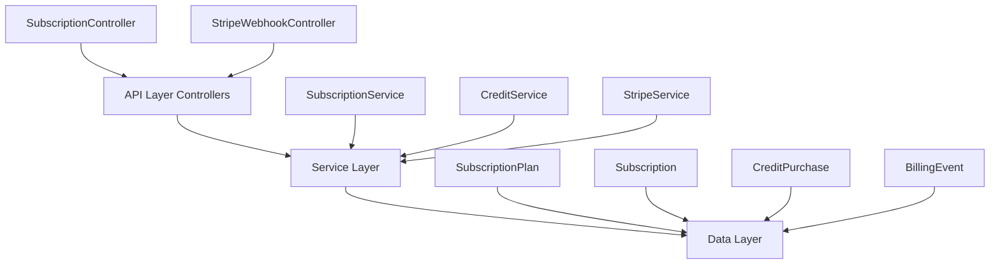

<Info>
**Status:** Active — fully implemented  
**Module Path:** `src/modules/subscription/`  
**Payment Gateway:** Stripe
</Info>

## Overview

The Subscription Module implements a **freemium SaaS billing system** for PropWise CRM. Every organization has a subscription tied to one of four plan tiers. The module handles:

- **Plan-based feature gating** — binary feature flags per tier
- **Resource limits** — caps on leads, contacts, deals, companies, and storage
- **Credit-based metering** — monthly AI and messaging allowances with purchasable top-ups
- **Dual seat types** — manager seats and agent seats with per-tier pricing; every user consumes a seat
- **Stripe integration** — checkout, subscription management, mid-cycle plan changes, webhooks, billing portal
- **Proration** — mid-cycle upgrades, downgrades, and seat changes are prorated to the day
- **Suspension flow** — 2-day grace period on payment failure, then org goes read-only

### Design Principles

<CardGroup cols={2}>
<Card title="Freemium Model" icon="gift">
Free plan with limited features; paid tiers unlock progressively
</Card>
<Card title="Per-Org Billing" icon="building">
Billing is per organization; developer portal is free
</Card>
<Card title="Dual Seat Types" icon="users">
Manager seats (Owner, Admin) and agent seats (Basic, custom roles); every user consumes a seat
</Card>
<Card title="Feature Flags Over Tier Checks" icon="flag">
Gating uses `@RequiresFeature('flag')` on plan JSONB — changing what a tier includes requires only a seeder update
</Card>
</CardGroup>

## Architecture

### High-Level Diagram



### Data Flow

<Tabs>
<Tab title="First-time Checkout">
<Steps>
<Step title="User clicks upgrade">
Frontend "Upgrade" button triggers POST /v1/subscriptions/checkout
</Step>
<Step title="Validation">
Rejects if org already has a Stripe subscription (use change-plan instead)
</Step>
<Step title="Checkout creation">
SubscriptionService.createCheckoutSession() → StripeService.createCheckoutSession()
</Step>
<Step title="Payment">
User pays on Stripe's hosted page
</Step>
<Step title="Webhook processing">
Stripe fires checkout.session.completed webhook → StripeWebhookController receives + verifies signature
</Step>
<Step title="Activation">
SubscriptionService.activateSubscription() → Subscription entity updated to ACTIVE
</Step>
</Steps>
</Tab>

<Tab title="Plan Change">
<Steps>
<Step title="Change request">
Frontend "Change Plan" button triggers POST /v1/subscriptions/change-plan
</Step>
<Step title="Validation">
Validates seat overflow (blocks if current users exceed new plan capacity)
</Step>
<Step title="Stripe update">
StripeService.swapSubscriptionPrice() with proration
</Step>
<Step title="Seat reconciliation">
Reconciles seat line items (old tier price → new tier price)
</Step>
<Step title="Local update">
Updates local Subscription entity and returns updated subscription immediately
</Step>
</Steps>
</Tab>

<Tab title="Payment Failure">
<Steps>
<Step title="Initial failure">
invoice.payment_failed → handleInvoicePaymentFailed() → status → PAST_DUE
</Step>
<Step title="Retry period">
Stripe retries for 2 days
</Step>
<Step title="Resolution">
Payment succeeds: invoice.paid → back to ACTIVE
OR
All retries fail: customer.subscription.updated (status: unpaid) → status → SUSPENDED
</Step>
<Step title="Read-only mode">
Org becomes read-only (SubscriptionActiveGuard blocks writes)
</Step>
</Steps>
</Tab>
</Tabs>

## Plan Tiers & Pricing

<Note>
All prices are in USD cents for Stripe compatibility.
</Note>

| Plan | Monthly | Annual | Manager Seats | Agent Seats | Extra Manager | Extra Agent |
|------|---------|--------|---------------|-------------|---------------|-------------|
| **Free** | $0 | $0 | 1 | 0 | — | — |
| **Starter** | $49 | $470.40 | 2 | 3 | $25/mo | $12/mo |
| **Professional** | $149 | $1,430.40 | 5 | 15 | $20/mo | $10/mo |
| **Business** | $399 | $3,830.40 | 10 | 40 | $18/mo | $8/mo |

### Resource Limits

<AccordionGroup>
<Accordion title="Data Limits">
| Resource | Free | Starter | Professional | Business |
|----------|------|---------|--------------|----------|
| Leads | 50 | 1,000 | 10,000 | Unlimited |
| Contacts | 50 | 1,000 | 10,000 | Unlimited |
| Deals | 20 | 500 | 5,000 | Unlimited |
| Companies | 10 | 200 | 2,000 | Unlimited |
| Storage | 500 MB | 5 GB | 25 GB | 100 GB |
</Accordion>

<Accordion title="Monthly Credits">
| Credit Type | Free | Starter | Professional | Business |
|-------------|------|---------|--------------|----------|
| AI credits | 20 | 200 | 1,000 | 5,000 |
| Messaging credits | 0 | 100 | 500 | 2,000 |
</Accordion>
</AccordionGroup>

## Feature Gating Model

Features are gated using three distinct mechanisms:

### Binary Feature Flags

Boolean flags stored in `SubscriptionPlan.features` (JSONB). Checked via `@RequiresFeature('flagName')` guard decorator or `SubscriptionService.checkFeature()`.

<CodeGroup>
```typescript Controller Usage
@Post('custom-pipeline')
@RequiresFeature('customPipelineStages')
async createCustomPipeline() {
  // Only available on paid plans
}
```

```typescript Service Usage
if (await this.subscriptionService.checkFeature(orgId, 'advancedAnalytics')) {
  // Generate advanced reports
}
```
</CodeGroup>

<AccordionGroup>
<Accordion title="Feature Flag Reference">
| Feature | Free | Starter | Pro | Business |
|---------|------|---------|-----|----------|
| `customPipelineStages` | — | ✓ | ✓ | ✓ |
| `distributionEngine` | — | — | ✓ | ✓ |
| `escalationEngine` | — | — | ✓ | ✓ |
| `advancedAnalytics` | — | — | ✓ | ✓ |
| `apiAccess` | — | — | ✓ | ✓ |
| `commissionTracking` | — | — | ✓ | ✓ |
| `teamsAndHierarchy` | — | — | ✓ | ✓ |
| `customRoles` | — | — | — | ✓ |
| `whiteLabel` | — | — | — | ✓ |
| `maxMessagingChannels` | 0 | 1 | 3 | Unlimited |
| `maxEmailIntegrations` | 0 | 1 | 3 | Unlimited |
| `auditLogRetentionDays` | 0 | 0 | 30 | Unlimited |
</Accordion>
</AccordionGroup>

### Credit-Based Features

Features available on the tier but with monthly budgets that reset each billing cycle. Tracked in `SubscriptionUsage`.

<Warning>
When credits are exhausted, the org can purchase one-time top-up packs. Consumption order: **monthly plan allowance first → purchased packs FIFO (oldest first)**.
</Warning>

### Add-on Packs

| Add-on | Behavior | Stripe Model |
|--------|----------|--------------|
| Storage pack (+10 GB) | Recurring, stacks | Subscription line item |
| AI credit pack (+500) | One-time, consumed | Payment intent |
| Messaging credit pack (+500) | One-time, consumed | Payment intent |

## Seat Management

### Seat Types

Every user in an organization consumes exactly one seat. The seat type is **derived from the user's RBAC role**.

<Tip>
There is no separate seat assignment — seat type is automatically determined by the user's role.
</Tip>

| Seat Type | Roles | Price Varies by Tier |
|-----------|-------|---------------------|
| **Manager** | Owner, Admin | ✓ |
| **Agent** | Basic, custom org roles | ✓ |

<CodeGroup>
```typescript Seat Type Mapping
const ROLE_SEAT_MAP: Record<string, SeatType> = {
  Owner: SeatType.MANAGER,
  Admin: SeatType.MANAGER,
};
// Any other role → SeatType.AGENT
```

```typescript Seat Counting
managerSeatsUsed = count of active users with Owner or Admin org role
agentSeatsUsed   = count of active users with any other org role
```
</CodeGroup>

### Enforcement Points

<Steps>
<Step title="Invitation Service">
Before creating an invitation, the role determines the seat type and availability is checked
</Step>
<Step title="Role Assignment Validation">
When changing a user's role (e.g., promoting Basic → Admin), checks that the target seat type has room
</Step>
</Steps>

### Proration on Seat Changes

Adding or removing seats mid-cycle uses `proration_behavior: 'create_prorations'`:

<Check>
**Adding a seat on April 15** (30-day month): prorated charge for 15 remaining days, billed on the next invoice
</Check>

<Check>
**Removing a seat on April 15**: prorated credit for 15 remaining days, applied to the next invoice
</Check>

## Credit System

### Consumption Flow

```typescript
SubscriptionService.consumeCredits(orgId, 'ai', 1)
  → CreditService.consumeCredits(subscription, AI, 1)
      1. Check monthly allowance: usage.aiCreditsUsed < usage.aiCreditsAllowed
      2. If insufficient, check purchased packs (FIFO order)
      3. Update usage counters
      4. Return success/failure + remaining balance
```

### Credit Types

<Tabs>
<Tab title="AI Credits">
Consumed by:
- AI-powered lead scoring
- Automated email generation
- Smart property recommendations
- Market analysis reports

**Top-up pack:** 500 credits for $25
</Tab>

<Tab title="Messaging Credits">
Consumed by:
- SMS campaigns
- Email broadcasts
- Push notifications
- WhatsApp messages

**Top-up pack:** 500 credits for $15
</Tab>
</Tabs>

## Entity Specifications

### SubscriptionPlan

<CodeGroup>
```typescript Entity Definition
@Entity()
export class SubscriptionPlan {
  @PrimaryKey()
  id!: string;

  @Property()
  name!: string; // 'Free', 'Starter', 'Professional', 'Business'

  @Property()
  monthlyPrice!: number; // USD cents

  @Property()
  annualPrice!: number; // USD cents (with discount)

  @Property({ type: 'json' })
  features!: Record<string, any>; // Feature flags + numeric limits

  @Property({ type: 'json' })
  limits!: {
    leads: number;
    contacts: number;
    deals: number;
    companies: number;
    storageBytes: number;
  };

  @Property({ type: 'json' })
  seats!: {
    managerSeats: number;
    agentSeats: number;
  };

  @Property({ type: 'json' })
  seatPricing!: {
    managerSeatPrice: number; // USD cents/month
    agentSeatPrice: number;   // USD cents/month
  };

  @Property({ type: 'json' })
  credits!: {
    aiCredits: number;
    messagingCredits: number;
  };
}
```
</CodeGroup>

### Subscription

<CodeGroup>
```typescript Entity Definition
@Entity()
export class Subscription {
  @PrimaryKey()
  id!: string;

  @ManyToOne()
  organization!: Organization;

  @ManyToOne()
  plan!: SubscriptionPlan;

  @Enum(() => SubscriptionStatus)
  status!: SubscriptionStatus; // ACTIVE, PAST_DUE, SUSPENDED

  @Property({ nullable: true })
  stripeSubscriptionId?: string; // null for Free plan

  @Property({ nullable: true })
  currentPeriodStart?: Date;

  @Property({ nullable: true })
  currentPeriodEnd?: Date;

  @Property({ default: 'monthly' })
  billingInterval!: 'monthly' | 'annual';

  @OneToOne(() => SubscriptionUsage, { nullable: true })
  usage?: SubscriptionUsage;

  @OneToMany(() => CreditPurchase, cp => cp.subscription)
  creditPurchases = new Collection<CreditPurchase>(this);
}
```
</CodeGroup>

### SubscriptionUsage

<CodeGroup>
```typescript Entity Definition
@Entity()
export class SubscriptionUsage {
  @PrimaryKey()
  id!: string;

  @OneToOne(() => Subscription)
  subscription!: Subscription;

  // Resource usage (cumulative)
  @Property({ default: 0 })
  leadsUsed!: number;

  @Property({ default: 0 })
  contactsUsed!: number;

  @Property({ default: 0 })
  dealsUsed!: number;

  @Property({ default: 0 })
  companiesUsed!: number;

  @Property({ default: 0 })
  storageBytesUsed!: number;

  // Credit usage (resets monthly)
  @Property({ default: 0 })
  aiCreditsUsed!: number;

  @Property({ default: 0 })
  messagingCreditsUsed!: number;

  @Property()
  lastResetDate!: Date; // When monthly counters were last reset
}
```
</CodeGroup>

## Stripe Integration

### Webhook Events

<AccordionGroup>
<Accordion title="Subscription Events">
| Event | Handler | Action |
|-------|---------|--------|
| `customer.subscription.created` | `handleSubscriptionCreated()` | Log subscription creation |
| `customer.subscription.updated` | `handleSubscriptionUpdated()` | Update status (SUSPENDED if unpaid) |
| `customer.subscription.deleted` | `handleSubscriptionDeleted()` | Downgrade to Free plan |
| `checkout.session.completed` | `handleCheckoutCompleted()` | Activate new subscription |
</Accordion>

<Accordion title="Invoice Events">
| Event | Handler | Action |
|-------|---------|--------|
| `invoice.paid` | `handleInvoicePaid()` | Keep status ACTIVE, update period |
| `invoice.payment_failed` | `handleInvoicePaymentFailed()` | Set status to PAST_DUE |
| `invoice.finalized` | `handleInvoiceFinalized()` | Log invoice details |
</Accordion>
</AccordionGroup>

### Error Handling

<Warning>
All webhook handlers are wrapped in try-catch blocks. Failed webhooks are logged but don't crash the application. Stripe will retry failed webhooks with exponential backoff.
</Warning>

<CodeGroup>
```typescript Webhook Signature Verification
@Post('/stripe')
async handleStripeWebhook(
  @Body() payload: any,
  @Headers('stripe-signature') signature: string,
) {
  let event: Stripe.Event;
  
  try {
    event = this.stripeService.constructEvent(payload, signature);
  } catch (err) {
    throw new BadRequestException('Invalid signature');
  }
  
  return this.stripeWebhookService.handleEvent(event);
}
```
</CodeGroup>

## API Endpoints

### Subscription Management

<CodeGroup>
```http GET /v1/subscriptions/current
# Get current subscription details
Authorization: Bearer {token}

Response: {
  "id": "sub_123",
  "plan": {
    "name": "Professional",
    "monthlyPrice": 14900
  },
  "status": "ACTIVE",
  "usage": {
    "leadsUsed": 150,
    "aiCreditsUsed": 45
  },
  "seatsUsed": {
    "manager": 3,
    "agent": 8
  }
}
```

```http POST /v1/subscriptions/checkout
# Create checkout session for Free → Paid upgrade
Authorization: Bearer {token}
Content-Type: application/json

{
  "planId": "plan_starter",
  "billingInterval": "monthly",
  "successUrl": "https://app.propwise.com/billing/success",
  "cancelUrl": "https://app.propwise.com/billing/cancel"
}

Response: {
  "checkoutUrl": "https://checkout.stripe.com/pay/cs_123"
}
```

```http POST /v1/subscriptions/change-plan
# Change between paid tiers
Authorization: Bearer {token}
Content-Type: application/json

{
  "newPlanId": "plan_professional",
  "billingInterval": "annual"
}

Response: {
  "subscription": { /* updated subscription */ }
}
```
</CodeGroup>

### Credit Management

<CodeGroup>
```http GET /v1/subscriptions/credits/balance
# Get credit balances
Authorization: Bearer {token}

Response: {
  "ai": {
    "monthly": { "used": 45, "allowed": 200 },
    "purchased": { "available": 150, "total": 500 }
  },
  "messaging": {
    "monthly": { "used": 12, "allowed": 100 },
    "purchased": { "available": 0, "total": 0 }
  }
}
```

```http POST /v1/subscriptions/credits/purchase
# Purchase credit top-up pack
Authorization: Bearer {token}
Content-Type: application/json

{
  "creditType": "ai",
  "quantity": 1
}

Response: {
  "paymentIntentClientSecret": "pi_123_secret_456"
}
```
</CodeGroup>

## Guards & Decorators

### Feature Gate Decorator

<CodeGroup>
```typescript @RequiresFeature Usage
@Post('/advanced-report')
@RequiresFeature('advancedAnalytics')
async generateAdvancedReport(@CurrentOrg() org: Organization) {
  // Only accessible on Pro+ plans
  return this.reportsService.generateAdvanced(org.id);
}
```

```typescript Guard Implementation
@Injectable()
export class FeatureGuard implements CanActivate {
  constructor(
    private reflector: Reflector,
    private subscriptionService: SubscriptionService,
  ) {}

  async canActivate(context: ExecutionContext): Promise<boolean> {
    const feature = this.reflector.get<string>('feature', context.getHandler());
    if (!feature) return true;

    const request = context.switchToHttp().getRequest();
    const orgId = request.user?.organizationId;
    
    if (!orgId) return false;

    return this.subscriptionService.checkFeature(orgId, feature);
  }
}
```
</CodeGroup>

### Subscription Active Guard

<CodeGroup>
```typescript Guard Usage
@UseGuards(SubscriptionActiveGuard)
@Post('/create-deal')
async createDeal(@Body() dealData: CreateDealDto) {
  // Blocked if subscription is SUSPENDED
}
```

```typescript Guard Implementation
@Injectable()
export class SubscriptionActiveGuard implements CanActivate {
  async canActivate(context: ExecutionContext): Promise<boolean> {
    const request = context.switchToHttp().getRequest();
    const orgId = request.user?.organizationId;
    
    const subscription = await this.subscriptionService.findByOrgId(orgId);
    
    return subscription?.status === SubscriptionStatus.ACTIVE || 
           subscription?.plan.name === 'Free';
  }
}
```
</CodeGroup>

## Environment Configuration

<CodeGroup>
```env Required Variables
# Stripe Configuration
STRIPE_SECRET_KEY=sk_test_...
STRIPE_WEBHOOK_SECRET=whsec_...
STRIPE_PUBLISHABLE_KEY=pk_test_...

# Plan Price IDs (from Stripe Dashboard)
STRIPE_STARTER_MONTHLY_PRICE=price_1234
STRIPE_STARTER_ANNUAL_PRICE=price_5678
STRIPE_PRO_MONTHLY_PRICE=price_9012
STRIPE_PRO_ANNUAL_PRICE=price_3456
STRIPE_BUSINESS_MONTHLY_PRICE=price_7890
STRIPE_BUSINESS_ANNUAL_PRICE=price_1234

# Seat Price IDs
STRIPE_STARTER_MANAGER_SEAT_PRICE=price_abcd
STRIPE_STARTER_AGENT_SEAT_PRICE=price_efgh
# ... etc for each tier

# Frontend URLs
FRONTEND_BILLING_SUCCESS_URL=https://app.propwise.com/billing/success
FRONTEND_BILLING_CANCEL_URL=https://app.propwise.com/billing/cancel
FRONTEND_CUSTOMER_PORTAL_RETURN_URL=https://app.propwise.com/settings/billing
```
</CodeGroup>

<Warning>
If `STRIPE_SECRET_KEY` is not set, billing features are unavailable but the app still starts in development mode.
</Warning>

## Module Structure

```
src/modules/subscription/
├── controllers/
│   ├── subscription.controller.ts       # Main subscription endpoints
│   └── stripe-webhook.controller.ts     # Webhook handling
├── services/
│   ├── subscription.service.ts          # Core subscription logic
│   ├── credit.service.ts               # Credit consumption/balance
│   ├── stripe.service.ts               # Stripe SDK wrapper
│   └── stripe-webhook.service.ts       # Webhook event processing
├── entities/
│   ├── subscription-plan.entity.ts     # Plan definitions
│   ├── subscription.entity.ts          # Org subscriptions
│   ├── subscription-usage.entity.ts    # Usage tracking
│   ├── credit-purchase.entity.ts       # Credit top-ups
│   └── billing-event.entity.ts         # Webhook audit log
├── guards/
│   ├── feature.guard.ts                # @RequiresFeature
│   ├── subscription-active.guard.ts    # Prevents suspended org writes
│   └── resource-limit.guard.ts         # Checks entity count limits
├── decorators/
│   └── requires-feature.decorator.ts   # @RequiresFeature('flag')
├── seeders/
│   └── subscription-plan.seeder.ts     # Populates plan data
└── subscription.module.ts              # Module definition
```

## Integration with Other Modules

<CardGroup cols={2}>
<Card title="RBAC Integration" icon="shield">
- Seat type derived from user roles
- Role changes trigger seat recalculation
- Custom roles require Business plan
</Card>

<Card title="Organization Module" icon="building-office">
- Every org has exactly one subscription
- Stripe customer ID stored on Organization
- Billing portal access through org settings
</Card>

<Card title="Lead Management" icon="user-group">
- Lead creation checks resource limits
- AI features consume credits
- Lead scoring requires advanced analytics
</Card>

<Card title="Communication Module" icon="envelope">
- SMS/email campaigns consume messaging credits
- Channel limits enforced by plan tier
- Integration limits vary by plan
</Card>
</CardGroup>

<Note>
The subscription module is designed to be the central enforcement point for all plan-based restrictions across the application.
</Note>