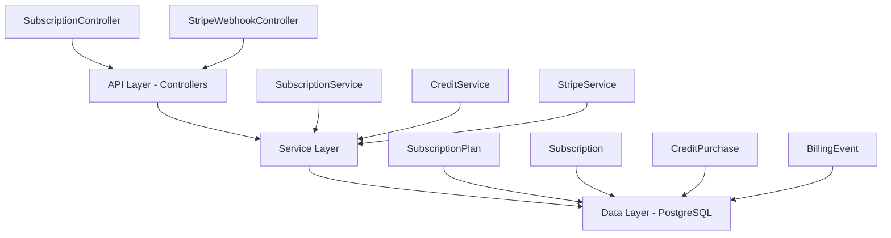

## Overview

The Subscription Module implements a **freemium SaaS billing system** for PropWise CRM. Every organization has a subscription tied to one of four plan tiers. The module handles:

- **Plan-based feature gating** — binary feature flags per tier
- **Resource limits** — caps on leads, contacts, deals, companies, and storage
- **Credit-based metering** — monthly AI and messaging allowances with purchasable top-ups
- **Dual seat types** — manager seats and agent seats with per-tier pricing; every user consumes a seat
- **Stripe integration** — checkout, subscription management, mid-cycle plan changes, webhooks, billing portal
- **Proration** — mid-cycle upgrades, downgrades, and seat changes are prorated to the day
- **Suspension flow** — 2-day grace period on payment failure, then org goes read-only

<Note>
**Module Path:** `src/modules/subscription/`  
**Payment Gateway:** Stripe  
**Status:** Active — fully implemented
</Note>

### Design Principles

<CardGroup cols={2}>
  <Card title="Freemium Model" icon="gift">
    Free plan with limited features; paid tiers unlock progressively
  </Card>
  <Card title="Per-Org Billing" icon="building">
    Billing is per organization; developer portal is free
  </Card>
  <Card title="Dual Seat Types" icon="users">
    Manager seats (Owner, Admin) and agent seats (Basic, custom roles)
  </Card>
  <Card title="Feature Flags" icon="flag">
    Gating uses `@RequiresFeature('flag')` on plan JSONB
  </Card>
</CardGroup>

## Architecture

### High-Level System Design



### Data Flow

<Tabs>
  <Tab title="First-time Checkout">
    **Free → Paid Tier Flow:**

    <Steps>
      <Step title="User clicks upgrade">
        Frontend sends `POST /v1/subscriptions/checkout`
      </Step>
      <Step title="Checkout session creation">
        SubscriptionService validates org doesn't have existing Stripe subscription
      </Step>
      <Step title="Stripe checkout">
        User completes payment on Stripe's hosted page
      </Step>
      <Step title="Webhook activation">
        Stripe fires `checkout.session.completed` webhook to activate subscription
      </Step>
    </Steps>
  </Tab>

  <Tab title="Plan Changes">
    **Paid → Different Paid Tier:**

    <Steps>
      <Step title="Plan change request">
        Frontend sends `POST /v1/subscriptions/change-plan`
      </Step>
      <Step title="Seat validation">
        System checks if current users exceed new plan capacity
      </Step>
      <Step title="Prorated swap">
        Stripe subscription price swapped with proration
      </Step>
      <Step title="Seat reconciliation">
        Old tier prices updated to new tier prices
      </Step>
    </Steps>
  </Tab>

  <Tab title="Payment Failure">
    **Renewal / Payment Issues:**

    <Steps>
      <Step title="Payment attempt">
        Stripe attempts to charge renewal invoice
      </Step>
      <Step title="Grace period">
        On failure, subscription enters `PAST_DUE` status for 2 days
      </Step>
      <Step title="Retry or suspend">
        Payment succeeds → ACTIVE, or all retries fail → SUSPENDED (read-only)
      </Step>
    </Steps>
  </Tab>
</Tabs>

## Plan Tiers & Pricing

### Tier Overview

| Plan | Monthly Price | Annual Price | Manager Seats | Agent Seats |
|------|---------------|--------------|---------------|-------------|
| **Free** | $0 | $0 | 1 included | 0 included |
| **Starter** | $49 | $470.40 | 2 included | 3 included |
| **Professional** | $149 | $1,430.40 | 5 included | 15 included |
| **Business** | $399 | $3,830.40 | 10 included | 40 included |

<Info>
Annual plans include approximately 20% discount compared to monthly billing.
</Info>

### Additional Seat Pricing

| Seat Type | Starter | Professional | Business |
|-----------|---------|--------------|----------|
| Extra Manager | $25/mo | $20/mo | $18/mo |
| Extra Agent | $12/mo | $10/mo | $8/mo |

### Resource Limits

<AccordionGroup>
  <Accordion title="Storage & Data Limits">
    | Resource | Free | Starter | Professional | Business |
    |----------|------|---------|--------------|----------|
    | Leads | 50 | 1,000 | 10,000 | Unlimited |
    | Contacts | 50 | 1,000 | 10,000 | Unlimited |
    | Deals | 20 | 500 | 5,000 | Unlimited |
    | Companies | 10 | 200 | 2,000 | Unlimited |
    | Storage | 500 MB | 5 GB | 25 GB | 100 GB |
  </Accordion>

  <Accordion title="Monthly Credits">
    | Credit Type | Free | Starter | Professional | Business |
    |-------------|------|---------|--------------|----------|
    | AI Credits | 20 | 200 | 1,000 | 5,000 |
    | Messaging Credits | 0 | 100 | 500 | 2,000 |
  </Accordion>
</AccordionGroup>

## Feature Gating Model

The system uses three distinct gating mechanisms:

### Type 1: Binary Feature Flags

Boolean flags stored in `SubscriptionPlan.features` (JSONB). Checked via `@RequiresFeature('flagName')` decorator.

<CodeGroup>
```typescript Guard Decorator
@Get('advanced-analytics')
@RequiresFeature('advancedAnalytics')
async getAdvancedAnalytics() {
  // Only available on Pro and Business plans
}
```

```typescript Service Check
async checkFeatureAccess(orgId: string, feature: string) {
  return this.subscriptionService.checkFeature(orgId, feature);
}
```
</CodeGroup>

### Feature Flag Matrix

| Feature | Free | Starter | Pro | Business |
|---------|------|---------|-----|----------|
| Custom Pipeline Stages | ❌ | ✅ | ✅ | ✅ |
| Distribution Engine | ❌ | ❌ | ✅ | ✅ |
| Escalation Engine | ❌ | ❌ | ✅ | ✅ |
| Advanced Analytics | ❌ | ❌ | ✅ | ✅ |
| API Access | ❌ | ❌ | ✅ | ✅ |
| Commission Tracking | ❌ | ❌ | ✅ | ✅ |
| Teams & Hierarchy | ❌ | ❌ | ✅ | ✅ |
| Custom Roles | ❌ | ❌ | ❌ | ✅ |
| White Label | ❌ | ❌ | ❌ | ✅ |

### Type 2: Credit-Based Features

Features with monthly allowances that can be topped up with purchased packs.

<Warning>
Consumption order: **Monthly plan allowance first → Purchased packs FIFO (oldest first)**
</Warning>

### Type 3: Add-on Packs

| Add-on | Type | Stripe Model |
|--------|------|--------------|
| Storage pack (+10 GB) | Recurring, stackable | Subscription line item |
| AI credit pack (+500) | One-time consumption | Payment intent |
| Messaging credit pack (+500) | One-time consumption | Payment intent |

## Seat Management

### Seat Type Mapping

Every user consumes exactly one seat based on their RBAC role:

<Tabs>
  <Tab title="Manager Seats">
    **Roles that consume manager seats:**
    - Owner
    - Admin
    
    Higher pricing tier, includes administrative privileges.
  </Tab>

  <Tab title="Agent Seats">
    **Roles that consume agent seats:**
    - Basic
    - Custom organization roles
    
    Lower pricing tier, standard user functionality.
  </Tab>
</Tabs>

<Note>
Seat type is **derived from RBAC roles** — there's no separate seat assignment table.
</Note>

### Seat Counting Logic

Seats are computed on-demand from active `UserOrgRole` records:

```typescript
// Seat counting implementation
const managerSeatsUsed = await this.userRepository.count({
  organization: orgId,
  role: { name: { $in: ['Owner', 'Admin'] } },
  deletedAt: null
});

const agentSeatsUsed = await this.userRepository.count({
  organization: orgId,
  role: { name: { $nin: ['Owner', 'Admin'] } },
  deletedAt: null
});
```

### Enforcement Points

<Steps>
  <Step title="Invitation Creation">
    `invitation.service.ts` checks seat availability before creating invitations
  </Step>
  <Step title="Role Assignment">
    `role-assignment-validation.service.ts` validates seat capacity when changing user roles
  </Step>
  <Step title="Proration Handling">
    Mid-cycle seat changes use Stripe's proration system for fair billing
  </Step>
</Steps>

## Credit System

### Consumption Flow

<CodeGroup>
```typescript Service Call
// Consume AI credits
await this.subscriptionService.consumeCredits(
  organizationId, 
  'ai', 
  creditAmount
);
```

```typescript Internal Logic
async consumeCredits(subscription: Subscription, type: CreditType, amount: number) {
  // 1. Check monthly allowance first
  if (usage.aiCreditsUsed < usage.aiCreditsAllowed) {
    const monthlyAvailable = usage.aiCreditsAllowed - usage.aiCreditsUsed;
    const fromMonthly = Math.min(amount, monthlyAvailable);
    usage.aiCreditsUsed += fromMonthly;
    amount -= fromMonthly;
  }
  
  // 2. If remaining, consume from purchased packs (FIFO)
  if (amount > 0) {
    await this.consumeFromPurchasedPacks(subscription.id, type, amount);
  }
}
```
</CodeGroup>

### Credit Balance Queries

<Tip>
Credits are calculated as: **Monthly allowance - Used + Purchased pack balance**
</Tip>

## Entity Specifications

### Core Entities

<AccordionGroup>
  <Accordion title="SubscriptionPlan Entity">
    ```typescript
    @Entity()
    export class SubscriptionPlan {
      @PrimaryKey()
      id: number;

      @Property()
      name: string; // 'Free', 'Starter', 'Professional', 'Business'

      @Property()
      priceMonthly: number; // USD cents

      @Property()
      priceAnnual: number; // USD cents

      @Property({ type: 'jsonb' })
      features: Record<string, any>; // Feature flags

      @Property({ type: 'jsonb' })
      limits: {
        leads: number;
        contacts: number;
        deals: number;
        companies: number;
        storageBytes: number;
      };

      @Property({ type: 'jsonb' })
      credits: {
        ai: number;
        messaging: number;
      };

      @Property({ type: 'jsonb' })
      seats: {
        manager: { included: number; price: number };
        agent: { included: number; price: number };
      };
    }
    ```
  </Accordion>

  <Accordion title="Subscription Entity">
    ```typescript
    @Entity()
    export class Subscription {
      @PrimaryKey()
      id: number;

      @ManyToOne(() => Organization)
      organization: Organization;

      @ManyToOne(() => SubscriptionPlan)
      plan: SubscriptionPlan;

      @Enum(() => SubscriptionStatus)
      status: SubscriptionStatus;

      @Property()
      stripeSubscriptionId?: string;

      @Property()
      currentPeriodStart?: Date;

      @Property()
      currentPeriodEnd?: Date;

      @Property()
      billingCycle: 'monthly' | 'annual';

      @OneToOne(() => SubscriptionUsage, usage => usage.subscription)
      usage: SubscriptionUsage;
    }
    ```
  </Accordion>

  <Accordion title="CreditPurchase Entity">
    ```typescript
    @Entity()
    export class CreditPurchase {
      @PrimaryKey()
      id: number;

      @ManyToOne(() => Subscription)
      subscription: Subscription;

      @Enum(() => CreditType)
      type: CreditType; // AI or MESSAGING

      @Property()
      amount: number; // Credits purchased

      @Property()
      consumed: number = 0; // Credits used from this pack

      @Property()
      purchaseDate: Date;

      @Property()
      stripePaymentIntentId?: string;
    }
    ```
  </Accordion>
</AccordionGroup>

## Stripe Integration

### Webhook Handling

<Warning>
All webhooks are idempotent — events are logged in `BillingEvent` with unique `stripeEventId` to prevent duplicate processing.
</Warning>

<CodeGroup>
```typescript Webhook Controller
@Controller('webhooks/stripe')
export class StripeWebhookController {
  @Post()
  async handleWebhook(
    @Req() req: Request,
    @Headers('stripe-signature') signature: string
  ) {
    const event = this.stripeService.validateWebhook(req.body, signature);
    
    switch (event.type) {
      case 'checkout.session.completed':
        return this.handleCheckoutCompleted(event);
      case 'invoice.paid':
        return this.handleInvoicePaid(event);
      case 'invoice.payment_failed':
        return this.handleInvoicePaymentFailed(event);
      case 'customer.subscription.updated':
        return this.handleSubscriptionUpdated(event);
    }
  }
}
```

```typescript Event Processing
async handleCheckoutCompleted(event: Stripe.Event) {
  const session = event.data.object as Stripe.Checkout.Session;
  
  // Prevent duplicate processing
  const existingEvent = await this.billingEventRepository.findOne({
    stripeEventId: event.id
  });
  
  if (existingEvent) return { received: true };
  
  // Activate subscription
  await this.subscriptionService.activateSubscription(
    session.subscription as string,
    session.customer as string
  );
  
  // Log event
  await this.billingEventRepository.create({
    stripeEventId: event.id,
    eventType: event.type,
    processedAt: new Date()
  }).persist();
}
```
</CodeGroup>

### Subscription Lifecycle

<Tabs>
  <Tab title="Creation Flow">
    <Steps>
      <Step title="Checkout Session">
        Create Stripe checkout session with line items for plan + seats
      </Step>
      <Step title="Payment Completion">
        Stripe webhook activates local subscription entity
      </Step>
      <Step title="Usage Initialization">
        Create `SubscriptionUsage` record for current billing period
      </Step>
    </Steps>
  </Tab>

  <Tab title="Plan Changes">
    <Steps>
      <Step title="Validation">
        Check seat overflow - block if current users exceed new plan capacity
      </Step>
      <Step title="Price Swap">
        Use Stripe's subscription modification with proration
      </Step>
      <Step title="Seat Reconciliation">
        Update seat line items to new tier pricing
      </Step>
    </Steps>
  </Tab>

  <Tab title="Suspension Flow">
    <Steps>
      <Step title="Payment Failure">
        Invoice payment fails, subscription enters `PAST_DUE`
      </Step>
      <Step title="Grace Period">
        2-day retry period with continued access
      </Step>
      <Step title="Suspension">
        All retries fail, subscription moves to `SUSPENDED` (read-only)
      </Step>
    </Steps>
  </Tab>
</Tabs>

## API Endpoints

### Subscription Management

<CodeGroup>
```typescript GET /v1/subscriptions/current
// Get current organization subscription
@Get('current')
@UseGuards(JwtAuthGuard, OrgMemberGuard)
async getCurrentSubscription(@Req() req: AuthenticatedRequest) {
  return this.subscriptionService.getSubscription(req.user.organizationId);
}
```

```typescript POST /v1/subscriptions/checkout
// Create checkout session for upgrade
@Post('checkout')
@UseGuards(JwtAuthGuard, OrgAdminGuard)
async createCheckout(
  @Req() req: AuthenticatedRequest,
  @Body() body: CheckoutDto
) {
  return this.subscriptionService.createCheckoutSession(
    req.user.organizationId,
    body.planId,
    body.billingCycle
  );
}
```

```typescript POST /v1/subscriptions/change-plan
// Change between paid plans
@Post('change-plan')
@UseGuards(JwtAuthGuard, OrgAdminGuard)
async changePlan(
  @Req() req: AuthenticatedRequest,
  @Body() body: ChangePlanDto
) {
  return this.subscriptionService.changePlan(
    req.user.organizationId,
    body.planId
  );
}
```
</CodeGroup>

### Credit Management

<CodeGroup>
```typescript GET /v1/subscriptions/credits/balance
// Get credit balance
@Get('credits/balance')
@UseGuards(JwtAuthGuard, OrgMemberGuard)
async getCreditBalance(@Req() req: AuthenticatedRequest) {
  return this.creditService.getBalance(req.user.organizationId);
}
```

```typescript POST /v1/subscriptions/credits/purchase
// Purchase credit pack
@Post('credits/purchase')
@UseGuards(JwtAuthGuard, OrgAdminGuard)
async purchaseCredits(
  @Req() req: AuthenticatedRequest,
  @Body() body: CreditPurchaseDto
) {
  return this.creditService.purchasePack(
    req.user.organizationId,
    body.type,
    body.amount
  );
}
```
</CodeGroup>

## Guards & Decorators

### Feature Gating

<CodeGroup>
```typescript @RequiresFeature Decorator
@Get('custom-pipelines')
@RequiresFeature('customPipelineStages')
@UseGuards(JwtAuthGuard, SubscriptionFeatureGuard)
async getCustomPipelines() {
  // Only available on Starter+ plans
}
```

```typescript Subscription Status Guard
@Post('create-deal')
@UseGuards(JwtAuthGuard, SubscriptionActiveGuard)
async createDeal() {
  // Blocked if subscription is SUSPENDED
}
```
</CodeGroup>

### Implementation

<AccordionGroup>
  <Accordion title="SubscriptionFeatureGuard">
    ```typescript
    @Injectable()
    export class SubscriptionFeatureGuard implements CanActivate {
      async canActivate(context: ExecutionContext): Promise<boolean> {
        const feature = this.reflector.get<string>(
          REQUIRES_FEATURE_KEY,
          context.getHandler()
        );
        
        if (!feature) return true;
        
        const request = context.switchToHttp().getRequest();
        const orgId = request.user.organizationId;
        
        return this.subscriptionService.checkFeature(orgId, feature);
      }
    }
    ```
  </Accordion>

  <Accordion title="SubscriptionActiveGuard">
    ```typescript
    @Injectable()
    export class SubscriptionActiveGuard implements CanActivate {
      async canActivate(context: ExecutionContext): Promise<boolean> {
        const request = context.switchToHttp().getRequest();
        const orgId = request.user.organizationId;
        
        const subscription = await this.subscriptionService.getSubscription(orgId);
        
        return subscription.status === SubscriptionStatus.ACTIVE ||
               subscription.status === SubscriptionStatus.PAST_DUE;
      }
    }
    ```
  </Accordion>
</AccordionGroup>

## Environment Configuration

<CodeGroup>
```env Required Variables
# Stripe Configuration
STRIPE_SECRET_KEY=sk_test_...
STRIPE_WEBHOOK_SECRET=whsec_...

# Stripe Price IDs (from Stripe Dashboard)
STRIPE_PRICE_STARTER_MONTHLY=price_...
STRIPE_PRICE_STARTER_ANNUAL=price_...
STRIPE_PRICE_PRO_MONTHLY=price_...
STRIPE_PRICE_PRO_ANNUAL=price_...
STRIPE_PRICE_BUSINESS_MONTHLY=price_...
STRIPE_PRICE_BUSINESS_ANNUAL=price_...

# Seat Price IDs
STRIPE_PRICE_MANAGER_SEAT_STARTER=price_...
STRIPE_PRICE_AGENT_SEAT_STARTER=price_...
# ... (additional seat prices for each tier)

# Add-on Price IDs
STRIPE_PRICE_STORAGE_PACK=price_...
STRIPE_PRICE_AI_CREDIT_PACK=price_...
STRIPE_PRICE_MESSAGING_CREDIT_PACK=price_...
```

```typescript Configuration Validation
@Injectable()
export class StripeConfigService {
  constructor(private configService: ConfigService) {
    this.validateConfig();
  }

  private validateConfig() {
    const required = [
      'STRIPE_SECRET_KEY',
      'STRIPE_WEBHOOK_SECRET',
      'STRIPE_PRICE_STARTER_MONTHLY',
      // ... other required price IDs
    ];

    const missing = required.filter(key => !this.configService.get(key));
    
    if (missing.length > 0) {
      throw new Error(`Missing Stripe configuration: ${missing.join(', ')}`);
    }
  }
}
```
</CodeGroup>

<Warning>
If `STRIPE_SECRET_KEY` is not set, billing features are unavailable but the app will still start for development purposes.
</Warning>

## Module Structure

```
src/modules/subscription/
├── controllers/
│   ├── subscription.controller.ts      # Main subscription API
│   └── stripe-webhook.controller.ts    # Webhook handling
├── services/
│   ├── subscription.service.ts         # Core business logic
│   ├── credit.service.ts              # Credit management
│   └── stripe.service.ts              # Stripe SDK wrapper
├── entities/
│   ├── subscription-plan.entity.ts
│   ├── subscription.entity.ts
│   ├── subscription-usage.entity.ts
│   ├── credit-purchase.entity.ts
│   └── billing-event.entity.ts
├── guards/
│   ├── subscription-feature.guard.ts   # Feature gating
│   └── subscription-active.guard.ts    # Status checking
├── decorators/
│   └── requires-feature.decorator.ts   # @RequiresFeature()
├── dto/
│   ├── checkout.dto.ts
│   ├── change-plan.dto.ts
│   └── credit-purchase.dto.ts
├── seeders/
│   └── subscription-plan.seeder.ts     # Plan data seeding
├── types/
│   ├── subscription.types.ts
│   └── credit.types.ts
└── subscription.module.ts
```

## Integration Points

### With Other Modules

<CardGroup cols={2}>
  <Card title="User Management" icon="user-group">
    **Integration:** Seat counting from active `UserOrgRole` records
    
    **Enforcement:** Invitation and role assignment validation
  </Card>
  
  <Card title="CRM Entities" icon="database">
    **Integration:** Resource limit enforcement in service layers
    
    **Example:** Lead creation blocked when limit reached
  </Card>
  
  <Card title="AI Services" icon="brain">
    **Integration:** Credit consumption before AI operations
    
    **Fallback:** Graceful degradation when credits exhausted
  </Card>
  
  <Card title="Messaging" icon="message">
    **Integration:** Channel limits and messaging credit consumption
    
    **Gating:** Feature flags control availability
  </Card>
</CardGroup>

<Check>
The subscription module is fully integrated and provides comprehensive billing management for the PropWise CRM platform.
</Check>