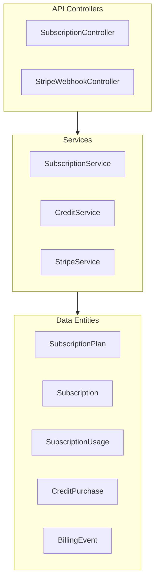
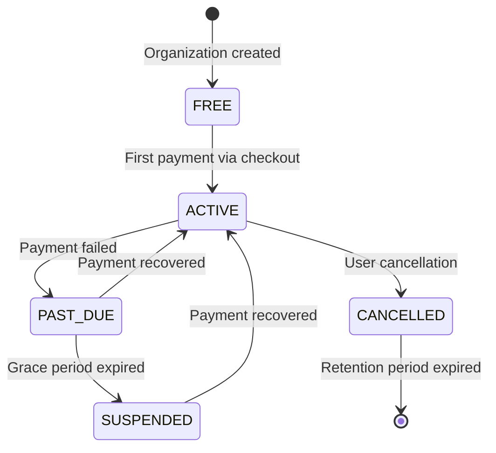

# Subscription Module Specification v6

<Note>
**Status:** Active — fully implemented  
**Module Path:** `src/modules/subscription/`  
**Payment Gateway:** Stripe
</Note>

## Overview

The Subscription Module implements a **freemium SaaS billing system** for PropWise CRM. Every organization has a subscription tied to one of four plan tiers. The module handles:

- **Plan-based feature gating** — binary feature flags per tier
- **Resource limits** — caps on leads, contacts, deals, companies, and storage
- **Credit-based metering** — monthly AI and messaging allowances with purchasable top-ups
- **Dual seat types** — manager seats and agent seats with per-tier pricing; every user consumes a seat
- **Stripe integration** — checkout, subscription management, mid-cycle plan changes, webhooks, billing portal
- **Proration** — mid-cycle upgrades, downgrades, and seat changes are prorated to the day
- **Suspension flow** — 2-day grace period on payment failure, then org goes read-only

### Design Principles

<AccordionGroup>
<Accordion title="Core Design Decisions">
| Principle | Decision |
|---|---|
| Freemium model | Free plan with limited features; paid tiers unlock progressively |
| Per-org billing | Billing is per organization; developer portal is free |
| Dual seat types | Manager seats (Owner, Admin) and agent seats (Basic, custom roles); every user consumes a seat |
| Seat type derived from role | No explicit seat assignment — seat type is automatically determined by the user's RBAC role |
| Feature flags over tier checks | Gating uses `@RequiresFeature('flag')` on plan JSONB — changing what a tier includes requires only a seeder update, not code changes |
| Service-layer limit enforcement | Resource limits and credit consumption are checked in service methods, not guards, because they need entity counts |
| Stripe as source of truth for payments | Webhook-driven lifecycle: the app reacts to Stripe events rather than polling |
| Prorated plan changes | All mid-cycle changes (upgrade, downgrade, add/remove seats) use `proration_behavior: 'create_prorations'` — charges are fair to the day |
| Checkout vs. change-plan separation | `POST /checkout` is for first-time subscription (Free → Paid); `POST /change-plan` is for switching between paid tiers |
| Idempotent webhooks | Every Stripe event is logged in `BillingEvent` with a unique `stripeEventId` to prevent duplicate processing |
| Graceful degradation | If `app.stripe.secretKey` (`STRIPE_SECRET_KEY`) is not set, billing features are unavailable but the app still starts |
</Accordion>
</AccordionGroup>

## Architecture

### High-Level System Design



### Data Flow Examples

<Tabs>
<Tab title="First-time Checkout">
<Steps>
<Step title="User clicks upgrade button">
Frontend sends `POST /v1/subscriptions/checkout`
</Step>
<Step title="Validation check">
System rejects if org already has a Stripe subscription (use change-plan instead)
</Step>
<Step title="Create checkout session">
`SubscriptionService.createCheckoutSession()` → `StripeService.createCheckoutSession()`
</Step>
<Step title="Payment processing">
User pays on Stripe's hosted page, Stripe fires `checkout.session.completed` webhook
</Step>
<Step title="Activation">
`StripeWebhookController` receives webhook → `SubscriptionService.activateSubscription()` → Subscription entity updated to ACTIVE
</Step>
</Steps>
</Tab>

<Tab title="Plan Change">
<Steps>
<Step title="Initiate change">
Frontend sends `POST /v1/subscriptions/change-plan`
</Step>
<Step title="Validate seats">
System validates seat overflow (blocks if current users exceed new plan capacity)
</Step>
<Step title="Update Stripe">
`StripeService.swapSubscriptionPrice()` with proration enabled
</Step>
<Step title="Reconcile seats">
Reconciles seat line items (old tier price → new tier price)
</Step>
<Step title="Update local data">
Updates local Subscription entity and returns updated subscription immediately
</Step>
</Steps>
</Tab>

<Tab title="Payment Failure">
<Steps>
<Step title="Initial failure">
Stripe invoice payment fails → `invoice.payment_failed` webhook → status changes to PAST_DUE
</Step>
<Step title="Grace period">
Stripe retries for 2 days automatically
</Step>
<Step title="Resolution outcomes">
- **Payment succeeds**: `invoice.paid` webhook → back to ACTIVE status
- **All retries fail**: `customer.subscription.updated` (status: unpaid) → status changes to SUSPENDED
</Step>
<Step title="Read-only mode">
Suspended orgs become read-only (SubscriptionActiveGuard blocks writes)
</Step>
</Steps>
</Tab>
</Tabs>

## Plan Tiers & Pricing

### Subscription Tiers

<CardGroup cols={2}>
<Card title="Free Plan" icon="circle" color="#gray">
- **Monthly**: $0
- **Annual**: $0
- **Manager seats**: 1 included
- **Agent seats**: 0 included
- Perfect for testing and small teams
</Card>

<Card title="Starter Plan" icon="rocket" color="#blue">
- **Monthly**: $49
- **Annual**: $470.40 (~20% off)
- **Manager seats**: 2 included
- **Agent seats**: 3 included
- Great for growing teams
</Card>

<Card title="Professional Plan" icon="star" color="#green">
- **Monthly**: $149
- **Annual**: $1,430.40
- **Manager seats**: 5 included
- **Agent seats**: 15 included
- Advanced features included
</Card>

<Card title="Business Plan" icon="building" color="#purple">
- **Monthly**: $399
- **Annual**: $3,830.40
- **Manager seats**: 10 included
- **Agent seats**: 40 included
- Enterprise-grade capabilities
</Card>
</CardGroup>

### Additional Seat Pricing

| Plan | Extra Manager Seat | Extra Agent Seat |
|------|-------------------|------------------|
| Free | — | — |
| Starter | $25/mo | $12/mo |
| Professional | $20/mo | $10/mo |
| Business | $18/mo | $8/mo |

### Resource Limits

<AccordionGroup>
<Accordion title="Data Storage Limits">
| Resource | Free | Starter | Professional | Business |
|----------|------|---------|--------------|----------|
| Leads | 50 | 1,000 | 10,000 | Unlimited |
| Contacts | 50 | 1,000 | 10,000 | Unlimited |
| Deals | 20 | 500 | 5,000 | Unlimited |
| Companies | 10 | 200 | 2,000 | Unlimited |
| Storage | 500 MB | 5 GB | 25 GB | 100 GB |
</Accordion>

<Accordion title="Monthly Credit Allowances">
| Credit Type | Free | Starter | Professional | Business |
|-------------|------|---------|--------------|----------|
| AI credits | 20 | 200 | 1,000 | 5,000 |
| Messaging credits | 0 | 100 | 500 | 2,000 |
</Accordion>
</AccordionGroup>

## Feature Gating Model

The system uses three distinct gating mechanisms:

### Type 1: Binary Feature Flags

<Info>
Boolean flags stored in `SubscriptionPlan.features` (JSONB). Checked via `@RequiresFeature('flagName')` guard decorator or `SubscriptionService.checkFeature()`.
</Info>

| Feature Flag | Free | Starter | Pro | Business |
|--------------|------|---------|-----|----------|
| `customPipelineStages` | ❌ | ✅ | ✅ | ✅ |
| `distributionEngine` | ❌ | ❌ | ✅ | ✅ |
| `escalationEngine` | ❌ | ❌ | ✅ | ✅ |
| `advancedAnalytics` | ❌ | ❌ | ✅ | ✅ |
| `apiAccess` | ❌ | ❌ | ✅ | ✅ |
| `commissionTracking` | ❌ | ❌ | ✅ | ✅ |
| `teamsAndHierarchy` | ❌ | ❌ | ✅ | ✅ |
| `customRoles` | ❌ | ❌ | ❌ | ✅ |
| `whiteLabel` | ❌ | ❌ | ❌ | ✅ |

### Type 2: Numeric Limits

| Feature | Free | Starter | Pro | Business |
|---------|------|---------|-----|----------|
| `maxMessagingChannels` | 0 | 1 | 3 | Unlimited (-1) |
| `maxEmailIntegrations` | 0 | 1 | 3 | Unlimited (-1) |
| `auditLogRetentionDays` | 0 | 0 | 30 | Unlimited (-1) |

### Type 3: Credit-Based Features

Features available on the tier but with monthly budgets that reset each billing cycle. When exhausted, orgs can purchase one-time top-up packs.

<Warning>
Consumption order: **monthly plan allowance first → purchased packs FIFO (oldest first)**
</Warning>

## Seat Management

### Seat Type Assignment

<Note>
Every user in an organization consumes exactly one seat. The seat type is **derived from the user's RBAC role** — there is no separate seat assignment.
</Note>

| Seat Type | RBAC Roles | Pricing |
|-----------|------------|---------|
| **Manager** | Owner, Admin | Varies by tier |
| **Agent** | Basic, custom org roles | Varies by tier |

### Seat Counting Logic

```typescript
const ROLE_SEAT_MAP: Record<string, SeatType> = {
  Owner: SeatType.MANAGER,
  Admin: SeatType.MANAGER,
};
// Any other role → SeatType.AGENT
```

Seats are **derived from RBAC roles**, not tracked separately:

```
managerSeatsUsed = count of active users with Owner or Admin org role
agentSeatsUsed   = count of active users with any other org role
```

### Seat Lifecycle

<Tabs>
<Tab title="Invitation Process">
| Step | Seat Occupied? |
|------|----------------|
| Admin sends invitation with role "Admin" | ❌ No — seat availability checked but not reserved |
| User accepts → `UserOrgRole` created | ✅ Yes — now counted |
| User removed (role soft-deleted) | ❌ No — freed |
| User's role changed (Basic → Admin) | 🔄 Swaps: frees one agent seat, occupies one manager seat |
</Tab>

<Tab title="Enforcement Points">
Seat availability is checked at:

1. **`invitation.service.ts`** — before creating an invitation
2. **`role-assignment-validation.service.ts`** — when changing user roles

Both check seat type availability; role changes swap seat types simultaneously.
</Tab>
</Tabs>

### Proration on Seat Changes

<Check>
Adding or removing seats mid-cycle uses `proration_behavior: 'create_prorations'`
</Check>

**Examples:**
- **Adding a seat on April 15** (30-day month): prorated charge for 15 remaining days
- **Removing a seat on April 15**: prorated credit for 15 remaining days  
- **Adding on April 4, removing on April 6**: net charge for 2 days only

## Credit System

### Consumption Flow

<CodeGroup>
```typescript Credit Consumption Logic
SubscriptionService.consumeCredits(orgId, 'ai', 1)
  → CreditService.consumeCredits(subscription, AI, 1)
      1. Check monthly allowance: usage.aiCreditsUsed < plan.aiCredits
      2. If insufficient, check purchased packs (FIFO order)
      3. Deduct from appropriate source
      4. Update SubscriptionUsage or CreditPurchase
```

```sql FIFO Pack Consumption
-- Find oldest purchased pack with remaining balance
SELECT * FROM credit_purchases 
WHERE organization_id = ? 
  AND credit_type = 'ai' 
  AND remaining_credits > 0 
ORDER BY purchased_at ASC 
LIMIT 1;
```
</CodeGroup>

### Credit Types and Packages

<AccordionGroup>
<Accordion title="AI Credit Packs">
- **Monthly allowance**: Varies by plan tier
- **Top-up pack**: +500 credits (one-time purchase)
- **Stripe model**: Payment intent (immediate charge)
- **Usage**: Content generation, analysis, automation
</Accordion>

<Accordion title="Messaging Credit Packs">
- **Monthly allowance**: Varies by plan tier  
- **Top-up pack**: +500 credits (one-time purchase)
- **Stripe model**: Payment intent (immediate charge)
- **Usage**: SMS, email campaigns, notifications
</Accordion>

<Accordion title="Storage Add-ons">
- **Base allowance**: Varies by plan tier
- **Add-on pack**: +10 GB storage
- **Stripe model**: Recurring subscription line item
- **Behavior**: Stacks (multiple packs allowed)
</Accordion>
</AccordionGroup>

## Entity Specifications

### Core Entities

<Tabs>
<Tab title="SubscriptionPlan">
```typescript
interface SubscriptionPlan {
  id: string;
  name: string; // "Free", "Starter", "Professional", "Business"
  monthlyPrice: number; // USD cents
  annualPrice: number;
  managerSeatsIncluded: number;
  agentSeatsIncluded: number;
  extraManagerSeatPrice: number;
  extraAgentSeatPrice: number;
  
  // Resource limits
  maxLeads: number; // -1 = unlimited
  maxContacts: number;
  maxDeals: number;
  maxCompanies: number;
  storageQuotaBytes: bigint;
  
  // Monthly credit allowances
  aiCredits: number;
  messagingCredits: number;
  
  // Feature flags (JSONB)
  features: Record<string, boolean | number>;
}
```
</Tab>

<Tab title="Subscription">
```typescript
interface Subscription {
  id: string;
  organization: Organization;
  plan: SubscriptionPlan;
  
  status: SubscriptionStatus; // ACTIVE, PAST_DUE, SUSPENDED, CANCELLED
  billingCycle: BillingCycle; // MONTHLY, ANNUAL
  
  // Stripe integration
  stripeSubscriptionId?: string;
  stripePriceId?: string;
  
  // Billing periods
  currentPeriodStart: Date;
  currentPeriodEnd: Date;
  
  // Seat overrides (when different from plan defaults)
  managerSeats?: number;
  agentSeats?: number;
}
```
</Tab>

<Tab title="SubscriptionUsage">
```typescript
interface SubscriptionUsage {
  id: string;
  subscription: Subscription;
  
  // Credit usage (resets each billing cycle)
  aiCreditsUsed: number;
  messagingCreditsUsed: number;
  
  // Resource counts (current totals)
  leadsCount: number;
  contactsCount: number;
  dealsCount: number;
  companiesCount: number;
  storageUsedBytes: bigint;
  
  // Tracking
  lastUpdated: Date;
}
```
</Tab>

<Tab title="CreditPurchase">
```typescript
interface CreditPurchase {
  id: string;
  organization: Organization;
  creditType: CreditType; // AI, MESSAGING
  
  purchasedCredits: number;
  remainingCredits: number;
  purchasedAt: Date;
  expiresAt?: Date; // null = never expires
  
  // Stripe tracking
  stripePaymentIntentId?: string;
  amount: number; // USD cents
}
```
</Tab>
</Tabs>

## Stripe Integration

### Webhook Event Handling

<Warning>
All webhooks are idempotent via `BillingEvent` entity tracking with unique `stripeEventId`.
</Warning>

<AccordionGroup>
<Accordion title="Checkout Events">
```typescript
// checkout.session.completed
async handleCheckoutCompleted(event: Stripe.Event) {
  const session = event.data.object as Stripe.Checkout.Session;
  
  // Activate subscription
  await this.subscriptionService.activateSubscription(
    session.client_reference_id, // organization ID
    session.subscription as string
  );
}
```
</Accordion>

<Accordion title="Subscription Lifecycle">
```typescript
// customer.subscription.updated
async handleSubscriptionUpdated(event: Stripe.Event) {
  const subscription = event.data.object as Stripe.Subscription;
  
  switch (subscription.status) {
    case 'active':
      await this.updateSubscriptionStatus(subscription.id, 'ACTIVE');
      break;
    case 'past_due':
      await this.updateSubscriptionStatus(subscription.id, 'PAST_DUE');
      break;
    case 'unpaid':
      await this.updateSubscriptionStatus(subscription.id, 'SUSPENDED');
      break;
  }
}
```
</Accordion>

<Accordion title="Invoice Events">
```typescript
// invoice.paid
async handleInvoicePaid(event: Stripe.Event) {
  const invoice = event.data.object as Stripe.Invoice;
  
  // Update billing period
  await this.updateBillingPeriod(
    invoice.subscription,
    new Date(invoice.period_start * 1000),
    new Date(invoice.period_end * 1000)
  );
}

// invoice.payment_failed  
async handleInvoicePaymentFailed(event: Stripe.Event) {
  const invoice = event.data.object as Stripe.Invoice;
  await this.updateSubscriptionStatus(invoice.subscription, 'PAST_DUE');
}
```
</Accordion>
</AccordionGroup>

## Subscription Lifecycle

### State Transitions



### Status Definitions

| Status | Description | User Experience |
|--------|-------------|-----------------|
| `ACTIVE` | Subscription current and paid | Full access to all plan features |
| `PAST_DUE` | Payment failed, in grace period | Full access (2-day grace period) |
| `SUSPENDED` | Payment failed, grace period expired | Read-only access via `SubscriptionActiveGuard` |
| `CANCELLED` | User cancelled subscription | Immediate downgrade to Free plan |

## Plan Changes (Upgrade/Downgrade)

### Change Process

<Steps>
<Step title="Validate seat availability">
Check if current users fit within new plan limits
</Step>
<Step title="Calculate proration">
Stripe automatically calculates mid-cycle adjustments
</Step>
<Step title="Update Stripe subscription">
Swap price IDs with proration enabled
</Step>
<Step title="Reconcile seat line items">
Add/remove extra seat charges as needed
</Step>
<Step title="Update local entities">
Subscription and usage records updated immediately
</Step>
</Steps>

### Seat Overflow Protection

<Warning>
Plan downgrades are blocked if the new plan cannot accommodate current users.
</Warning>

```typescript
// Example: Professional (5 managers, 15 agents) → Starter (2 managers, 3 agents)
const currentManagers = 6; // exceeds Starter limit of 2
const currentAgents = 10;   // exceeds Starter limit of 3

// This change would be rejected with specific error messages
```

## API Endpoints

### Subscription Management

<CodeGroup>
```http GET Current Subscription
GET /v1/subscriptions/current
Authorization: Bearer <token>

Response:
{
  "subscription": {
    "id": "sub_123",
    "plan": { "name": "Professional", ... },
    "status": "ACTIVE",
    "currentPeriodEnd": "2024-02-01T00:00:00Z",
    "usage": { "aiCreditsUsed": 245, ... }
  }
}
```

```http POST Checkout Session
POST /v1/subscriptions/checkout
Authorization: Bearer <token>
Content-Type: application/json

{
  "planId": "starter",
  "billingCycle": "monthly",
  "managerSeats": 3,
  "agentSeats": 5,
  "successUrl": "https://app.propwise.ai/billing/success",
  "cancelUrl": "https://app.propwise.ai/billing"
}

Response:
{
  "checkoutUrl": "https://checkout.stripe.com/c/pay/..."
}
```

```http POST Change Plan
POST /v1/subscriptions/change-plan
Authorization: Bearer <token>
Content-Type: application/json

{
  "planId": "professional",
  "managerSeats": 5,
  "agentSeats": 15
}

Response:
{
  "subscription": { ... },
  "prorationAmount": 2340 // USD cents
}
```
</CodeGroup>

### Credit Management

<CodeGroup>
```http GET Credit Balance
GET /v1/subscriptions/credits
Authorization: Bearer <token>

Response:
{
  "monthly": {
    "ai": { "allowance": 1000, "used": 245, "remaining": 755 },
    "messaging": { "allowance": 500, "used": 89, "remaining": 411 }
  },
  "purchased": {
    "ai": 1500,
    "messaging": 0
  }
}
```

```http POST Purchase Credits
POST /v1/subscriptions/credits/purchase
Authorization: Bearer <token>
Content-Type: application/json

{
  "creditType": "ai",
  "quantity": 1, // number of 500-credit packs
  "successUrl": "https://app.propwise.ai/billing/success",
  "cancelUrl": "https://app.propwise.ai/billing"
}

Response:
{
  "paymentUrl": "https://checkout.stripe.com/c/pay/..."
}
```
</CodeGroup>

## Guards & Decorators

### Feature Gating

<CodeGroup>
```typescript @RequiresFeature Decorator
@Controller('pipelines')
export class PipelineController {
  
  @Post('stages')
  @RequiresFeature('customPipelineStages')
  async createCustomStage(@Body() dto: CreateStageDto) {
    // Only available on Starter+ plans
  }
}
```

```typescript Service-Level Checks
@Injectable()
export class DealService {
  
  async createDeal(dto: CreateDealDto, orgId: string) {
    // Check resource limits
    await this.subscriptionService.checkResourceLimit(
      orgId, 
      'deals', 
      1 // adding 1 deal
    );
    
    // Proceed with creation
    return this.dealRepository.save(deal);
  }
}
```

```typescript Credit Consumption
@Injectable() 
export class AIService {
  
  async generateContent(prompt: string, orgId: string) {
    // Consume 1 AI credit
    await this.subscriptionService.consumeCredits(orgId, 'ai', 1);
    
    // Generate content
    return this.openAI.complete(prompt);
  }
}
```
</CodeGroup>

### Guards

<AccordionGroup>
<Accordion title="SubscriptionActiveGuard">
Blocks write operations for suspended organizations:

```typescript
@Injectable()
export class SubscriptionActiveGuard implements CanActivate {
  async canActivate(context: ExecutionContext): Promise<boolean> {
    const request = context.switchToHttp().getRequest();
    const orgId = request.user?.currentOrganizationId;
    
    if (!orgId) return false;
    
    const subscription = await this.subscriptionService.getByOrganization(orgId);
    
    // Allow reads, block writes for suspended orgs
    const isReadOperation = request.method === 'GET';
    const isActive = ['ACTIVE', 'PAST_DUE'].includes(subscription.status);
    
    return isReadOperation || isActive;
  }
}
```
</Accordion>

<Accordion title="RequiresFeature Decorator">
Checks binary feature flags from plan configuration:

```typescript
export const RequiresFeature = (feature: string) => {
  return applyDecorators(
    UseGuards(FeatureGuard),
    SetMetadata('requiredFeature', feature)
  );
};

@Injectable()
export class FeatureGuard implements CanActivate {
  async canActivate(context: ExecutionContext): Promise<boolean> {
    const feature = Reflector.get('requiredFeature', context.getHandler());
    const orgId = context.switchToHttp().getRequest().user.currentOrganizationId;
    
    return await this.subscriptionService.checkFeature(orgId, feature);
  }
}
```
</Accordion>
</AccordionGroup>

## Environment Configuration

### Required Environment Variables

<CodeGroup>
```bash Production
# Stripe configuration
STRIPE_PUBLIC_KEY=pk_live_...
STRIPE_SECRET_KEY=sk_live_...
STRIPE_WEBHOOK_SECRET=whsec_...

# Application URLs
APP_URL=https://app.propwise.ai
BILLING_PORTAL_RETURN_URL=https://app.propwise.ai/settings/billing
```

```bash Development  
# Stripe test keys
STRIPE_PUBLIC_KEY=pk_test_...
STRIPE_SECRET_KEY=sk_test_...
STRIPE_WEBHOOK_SECRET=whsec_...

# Local URLs
APP_URL=http://localhost:3000
BILLING_PORTAL_RETURN_URL=http://localhost:3000/settings/billing
```
</CodeGroup>

<Warning>
If `STRIPE_SECRET_KEY` is not set, the application starts but billing features are disabled. All subscription checks return the Free plan.
</Warning>

## Module Structure

```
src/modules/subscription/
├── controllers/
│   ├── subscription.controller.ts
│   └── stripe-webhook.controller.ts
├── services/
│   ├── subscription.service.ts
│   ├── credit.service.ts
│   └── stripe.service.ts
├── entities/
│   ├── subscription-plan.entity.ts
│   ├── subscription.entity.ts
│   ├── subscription-usage.entity.ts
│   ├── credit-purchase.entity.ts
│   └── billing-event.entity.ts
├── guards/
│   ├── subscription-active.guard.ts
│   └── feature.guard.ts
├── decorators/
│   └── requires-feature.decorator.ts
├── dto/
│   ├── create-checkout-session.dto.ts
│   ├── change-plan.dto.ts
│   └── purchase-credits.dto.ts
├── seeders/
│   └── subscription-plan.seeder.ts
├── types/
│   └── subscription.types.ts
└── subscription.module.ts
```

## Integration with Other Modules

<CardGroup cols={2}>
<Card title="User Management" icon="users">
- Seat counting from `UserOrgRole` entities
- Role changes trigger seat type swaps
- Invitation validation checks seat availability
</Card>

<Card title="Lead Management" icon="funnel">
- Resource limit enforcement on lead creation
- Count queries for usage tracking
- Feature gating for advanced lead features
</Card>

<Card title="AI Services" icon="brain">
- Credit consumption for content generation
- Monthly allowance tracking
- Feature gating for AI capabilities
</Card>

<Card title="Communication" icon="message">
- Credit consumption for messaging
- Channel limits by plan tier
- Feature gating for email integrations
</Card>
</CardGroup>

<Tip>
The subscription module is designed to be the central authority for all plan-based restrictions and usage tracking across the application.
</Tip>