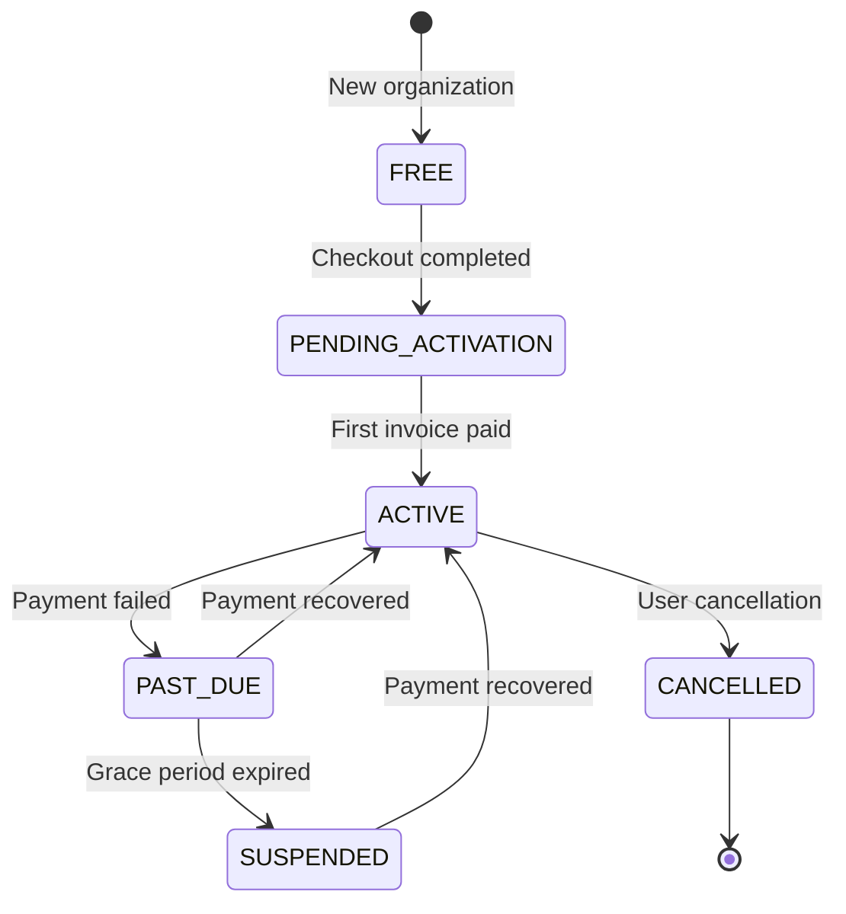

<Note>
**Status:** Active — fully implemented  
**Module Path:** `src/modules/subscription/`  
**Payment Gateway:** Stripe
</Note>

## Overview

The Subscription Module implements a **freemium SaaS billing system** for PropWise CRM. Every organization has a subscription tied to one of four plan tiers. The module handles:

- **Plan-based feature gating** — binary feature flags per tier
- **Resource limits** — caps on leads, contacts, deals, companies, and storage
- **Credit-based metering** — monthly AI and messaging allowances with purchasable top-ups
- **Dual seat types** — manager seats and agent seats with per-tier pricing; every user consumes a seat
- **Stripe integration** — checkout, subscription management, mid-cycle plan changes, webhooks, billing portal
- **Proration** — mid-cycle upgrades, downgrades, and seat changes are prorated to the day
- **Suspension flow** — 2-day grace period on payment failure, then org goes read-only

### Design Principles

| Principle | Decision |
|---|---|
| Freemium model | Free plan with limited features; paid tiers unlock progressively |
| Per-org billing | Billing is per organization; developer portal is free |
| Dual seat types | Manager seats (Owner, Admin) and agent seats (Basic, custom roles); every user consumes a seat |
| Seat type derived from role | No explicit seat assignment — seat type is automatically determined by the user's RBAC role |
| Feature flags over tier checks | Gating uses `@RequiresFeature('flag')` on plan JSONB — changing what a tier includes requires only a seeder update, not code changes |
| Service-layer limit enforcement | Resource limits and credit consumption are checked in service methods, not guards, because they need entity counts |
| Stripe as source of truth for payments | Webhook-driven lifecycle: the app reacts to Stripe events rather than polling |
| Prorated plan changes | All mid-cycle changes (upgrade, downgrade, add/remove seats) use `proration_behavior: 'create_prorations'` — charges are fair to the day |
| Checkout vs. change-plan separation | `POST /checkout` is for first-time subscription (Free → Paid); `POST /change-plan` is for switching between paid tiers |
| Idempotent webhooks | Every Stripe event is logged in `BillingEvent` with a unique `stripeEventId` to prevent duplicate processing |
| Graceful degradation | If `app.stripe.secretKey` (`STRIPE_SECRET_KEY`) is not set, billing features are unavailable but the app still starts |

## Architecture

### High-level diagram

```
┌─────────────────────────────────────────────────────────────────────┐
│                        API Layer (Controllers)                       │
│  SubscriptionController            │  StripeWebhookController        │
│  (authenticated, /v1/subscriptions)│  (public, /webhooks/stripe)     │
└──────────────┬─────────────────────┴────────────┬───────────────────┘
               │                                  │
┌──────────────▼──────────────────────────────────▼───────────────────┐
│  Service Layer                                                       │
│  ┌──────────────────┐  ┌──────────────────┐  ┌───────────────────┐  │
│  │ SubscriptionSvc  │  │  CreditService   │  │  StripeService    │  │
│  │ • lifecycle      │  │  • consume FIFO  │  │  • SDK wrapper    │  │
│  │ • plan changes   │  │  • balance query │  │  • checkout       │  │
│  │ • seat mgmt      │  │  • record packs  │  │  • subscriptions  │  │
│  │ • resource limits│  │                  │  │  • price swaps    │  │
│  │ • feature checks │  │                  │  │  • webhooks       │  │
│  └──────────────────┘  └──────────────────┘  └───────────────────┘  │
└──────────────┬──────────────────────────────────────────────────────┘
               │
┌──────────────▼──────────────────────────────────────────────────────┐
│  Data Layer (MikroORM / PostgreSQL)                                  │
│  SubscriptionPlan │ Subscription │ SubscriptionUsage                 │
│  CreditPurchase   │ BillingEvent │ Organization.stripeCustomerId     │
└─────────────────────────────────────────────────────────────────────┘
```

### Data flow

<Tabs>
  <Tab title="First-time checkout">
    **Free → Paid flow:**

    ```
    Frontend "Upgrade" button
      → POST /v1/subscriptions/checkout
        → Rejects if org already has a Stripe subscription (use change-plan instead)
        → SubscriptionService.createCheckoutSession()
          → StripeService.createCheckoutSession()
            → Returns Stripe Checkout URL
              → User pays on Stripe's hosted page
                → Stripe fires checkout.session.completed webhook
                  → StripeWebhookController receives + verifies signature
                    → SubscriptionService.activateSubscription()
                      → Subscription entity updated to ACTIVE
    ```
  </Tab>

  <Tab title="Plan change">
    **Paid → different Paid tier flow:**

    ```
    Frontend "Change Plan" button
      → POST /v1/subscriptions/change-plan
        → SubscriptionService.changePlan()
          → Validates seat overflow (blocks if current users exceed new plan capacity)
          → StripeService.swapSubscriptionPrice() — prorated
          → Reconciles seat line items (old tier price → new tier price)
          → Updates local Subscription entity
          → Returns updated subscription immediately
    ```
  </Tab>

  <Tab title="Renewal/failure">
    **Renewal / payment failure flow:**

    ```
    Stripe charges renewal invoice
      ├─ invoice.paid → handleInvoicePaid() → status stays ACTIVE, period updated
      └─ invoice.payment_failed → handleInvoicePaymentFailed() → status → PAST_DUE
           └─ Stripe retries for 2 days
                ├─ Payment succeeds → invoice.paid → back to ACTIVE
                └─ All retries fail → customer.subscription.updated (status: unpaid)
                     → handleSubscriptionUpdated() → status → SUSPENDED
                          → Org is read-only (SubscriptionActiveGuard blocks writes)
    ```
  </Tab>
</Tabs>

## Plan tiers & pricing

Four tiers, priced in USD cents:

| | **Free** | **Starter** | **Professional** | **Business** |
|---|---|---|---|---|
| Monthly price | $0 | $49 | $149 | $399 |
| Annual price | $0 | $470.40 (~20% off) | $1,430.40 | $3,830.40 |
| Manager seats included | 1 | 2 | 5 | 10 |
| Agent seats included | 0 | 3 | 15 | 40 |
| Extra manager seat | — | $25/mo | $20/mo | $18/mo |
| Extra agent seat | — | $12/mo | $10/mo | $8/mo |

### Resource limits

| Resource | Free | Starter | Professional | Business |
|---|---|---|---|---|
| Leads | 50 | 1,000 | 10,000 | Unlimited |
| Contacts | 50 | 1,000 | 10,000 | Unlimited |
| Deals | 20 | 500 | 5,000 | Unlimited |
| Companies | 10 | 200 | 2,000 | Unlimited |
| Storage | 500 MB | 5 GB | 25 GB | 100 GB |

### Monthly credits

| Credit type | Free | Starter | Professional | Business |
|---|---|---|---|---|
| AI credits | 20 | 200 | 1,000 | 5,000 |
| Messaging credits | 0 | 100 | 500 | 2,000 |

## Feature gating model

Features are gated using three distinct mechanisms:

### Binary feature flags

<Info>
Boolean flags stored in `SubscriptionPlan.features` (JSONB). Checked via `@RequiresFeature('flagName')` guard decorator or `SubscriptionService.checkFeature()`.
</Info>

| Feature flag | Free | Starter | Pro | Business |
|---|---|---|---|---|
| `customPipelineStages` | — | Yes | Yes | Yes |
| `distributionEngine` | — | — | Yes | Yes |
| `escalationEngine` | — | — | Yes | Yes |
| `advancedAnalytics` | — | — | Yes | Yes |
| `apiAccess` | — | — | Yes | Yes |
| `commissionTracking` | — | — | Yes | Yes |
| `teamsAndHierarchy` | — | — | Yes | Yes |
| `customRoles` | — | — | — | Yes |
| `whiteLabel` | — | — | — | Yes |
| `maxMessagingChannels` | 0 | 1 | 3 | Unlimited (-1) |
| `maxEmailIntegrations` | 0 | 1 | 3 | Unlimited (-1) |
| `auditLogRetentionDays` | 0 | 0 | 30 | Unlimited (-1) |

### Credit-based (monthly allowance)

Features that are available on the tier but have a monthly budget that resets each billing cycle. Tracked in `SubscriptionUsage`. When exhausted, the org can purchase one-time top-up packs (`CreditPurchase`).

<Note>
Consumption order: **monthly plan allowance first → purchased packs FIFO (oldest first)**.
</Note>

### Add-on packs

| Add-on | Behavior | Stripe model |
|---|---|---|
| Storage pack (+10 GB) | Recurring, stacks | Subscription line item (per-unit) |
| AI credit pack (+500) | One-time, consumed then gone | Payment intent |
| Messaging credit pack (+500) | One-time, consumed then gone | Payment intent |

## Seat management

### Seat types

Every user in an organization consumes exactly one seat. The seat type is **derived from the user's RBAC role** — there is no separate seat assignment.

| Seat type | Roles that consume it | Price varies by tier |
|---|---|---|
| **Manager** | Owner, Admin | Yes |
| **Agent** | Basic, custom org roles | Yes |

The mapping is defined in `subscription.service.ts`:

```typescript
const ROLE_SEAT_MAP: Record<string, SeatType> = {
  Owner: SeatType.MANAGER,
  Admin: SeatType.MANAGER,
};
// Any other role → SeatType.AGENT
```

### Seat counting

<Info>
Seats are **derived from RBAC roles**, not tracked via a separate assignment table. The count is computed on-demand from active `UserOrgRole` records.
</Info>

```
managerSeatsUsed = count of active users with Owner or Admin org role
agentSeatsUsed   = count of active users with any other org role
```

A seat is **not occupied** by a pending invitation — it only counts when the user has accepted and has an active `UserOrgRole`:

| Step | Seat occupied? |
|---|---|
| Admin sends invitation with role "Admin" | No — seat availability is checked but not reserved |
| User accepts → `UserOrgRole` created | Yes — now counted |
| User removed (role soft-deleted) | No — freed |
| User's role changed (Basic → Admin) | Swaps: frees one agent seat, occupies one manager seat |

### Enforcement points

Seat availability is checked at two integration points:

1. **`invitation.service.ts`** — before creating an invitation, the role determines the seat type and availability is checked
2. **`role-assignment-validation.service.ts`** — when changing a user's role (e.g. promoting Basic → Admin), checks that the target seat type has room; the old seat type is freed simultaneously

### Proration on seat changes

<Tip>
Adding or removing seats mid-cycle uses `proration_behavior: 'create_prorations'`
</Tip>

- **Adding a seat on April 15** (30-day month): prorated charge for 15 remaining days, billed on the next invoice
- **Removing a seat on April 15**: prorated credit for 15 remaining days, applied to the next invoice
- **Adding on April 4, removing on April 6**: net charge for 2 days only (charge for 26 days minus credit for 24 days)

### Stripe billing

Extra seats are billed as subscription line items with `per_unit` pricing. A subscription for a Professional org with 7 managers and 20 agents would have:

| Line Item | Qty | Price |
|---|---|---|
| PropWise Professional | 1 | $149/mo |
| Extra Manager Seat (Pro) | 2 | $40/mo |
| Extra Agent Seat (Pro) | 5 | $50/mo |

## Credit system

### Consumption flow

```typescript
SubscriptionService.consumeCredits(orgId, 'ai', 1)
  → CreditService.consumeCredits(subscription, AI, 1)
      1. Check monthly allowance: usage.aiCreditsUsed < plan.limits.ai
         → If sufficient: increment usage.aiCreditsUsed, return success
      2. Else: query purchased packs (oldest first)
         → Deduct from first pack with remaining balance
         → If pack exhausted, soft-delete it
         → Return success or insufficient credits
```

### Credit types

<Tabs>
  <Tab title="AI credits">
    - Used for AI-powered features (lead scoring, content generation, etc.)
    - Monthly allowance varies by tier (20-5,000)
    - Top-up packs: 500 credits for $10
  </Tab>
  
  <Tab title="Messaging credits">
    - Used for SMS, WhatsApp, email campaigns
    - Monthly allowance varies by tier (0-2,000)
    - Top-up packs: 500 credits for $15
  </Tab>
</Tabs>

### Credit purchase flow

<Steps>
<Step title="User requests credit top-up">
Frontend calls `POST /v1/subscriptions/purchase-credits`
</Step>

<Step title="Payment intent created">
StripeService creates payment intent for the credit pack
</Step>

<Step title="Payment completion">
Stripe webhook `payment_intent.succeeded` triggers credit addition to org
</Step>

<Step title="Credit availability">
Credits are immediately available for consumption via FIFO system
</Step>
</Steps>

## Entity specifications

### SubscriptionPlan

```typescript
@Entity()
export class SubscriptionPlan {
  @PrimaryKey()
  id: number;

  @Property()
  name: string; // 'Free', 'Starter', 'Professional', 'Business'

  @Property()
  tier: PlanTier; // enum

  @Property()
  monthlyPriceInCents: number;

  @Property()
  yearlyPriceInCents: number;

  @Property({ type: 'json' })
  features: Record<string, boolean | number>; // JSONB feature flags

  @Property({ type: 'json' })
  limits: PlanLimits; // Resource limits

  @Property({ type: 'json' })
  seatPricing: SeatPricing; // Per-tier seat costs
}
```

### Subscription

```typescript
@Entity()
export class Subscription {
  @PrimaryKey()
  id: number;

  @ManyToOne(() => Organization)
  organization: Organization;

  @ManyToOne(() => SubscriptionPlan)
  plan: SubscriptionPlan;

  @Property()
  status: SubscriptionStatus; // ACTIVE, PAST_DUE, SUSPENDED, CANCELLED

  @Property()
  billingCycle: BillingCycle; // MONTHLY, YEARLY

  @Property()
  stripeSubscriptionId?: string;

  @Property()
  currentPeriodStart: Date;

  @Property()
  currentPeriodEnd: Date;
}
```

### SubscriptionUsage

<Info>
Tracks monthly resource and credit consumption. Resets each billing cycle.
</Info>

```typescript
@Entity()
export class SubscriptionUsage {
  @PrimaryKey()
  id: number;

  @OneToOne(() => Subscription)
  subscription: Subscription;

  @Property()
  aiCreditsUsed: number = 0;

  @Property()
  messagingCreditsUsed: number = 0;

  @Property()
  storageUsedBytes: number = 0;

  @Property()
  leadsCount: number = 0;

  @Property()
  contactsCount: number = 0;

  @Property()
  dealsCount: number = 0;

  @Property()
  companiesCount: number = 0;
}
```

### CreditPurchase

```typescript
@Entity()
export class CreditPurchase {
  @PrimaryKey()
  id: number;

  @ManyToOne(() => Subscription)
  subscription: Subscription;

  @Property()
  creditType: CreditType; // AI, MESSAGING

  @Property()
  amountPurchased: number;

  @Property()
  amountRemaining: number;

  @Property()
  purchaseDate: Date;

  @Property()
  stripePaymentIntentId: string;
}
```

## Stripe integration

### Webhook events

<Warning>
All webhook events must be verified with Stripe's signature verification to prevent spoofing.
</Warning>

| Event | Handler | Purpose |
|---|---|---|
| `checkout.session.completed` | `handleCheckoutCompleted` | Activate new subscription |
| `invoice.paid` | `handleInvoicePaid` | Renew active subscription |
| `invoice.payment_failed` | `handleInvoicePaymentFailed` | Mark as past due |
| `customer.subscription.updated` | `handleSubscriptionUpdated` | Handle plan changes, suspensions |
| `payment_intent.succeeded` | `handlePaymentIntentSucceeded` | Process credit purchases |

### Stripe service methods

```typescript
@Injectable()
export class StripeService {
  // Checkout & subscriptions
  async createCheckoutSession(params: CheckoutParams): Promise<string>
  async swapSubscriptionPrice(subscriptionId: string, newPriceId: string): Promise<void>
  async addSubscriptionItem(subscriptionId: string, priceId: string, quantity: number): Promise<void>
  async updateSubscriptionItem(itemId: string, quantity: number): Promise<void>
  
  // Credit purchases
  async createCreditPurchaseIntent(amount: number, metadata: Record<string, string>): Promise<string>
  
  // Billing portal
  async createBillingPortalSession(customerId: string, returnUrl: string): Promise<string>
  
  // Webhooks
  async constructWebhookEvent(body: Buffer, signature: string): Promise<Stripe.Event>
}
```

## Subscription lifecycle

### States and transitions



### Status behaviors

| Status | Write operations | Feature access | Billing |
|---|---|---|---|
| `FREE` | Allowed (within limits) | Free tier only | No charges |
| `PENDING_ACTIVATION` | Blocked | Free tier only | Awaiting first payment |
| `ACTIVE` | Allowed (within limits) | Full plan access | Regular billing |
| `PAST_DUE` | Allowed (with warnings) | Full plan access | Retrying payment |
| `SUSPENDED` | Read-only | Free tier fallback | Paused |
| `CANCELLED` | Read-only | Free tier fallback | No future charges |

## Plan changes (upgrade/downgrade)

### Validation rules

<Steps>
<Step title="Seat overflow check">
Verify current user count doesn't exceed new plan's seat limits
</Step>

<Step title="Feature compatibility">
Check for features that would be lost (e.g., custom roles on Business → Pro downgrade)
</Step>

<Step title="Resource limits">
Ensure current usage fits within new plan's resource caps
</Step>
</Steps>

### Change process

```typescript
async changePlan(organizationId: number, targetPlanId: number): Promise<Subscription> {
  // 1. Load current subscription and target plan
  const subscription = await this.getCurrentSubscription(organizationId);
  const targetPlan = await this.planRepository.findOneOrFail(targetPlanId);
  
  // 2. Validate change is allowed
  await this.validatePlanChange(subscription, targetPlan);
  
  // 3. Update Stripe subscription (prorated)
  await this.stripeService.swapSubscriptionPrice(
    subscription.stripeSubscriptionId,
    targetPlan.stripePriceIds.monthly
  );
  
  // 4. Reconcile seat line items
  await this.reconcileSeats(subscription, targetPlan);
  
  // 5. Update local entities
  subscription.plan = targetPlan;
  await this.em.persistAndFlush(subscription);
  
  return subscription;
}
```

## API endpoints

### Subscription management

<CodeGroup>

```typescript GET /v1/subscriptions/current
// Get current subscription details
@Get('current')
@RequiresAuth()
async getCurrentSubscription(@CurrentOrganization() org: Organization) {
  return this.subscriptionService.getCurrentSubscription(org.id);
}
```

```typescript POST /v1/subscriptions/checkout
// Create checkout session for Free → Paid upgrade
@Post('checkout')
@RequiresAuth()
async createCheckoutSession(
  @CurrentOrganization() org: Organization,
  @Body() dto: CreateCheckoutDto
) {
  return this.subscriptionService.createCheckoutSession(org.id, dto);
}
```

```typescript POST /v1/subscriptions/change-plan
// Change between paid plans
@Post('change-plan')
@RequiresAuth()
async changePlan(
  @CurrentOrganization() org: Organization,
  @Body() dto: ChangePlanDto
) {
  return this.subscriptionService.changePlan(org.id, dto.targetPlanId);
}
```

```typescript POST /v1/subscriptions/purchase-credits
// Purchase credit top-up packs
@Post('purchase-credits')
@RequiresAuth()
async purchaseCredits(
  @CurrentOrganization() org: Organization,
  @Body() dto: PurchaseCreditsDto
) {
  return this.subscriptionService.createCreditPurchaseIntent(org.id, dto);
}
```

</CodeGroup>

### Webhook endpoints

```typescript
@Controller('webhooks')
export class StripeWebhookController {
  @Post('stripe')
  @UseGuards(StripeWebhookGuard)
  async handleWebhook(@Body() event: Stripe.Event) {
    return this.stripeWebhookService.handleEvent(event);
  }
}
```

## Guards & decorators

### RequiresFeature decorator

```typescript
@RequiresFeature('customPipelineStages')
@Post('stages')
async createCustomStage(@Body() dto: CreateStageDto) {
  // Only accessible on Starter+ plans
}
```

### SubscriptionActiveGuard

<Warning>
Blocks write operations for organizations with SUSPENDED or CANCELLED subscriptions
</Warning>

```typescript
@Injectable()
export class SubscriptionActiveGuard implements CanActivate {
  async canActivate(context: ExecutionContext): Promise<boolean> {
    const org = getCurrentOrganization(context);
    const subscription = await this.subscriptionService.getCurrentSubscription(org.id);
    
    return subscription.status === SubscriptionStatus.ACTIVE ||
           subscription.status === SubscriptionStatus.PAST_DUE ||
           subscription.status === SubscriptionStatus.FREE;
  }
}
```

### RequiresPlan decorator

```typescript
@RequiresPlan(['professional', 'business'])
@Get('advanced-analytics')
async getAdvancedAnalytics() {
  // Only accessible on Pro+ plans
}
```

## Enforcement points

### Service-layer checks

<Info>
Resource limits and credit consumption are enforced in service methods, not guards, because they require database queries for current counts.
</Info>

```typescript
@Injectable()
export class LeadService {
  async createLead(dto: CreateLeadDto): Promise<Lead> {
    // Check resource limit before creation
    await this.subscriptionService.checkResourceLimit(
      this.currentOrg.id,
      'leads'
    );
    
    // Consume AI credits if using AI features
    if (dto.useAiScoring) {
      await this.subscriptionService.consumeCredits(
        this.currentOrg.id,
        CreditType.AI,
        1
      );
    }
    
    // Create the lead...
  }
}
```

### Feature gates

```typescript
async checkFeature(orgId: number, featureName: string): Promise<boolean> {
  const subscription = await this.getCurrentSubscription(orgId);
  return !!subscription.plan.features[featureName];
}

async checkResourceLimit(orgId: number, resourceType: ResourceType): Promise<void> {
  const subscription = await this.getCurrentSubscription(orgId);
  const usage = await this.getUsage(subscription.id);
  const limit = subscription.plan.limits[resourceType];
  
  if (limit !== -1 && usage[resourceType] >= limit) {
    throw new ForbiddenException(`${resourceType} limit exceeded`);
  }
}
```

## Plan seeder

<Tip>
The plan seeder populates the four tiers with their pricing, features, and limits. Run this during deployment to ensure plans are up-to-date.
</Tip>

```typescript
export class PlanSeeder {
  async run(): Promise<void> {
    const plans = [
      {
        name: 'Free',
        tier: PlanTier.FREE,
        monthlyPriceInCents: 0,
        yearlyPriceInCents: 0,
        features: {
          customPipelineStages: false,
          distributionEngine: false,
          // ... other features
        },
        limits: {
          leads: 50,
          contacts: 50,
          deals: 20,
          companies: 10,
          storageBytes: 500 * 1024 * 1024, // 500 MB
          aiCreditsMonthly: 20,
          messagingCreditsMonthly: 0,
        },
        seatPricing: {
          managerSeatsIncluded: 1,
          agentSeatsIncluded: 0,
          extraManagerSeatPrice: 0,
          extraAgentSeatPrice: 0,
        }
      },
      // ... other plans
    ];
    
    for (const planData of plans) {
      await this.em.upsert(SubscriptionPlan, planData, ['name']);
    }
  }
}
```

## Module structure

```
src/modules/subscription/
├── controllers/
│   ├── subscription.controller.ts
│   └── stripe-webhook.controller.ts
├── services/
│   ├── subscription.service.ts
│   ├── credit.service.ts
│   └── stripe.service.ts
├── entities/
│   ├── subscription-plan.entity.ts
│   ├── subscription.entity.ts
│   ├── subscription-usage.entity.ts
│   ├── credit-purchase.entity.ts
│   └── billing-event.entity.ts
├── guards/
│   ├── subscription-active.guard.ts
│   ├── stripe-webhook.guard.ts
│   └── requires-feature.guard.ts
├── decorators/
│   ├── requires-feature.decorator.ts
│   └── requires-plan.decorator.ts
├── dtos/
│   ├── create-checkout.dto.ts
│   ├── change-plan.dto.ts
│   └── purchase-credits.dto.ts
├── enums/
│   ├── subscription-status.enum.ts
│   ├── plan-tier.enum.ts
│   └── credit-type.enum.ts
├── types/
│   └── subscription.types.ts
└── subscription.module.ts
```

## Environment configuration

<AccordionGroup>
  <Accordion title="Required environment variables">
    ```bash
    # Stripe configuration
    STRIPE_SECRET_KEY=sk_live_... # or sk_test_...
    STRIPE_WEBHOOK_SECRET=whsec_...
    STRIPE_PUBLISHABLE_KEY=pk_live_... # for frontend

    # Plan price IDs (from Stripe Dashboard)
    STRIPE_STARTER_MONTHLY_PRICE_ID=price_...
    STRIPE_STARTER_YEARLY_PRICE_ID=price_...
    STRIPE_PRO_MONTHLY_PRICE_ID=price_...
    STRIPE_PRO_YEARLY_PRICE_ID=price_...
    STRIPE_BUSINESS_MONTHLY_PRICE_ID=price_...
    STRIPE_BUSINESS_YEARLY_PRICE_ID=price_...

    # Seat pricing IDs
    STRIPE_MANAGER_SEAT_STARTER_PRICE_ID=price_...
    STRIPE_AGENT_SEAT_STARTER_PRICE_ID=price_...
    # ... (repeat for Pro and Business tiers)
    ```
  </Accordion>

  <Accordion title="Optional configuration">
    ```bash
    # Credit pack pricing
    STRIPE_AI_CREDITS_PRICE_ID=price_...
    STRIPE_MESSAGING_CREDITS_PRICE_ID=price_...

    # Storage add-on
    STRIPE_STORAGE_PACK_PRICE_ID=price_...

    # Billing portal
    STRIPE_BILLING_PORTAL_RETURN_URL=https://app.propwise.com/settings/billing
    ```
  </Accordion>
</AccordionGroup>

## Integration with other modules

<CardGroup cols={2}>
  <Card title="RBAC Module" href="/backend/rbac">
    Seat types derived from user roles; invitation validation checks seat availability
  </Card>
  
  <Card title="Organization Module" href="/backend/organization">
    Every org has exactly one subscription; Stripe customer ID stored on Organization entity
  </Card>
  
  <Card title="Lead Module" href="/backend/lead">
    Resource limits enforced in LeadService; AI credit consumption for scoring features
  </Card>
  
  <Card title="Messaging Module" href="/backend/messaging">
    Channel limits and messaging credit consumption; feature gates for SMS/WhatsApp
  </Card>
</CardGroup>

<Check>
The Subscription Module is fully operational and handles all billing scenarios including upgrades, downgrades, seat changes, credit purchases, and payment failures with proper proration and webhook handling.
</Check>