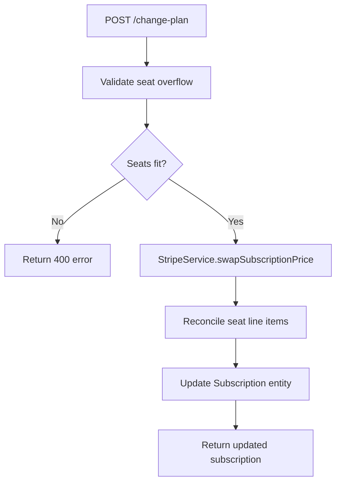

The Subscription Module implements a **freemium SaaS billing system** for PropWise CRM. Every organization has a subscription tied to one of four plan tiers. The module handles plan-based feature gating, resource limits, credit-based metering, dual seat types, and complete Stripe integration.

<Note>
This module is **fully implemented** and active at path `src/modules/subscription/` with Stripe as the payment gateway.
</Note>

## Architecture Overview

The subscription system follows a three-layer architecture with distinct separation of concerns:

```
┌─────────────────────────────────────────────────────────────────────┐
│                        API Layer (Controllers)                       │
│  SubscriptionController            │  StripeWebhookController        │
│  (authenticated, /v1/subscriptions)│  (public, /webhooks/stripe)     │
└──────────────┬─────────────────────┴────────────┬───────────────────┘
               │                                  │
┌──────────────▼──────────────────────────────────▼───────────────────┐
│  Service Layer                                                       │
│  ┌──────────────────┐  ┌──────────────────┐  ┌───────────────────┐  │
│  │ SubscriptionSvc  │  │  CreditService   │  │  StripeService    │  │
│  │ • lifecycle      │  │  • consume FIFO  │  │  • SDK wrapper    │  │
│  │ • plan changes   │  │  • balance query │  │  • checkout       │  │
│  │ • seat mgmt      │  │  • record packs  │  │  • subscriptions  │  │
│  │ • resource limits│  │                  │  │  • price swaps    │  │
│  │ • feature checks │  │                  │  │  • webhooks       │  │
│  └──────────────────┘  └──────────────────┘  └───────────────────┘  │
└──────────────┬──────────────────────────────────────────────────────┘
               │
┌──────────────▼──────────────────────────────────────────────────────┐
│  Data Layer (MikroORM / PostgreSQL)                                  │
│  SubscriptionPlan │ Subscription │ SubscriptionUsage                 │
│  CreditPurchase   │ BillingEvent │ Organization.stripeCustomerId     │
└─────────────────────────────────────────────────────────────────────┘
```

### Design Principles

<CardGroup cols={2}>
  <Card title="Freemium Model" icon="gift">
    Free plan with limited features; paid tiers unlock progressively
  </Card>
  <Card title="Per-Organization Billing" icon="building">
    Billing is per organization; developer portal is free
  </Card>
  <Card title="Dual Seat Types" icon="users">
    Manager seats and agent seats with per-tier pricing
  </Card>
  <Card title="Feature Flags Over Tier Checks" icon="flag">
    Gating uses `@RequiresFeature('flag')` on plan JSONB
  </Card>
</CardGroup>

## Plan Tiers & Pricing

Four tiers are available, priced in USD cents:

<Tabs>
  <Tab title="Monthly Pricing">
    | Plan | Price | Manager Seats | Agent Seats | Extra Manager | Extra Agent |
    |------|-------|---------------|-------------|---------------|-------------|
    | **Free** | $0 | 1 | 0 | — | — |
    | **Starter** | $49 | 2 | 3 | $25/mo | $12/mo |
    | **Professional** | $149 | 5 | 15 | $20/mo | $10/mo |
    | **Business** | $399 | 10 | 40 | $18/mo | $8/mo |
  </Tab>
  <Tab title="Annual Pricing">
    | Plan | Price | Discount |
    |------|-------|----------|
    | **Free** | $0 | — |
    | **Starter** | $470.40 | ~20% off |
    | **Professional** | $1,430.40 | ~20% off |
    | **Business** | $3,830.40 | ~20% off |
  </Tab>
</Tabs>

### Resource Limits

<AccordionGroup>
  <Accordion title="CRM Entity Limits">
    | Resource | Free | Starter | Professional | Business |
    |----------|------|---------|--------------|----------|
    | Leads | 50 | 1,000 | 10,000 | Unlimited |
    | Contacts | 50 | 1,000 | 10,000 | Unlimited |
    | Deals | 20 | 500 | 5,000 | Unlimited |
    | Companies | 10 | 200 | 2,000 | Unlimited |
    | Storage | 500 MB | 5 GB | 25 GB | 100 GB |
  </Accordion>
  <Accordion title="Monthly Credits">
    | Credit Type | Free | Starter | Professional | Business |
    |-------------|------|---------|--------------|----------|
    | AI credits | 20 | 200 | 1,000 | 5,000 |
    | Messaging credits | 0 | 100 | 500 | 2,000 |
  </Accordion>
</AccordionGroup>

## Feature Gating Model

Features are gated using three distinct mechanisms:

### Binary Feature Flags

Boolean flags stored in `SubscriptionPlan.features` (JSONB). Checked via `@RequiresFeature('flagName')` guard decorator:

```typescript
@RequiresFeature('customPipelineStages')
@Post('pipeline-stages')
async createPipelineStage() {
  // Only available on Starter+ plans
}
```

<Tabs>
  <Tab title="Core Features">
    | Feature | Free | Starter | Pro | Business |
    |---------|------|---------|-----|----------|
    | `customPipelineStages` | ❌ | ✅ | ✅ | ✅ |
    | `distributionEngine` | ❌ | ❌ | ✅ | ✅ |
    | `escalationEngine` | ❌ | ❌ | ✅ | ✅ |
    | `advancedAnalytics` | ❌ | ❌ | ✅ | ✅ |
    | `apiAccess` | ❌ | ❌ | ✅ | ✅ |
  </Tab>
  <Tab title="Advanced Features">
    | Feature | Free | Starter | Pro | Business |
    |---------|------|---------|-----|----------|
    | `commissionTracking` | ❌ | ❌ | ✅ | ✅ |
    | `teamsAndHierarchy` | ❌ | ❌ | ✅ | ✅ |
    | `customRoles` | ❌ | ❌ | ❌ | ✅ |
    | `whiteLabel` | ❌ | ❌ | ❌ | ✅ |
  </Tab>
  <Tab title="Quantified Features">
    | Feature | Free | Starter | Pro | Business |
    |---------|------|---------|-----|----------|
    | `maxMessagingChannels` | 0 | 1 | 3 | Unlimited (-1) |
    | `maxEmailIntegrations` | 0 | 1 | 3 | Unlimited (-1) |
    | `auditLogRetentionDays` | 0 | 0 | 30 | Unlimited (-1) |
  </Tab>
</Tabs>

### Credit-Based Features

Features available on the tier but with monthly budgets that reset each billing cycle:

<CodeGroup>
```typescript Consumption Order
// Monthly plan allowance first → purchased packs FIFO (oldest first)
SubscriptionService.consumeCredits(orgId, 'ai', 1)
  → CreditService.consumeCredits(subscription, AI, 1)
    1. Check monthly allowance: usage.aiCreditsUsed < plan.aiCreditsIncluded
    2. If exhausted, consume from oldest CreditPurchase (FIFO)
    3. Update SubscriptionUsage.aiCreditsUsed
```

```typescript Credit Purchase
// One-time top-up packs via Stripe Payment Intent
{
  "ai_pack_500": {
    "credits": 500,
    "price": 2500, // $25.00 in cents
    "type": "AI"
  },
  "messaging_pack_500": {
    "credits": 500,
    "price": 1500, // $15.00 in cents
    "type": "MESSAGING"
  }
}
```
</CodeGroup>

### Add-on Packs

<CardGroup cols={2}>
  <Card title="Storage Pack (+10 GB)" icon="hard-drive">
    Recurring subscription line item that stacks with base plan storage
  </Card>
  <Card title="Credit Packs (+500)" icon="coins">
    One-time Payment Intents for AI and messaging credit top-ups
  </Card>
</CardGroup>

## Seat Management

Every user in an organization consumes exactly one seat. The seat type is **derived from the user's RBAC role**.

### Seat Type Mapping

```typescript
const ROLE_SEAT_MAP: Record<string, SeatType> = {
  Owner: SeatType.MANAGER,
  Admin: SeatType.MANAGER,
};
// Any other role → SeatType.AGENT
```

<Warning>
Seats are **not occupied** by pending invitations — they only count when the user has accepted and has an active `UserOrgRole`.
</Warning>

### Enforcement Points

<Steps>
  <Step title="Invitation Creation">
    `invitation.service.ts` checks seat availability before creating an invitation based on the assigned role
  </Step>
  <Step title="Role Assignment">
    `role-assignment-validation.service.ts` validates seat capacity when changing user roles
  </Step>
  <Step title="Proration">
    Adding or removing seats mid-cycle uses `proration_behavior: 'create_prorations'`
  </Step>
</Steps>

### Stripe Billing Example

A Professional org with 7 managers and 20 agents would have:

| Line Item | Quantity | Price |
|-----------|----------|-------|
| PropWise Professional | 1 | $149/mo |
| Extra Manager Seat (Pro) | 2 | $40/mo |
| Extra Agent Seat (Pro) | 5 | $50/mo |

## Subscription Lifecycle

### First-time Checkout Flow

<Steps>
  <Step title="User Clicks Upgrade">
    Frontend sends `POST /v1/subscriptions/checkout`
  </Step>
  <Step title="Validation">
    Service rejects if org already has a Stripe subscription (use change-plan instead)
  </Step>
  <Step title="Stripe Checkout">
    `StripeService.createCheckoutSession()` returns hosted checkout URL
  </Step>
  <Step title="Payment Processing">
    User pays on Stripe's hosted page
  </Step>
  <Step title="Webhook Activation">
    `checkout.session.completed` webhook activates subscription
  </Step>
</Steps>

### Plan Change Flow



### Payment Failure Flow

<Tabs>
  <Tab title="Grace Period">
    - Invoice payment fails → status becomes `PAST_DUE`
    - Stripe retries for 2 days
    - Organization remains fully functional
  </Tab>
  <Tab title="Suspension">
    - All retries fail → status becomes `SUSPENDED`
    - Organization becomes read-only
    - `SubscriptionActiveGuard` blocks write operations
  </Tab>
  <Tab title="Recovery">
    - Payment succeeds → `invoice.paid` webhook
    - Status returns to `ACTIVE`
    - Full functionality restored
  </Tab>
</Tabs>

## API Endpoints

### Subscription Management

```typescript
// Get current subscription
GET /v1/subscriptions/current
Response: {
  plan: SubscriptionPlan,
  usage: SubscriptionUsage,
  stripeSubscription?: Stripe.Subscription
}

// Create checkout session (Free → Paid)
POST /v1/subscriptions/checkout
Body: { planId: string, billingCycle: 'monthly' | 'annual' }
Response: { checkoutUrl: string }

// Change plan (Paid → different Paid)
POST /v1/subscriptions/change-plan  
Body: { newPlanId: string }
Response: { subscription: Subscription }
```

### Credit Management

```typescript
// Purchase credit pack
POST /v1/subscriptions/credits/purchase
Body: { packType: 'ai_pack_500' | 'messaging_pack_500' }
Response: { clientSecret: string, paymentIntentId: string }

// Get credit balance
GET /v1/subscriptions/credits/balance
Response: {
  ai: { monthly: number, purchased: number, total: number },
  messaging: { monthly: number, purchased: number, total: number }
}
```

<Info>
All endpoints require authentication except `/webhooks/stripe/*` which uses Stripe signature verification.
</Info>

## Guards & Decorators

### Feature Guards

```typescript
@RequiresFeature('apiAccess')
@RequiresActiveSubscription()
export class ApiKeysController {
  // Only accessible on Pro+ plans with active subscription
}
```

### Service-Layer Enforcement

```typescript
// Resource limits checked in service methods
async createLead(orgId: string, data: CreateLeadDto) {
  await this.subscriptionService.checkResourceLimit(orgId, 'leads');
  // Proceed with lead creation
}

// Credit consumption
async generateAiInsight(orgId: string) {
  await this.subscriptionService.consumeCredits(orgId, 'ai', 1);
  // Proceed with AI operation
}
```

## Entity Specifications

### Subscription Plan

```typescript
@Entity()
export class SubscriptionPlan {
  @PrimaryKey()
  id: string;

  @Property()
  name: string; // 'Free', 'Starter', 'Professional', 'Business'

  @Property({ type: 'jsonb' })
  features: Record<string, any>; // Feature flags

  @Property()
  leadsLimit: number; // -1 for unlimited

  @Property()
  managerSeatsIncluded: number;

  @Property()
  agentSeatsIncluded: number;

  @Property()
  aiCreditsIncluded: number;

  @Property()
  messagingCreditsIncluded: number;
}
```

### Subscription

```typescript
@Entity()
export class Subscription {
  @PrimaryKey()
  id: string;

  @ManyToOne(() => Organization)
  organization: Organization;

  @ManyToOne(() => SubscriptionPlan)
  plan: SubscriptionPlan;

  @Enum(() => SubscriptionStatus)
  status: SubscriptionStatus; // ACTIVE, PAST_DUE, SUSPENDED, CANCELED

  @Property()
  stripeSubscriptionId?: string;

  @Property()
  currentPeriodStart: Date;

  @Property()
  currentPeriodEnd: Date;

  @Property()
  billingCycle: 'monthly' | 'annual';
}
```

<Tip>
The `stripeSubscriptionId` field is nullable to support the Free plan, which doesn't have a Stripe subscription.
</Tip>

## Stripe Integration

### Webhook Event Handling

The system processes these critical Stripe events:

<AccordionGroup>
  <Accordion title="Subscription Events">
    - `customer.subscription.created` → Activate new subscription
    - `customer.subscription.updated` → Handle status changes (suspension)
    - `customer.subscription.deleted` → Cancel subscription
  </Accordion>
  <Accordion title="Invoice Events">
    - `invoice.paid` → Update billing period, maintain ACTIVE status
    - `invoice.payment_failed` → Set PAST_DUE status, start grace period
    - `invoice.finalized` → Log billing event
  </Accordion>
  <Accordion title="Checkout Events">
    - `checkout.session.completed` → Activate first-time subscription
    - `payment_intent.succeeded` → Process credit pack purchases
  </Accordion>
</AccordionGroup>

### Idempotent Processing

```typescript
async handleWebhook(event: Stripe.Event) {
  // Check if event already processed
  const existing = await this.billingEventRepo.findOne({
    stripeEventId: event.id
  });
  
  if (existing) {
    return; // Skip duplicate processing
  }

  // Process event and log
  await this.processStripeEvent(event);
  await this.billingEventRepo.create({
    stripeEventId: event.id,
    eventType: event.type,
    processedAt: new Date()
  });
}
```

## Environment Configuration

<CodeGroup>
```env Development
STRIPE_SECRET_KEY=sk_test_...
STRIPE_PUBLISHABLE_KEY=pk_test_...
STRIPE_WEBHOOK_SECRET=whsec_...
STRIPE_PRICE_FREE_MONTHLY=price_free
STRIPE_PRICE_STARTER_MONTHLY=price_...
STRIPE_PRICE_STARTER_ANNUAL=price_...
# ... (all plan prices)
```

```env Production
STRIPE_SECRET_KEY=sk_live_...
STRIPE_PUBLISHABLE_KEY=pk_live_...
STRIPE_WEBHOOK_SECRET=whsec_...
# Production price IDs
```
</CodeGroup>

<Warning>
If `STRIPE_SECRET_KEY` is not set, billing features are unavailable but the app still starts with graceful degradation.
</Warning>

## Module Structure

```
src/modules/subscription/
├── controllers/
│   ├── subscription.controller.ts
│   └── stripe-webhook.controller.ts
├── services/
│   ├── subscription.service.ts
│   ├── credit.service.ts
│   └── stripe.service.ts
├── entities/
│   ├── subscription-plan.entity.ts
│   ├── subscription.entity.ts
│   ├── subscription-usage.entity.ts
│   ├── credit-purchase.entity.ts
│   └── billing-event.entity.ts
├── guards/
│   ├── requires-feature.guard.ts
│   └── subscription-active.guard.ts
├── decorators/
│   └── requires-feature.decorator.ts
├── seeders/
│   └── subscription-plans.seeder.ts
└── subscription.module.ts
```

## Integration with Other Modules

<CardGroup cols={2}>
  <Card title="User Management" icon="user">
    Seat counting based on active `UserOrgRole` records
  </Card>
  <Card title="RBAC Module" icon="shield">
    Feature guards integrate with role-based permissions
  </Card>
  <Card title="CRM Entities" icon="database">
    Resource limits enforced at service layer
  </Card>
  <Card title="AI Services" icon="brain">
    Credit consumption for AI operations
  </Card>
</CardGroup>

<Check>
The subscription module is fully operational with comprehensive Stripe integration, automated billing lifecycle management, and robust feature gating across all plan tiers.
</Check>