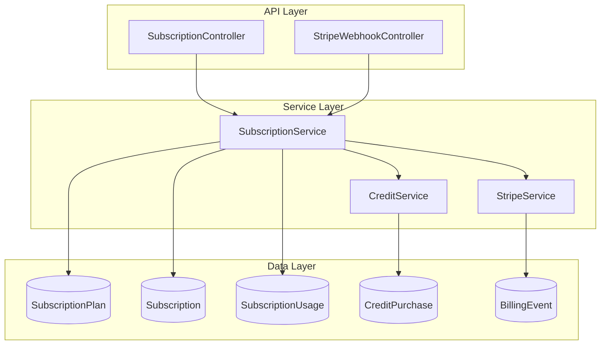
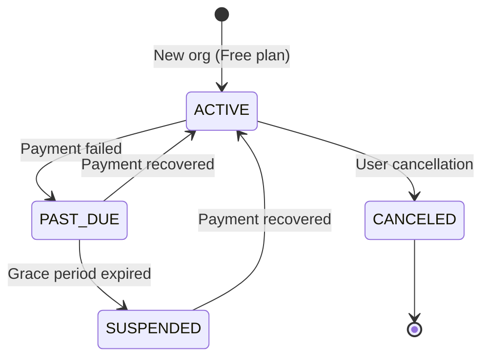
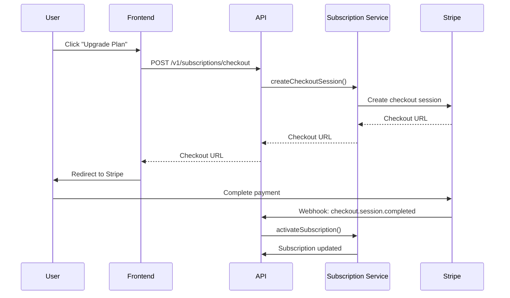

# Subscription Module Specification v9

<Info>
**Status:** Active — fully implemented  
**Module Path:** `src/modules/subscription/`  
**Payment Gateway:** Stripe
</Info>

## Overview

The Subscription Module implements a **freemium SaaS billing system** for PropWise CRM. Every organization has a subscription tied to one of four plan tiers. The module handles:

- **Plan-based feature gating** — binary feature flags per tier
- **Resource limits** — caps on leads, contacts, deals, companies, and storage
- **Credit-based metering** — monthly AI and messaging allowances with purchasable top-ups
- **Dual seat types** — manager seats and agent seats with per-tier pricing; every user consumes a seat
- **Stripe integration** — checkout, subscription management, mid-cycle plan changes, webhooks, billing portal
- **Proration** — mid-cycle upgrades, downgrades, and seat changes are prorated to the day
- **Suspension flow** — 2-day grace period on payment failure, then org goes read-only

### Design Principles

<CardGroup cols={2}>
  <Card title="Freemium Model" icon="gift">
    Free plan with limited features; paid tiers unlock progressively
  </Card>
  <Card title="Per-Organization Billing" icon="building">
    Billing is per organization; developer portal is free
  </Card>
  <Card title="Dual Seat Types" icon="users">
    Manager seats (Owner, Admin) and agent seats (Basic, custom roles)
  </Card>
  <Card title="Feature Flags Over Tier Checks" icon="flag">
    Uses `@RequiresFeature('flag')` on plan JSONB for flexible gating
  </Card>
</CardGroup>

<Note>
Every user consumes exactly one seat, with seat type automatically determined by the user's RBAC role.
</Note>

## Architecture

### High-Level Diagram



### Data Flow Patterns

<Tabs>
  <Tab title="First-time Checkout">
    ```
    Frontend "Upgrade" button
      → POST /v1/subscriptions/checkout
        → Rejects if org already has Stripe subscription
        → SubscriptionService.createCheckoutSession()
          → StripeService.createCheckoutSession()
            → Returns Stripe Checkout URL
              → User pays on Stripe's hosted page
                → Stripe fires checkout.session.completed webhook
                  → StripeWebhookController processes event
                    → SubscriptionService.activateSubscription()
                      → Subscription entity updated to ACTIVE
    ```
  </Tab>
  
  <Tab title="Plan Changes">
    ```
    Frontend "Change Plan" button
      → POST /v1/subscriptions/change-plan
        → SubscriptionService.changePlan()
          → Validates seat overflow
          → StripeService.swapSubscriptionPrice() — prorated
          → Reconciles seat line items
          → Updates local Subscription entity
          → Returns updated subscription
    ```
  </Tab>
  
  <Tab title="Payment Failure">
    ```
    Stripe charges renewal invoice
      ├─ invoice.paid → status stays ACTIVE
      └─ invoice.payment_failed → status → PAST_DUE
           └─ Stripe retries for 2 days
                ├─ Payment succeeds → back to ACTIVE
                └─ All retries fail → status → SUSPENDED
                     → Org becomes read-only
    ```
  </Tab>
</Tabs>

## Plan Tiers & Pricing

Four tiers are available, priced in USD cents:

| Plan | Monthly | Annual | Manager Seats | Agent Seats |
|------|---------|---------|---------------|-------------|
| **Free** | $0 | $0 | 1 | 0 |
| **Starter** | $49 | $470.40 | 2 | 3 |
| **Professional** | $149 | $1,430.40 | 5 | 15 |
| **Business** | $399 | $3,830.40 | 10 | 40 |

<Note>
Annual plans include approximately 20% discount compared to monthly billing.
</Note>

### Extra Seat Pricing

| Seat Type | Starter | Professional | Business |
|-----------|---------|--------------|----------|
| Manager seat | $25/mo | $20/mo | $18/mo |
| Agent seat | $12/mo | $10/mo | $8/mo |

### Resource Limits

<AccordionGroup>
  <Accordion title="Entity Limits">
    | Resource | Free | Starter | Professional | Business |
    |----------|------|---------|--------------|----------|
    | Leads | 50 | 1,000 | 10,000 | Unlimited |
    | Contacts | 50 | 1,000 | 10,000 | Unlimited |
    | Deals | 20 | 500 | 5,000 | Unlimited |
    | Companies | 10 | 200 | 2,000 | Unlimited |
    | Storage | 500 MB | 5 GB | 25 GB | 100 GB |
  </Accordion>
  
  <Accordion title="Monthly Credits">
    | Credit type | Free | Starter | Professional | Business |
    |-------------|------|---------|--------------|----------|
    | AI credits | 20 | 200 | 1,000 | 5,000 |
    | Messaging credits | 0 | 100 | 500 | 2,000 |
  </Accordion>
</AccordionGroup>

## Feature Gating Model

Features are gated using three distinct mechanisms:

### Type 1: Binary Feature Flags

Boolean flags stored in `SubscriptionPlan.features` (JSONB). Checked via `@RequiresFeature('flagName')` guard decorator or `SubscriptionService.checkFeature()`.

| Feature Flag | Free | Starter | Pro | Business |
|--------------|------|---------|-----|----------|
| `customPipelineStages` | ❌ | ✅ | ✅ | ✅ |
| `distributionEngine` | ❌ | ❌ | ✅ | ✅ |
| `escalationEngine` | ❌ | ❌ | ✅ | ✅ |
| `advancedAnalytics` | ❌ | ❌ | ✅ | ✅ |
| `apiAccess` | ❌ | ❌ | ✅ | ✅ |
| `commissionTracking` | ❌ | ❌ | ✅ | ✅ |
| `teamsAndHierarchy` | ❌ | ❌ | ✅ | ✅ |
| `customRoles` | ❌ | ❌ | ❌ | ✅ |
| `whiteLabel` | ❌ | ❌ | ❌ | ✅ |

### Type 2: Numeric Limits

| Limit | Free | Starter | Pro | Business |
|-------|------|---------|-----|----------|
| `maxMessagingChannels` | 0 | 1 | 3 | Unlimited (-1) |
| `maxEmailIntegrations` | 0 | 1 | 3 | Unlimited (-1) |
| `auditLogRetentionDays` | 0 | 0 | 30 | Unlimited (-1) |

### Type 3: Credit-Based (Monthly Allowance)

Features available on the tier but with monthly budgets that reset each billing cycle. Tracked in `SubscriptionUsage`. When exhausted, organizations can purchase one-time top-up packs.

<Warning>
Consumption order: **monthly plan allowance first → purchased packs FIFO (oldest first)**.
</Warning>

## Seat Management

### Seat Types

Every user in an organization consumes exactly one seat. The seat type is **derived from the user's RBAC role**.

<Tabs>
  <Tab title="Manager Seats">
    **Roles:** Owner, Admin  
    **Price:** Varies by tier  
    **Capabilities:** Full administrative access
  </Tab>
  
  <Tab title="Agent Seats">
    **Roles:** Basic, custom org roles  
    **Price:** Lower than manager seats  
    **Capabilities:** Standard user access
  </Tab>
</Tabs>

### Seat Counting Logic

```typescript
const ROLE_SEAT_MAP: Record<string, SeatType> = {
  Owner: SeatType.MANAGER,
  Admin: SeatType.MANAGER,
};
// Any other role → SeatType.AGENT
```

Seats are derived from active `UserOrgRole` records:

```typescript
managerSeatsUsed = count of active users with Owner or Admin org role
agentSeatsUsed   = count of active users with any other org role
```

<Check>
A seat is **not occupied** by a pending invitation — it only counts when the user has accepted and has an active `UserOrgRole`.
</Check>

### Enforcement Points

<Steps>
  <Step title="Invitation Service">
    Before creating an invitation, the role determines the seat type and availability is checked
  </Step>
  <Step title="Role Assignment Validation">
    When changing a user's role (e.g., promoting Basic → Admin), checks that the target seat type has room
  </Step>
</Steps>

### Proration on Seat Changes

Adding or removing seats mid-cycle uses `proration_behavior: 'create_prorations'`:

<CodeGroup>
```typescript Example: Adding Seat Mid-Cycle
// Adding a seat on April 15 (30-day month)
// Prorated charge for 15 remaining days
const prorationAmount = (seatPrice / 30) * 15;
```

```typescript Example: Net Seat Change
// Adding on April 4, removing on April 6
// Net charge for 2 days only
const netCharge = (seatPrice / 30) * 2;
```
</CodeGroup>

## Credit System

### Consumption Flow

```typescript
SubscriptionService.consumeCredits(orgId, 'ai', 1)
  → CreditService.consumeCredits(subscription, AI, 1)
    1. Check monthly allowance: usage.aiCreditsUsed < plan.aiCredits
    2. If insufficient, check purchased packs (FIFO order)
    3. Update usage counters
    4. Return success/failure + remaining balance
```

<Warning>
Credits are consumed in strict order: monthly allowance first, then purchased packs in first-in-first-out order.
</Warning>

### Credit Types

<CardGroup cols={2}>
  <Card title="AI Credits" icon="brain">
    Used for AI-powered features like lead scoring, content generation, and analytics
  </Card>
  <Card title="Messaging Credits" icon="message">
    Used for SMS, email campaigns, and automated communications
  </Card>
</CardGroup>

## Entity Specifications

### SubscriptionPlan

```typescript
interface SubscriptionPlan {
  id: string;
  name: string; // 'free' | 'starter' | 'professional' | 'business'
  displayName: string;
  monthlyPriceUsd: number; // USD cents
  annualPriceUsd: number;  // USD cents
  features: Record<string, boolean | number>; // JSONB
  managerSeatsIncluded: number;
  agentSeatsIncluded: number;
  extraManagerSeatPriceUsd: number;
  extraAgentSeatPriceUsd: number;
  // Resource limits
  maxLeads: number;        // -1 = unlimited
  maxContacts: number;
  maxDeals: number;
  maxCompanies: number;
  maxStorageMb: number;
  // Monthly credit allowances
  aiCredits: number;
  messagingCredits: number;
}
```

### Subscription

```typescript
interface Subscription {
  id: string;
  organizationId: string;
  planId: string;
  status: SubscriptionStatus;
  billingCycle: 'monthly' | 'annual';
  stripeSubscriptionId?: string;
  stripeCustomerId?: string;
  currentPeriodStart?: Date;
  currentPeriodEnd?: Date;
  cancelAtPeriodEnd: boolean;
  trialEndsAt?: Date;
}

enum SubscriptionStatus {
  ACTIVE = 'active',
  PAST_DUE = 'past_due',
  SUSPENDED = 'suspended',
  CANCELED = 'canceled'
}
```

### SubscriptionUsage

```typescript
interface SubscriptionUsage {
  id: string;
  subscriptionId: string;
  // Current billing period usage
  aiCreditsUsed: number;
  messagingCreditsUsed: number;
  // Period tracking
  usagePeriodStart: Date;
  usagePeriodEnd: Date;
  // Reset monthly on billing cycle
}
```

## Stripe Integration

### Webhook Events

<AccordionGroup>
  <Accordion title="Critical Events">
    | Event | Handler | Action |
    |-------|---------|--------|
    | `checkout.session.completed` | `handleCheckoutCompleted` | Activate subscription |
    | `customer.subscription.updated` | `handleSubscriptionUpdated` | Sync status changes |
    | `invoice.paid` | `handleInvoicePaid` | Update period dates |
    | `invoice.payment_failed` | `handleInvoicePaymentFailed` | Mark past due |
  </Accordion>
  
  <Accordion title="Logging Events">
    All webhook events are logged in the `BillingEvent` table with unique `stripeEventId` to prevent duplicate processing.
    
    ```typescript
    interface BillingEvent {
      id: string;
      stripeEventId: string; // Unique constraint
      eventType: string;
      organizationId?: string;
      data: Record<string, any>; // JSONB
      processedAt: Date;
    }
    ```
  </Accordion>
</AccordionGroup>

### Stripe Configuration

```typescript
// Environment variables
STRIPE_SECRET_KEY=sk_live_... // or sk_test_...
STRIPE_WEBHOOK_SECRET=whsec_...
STRIPE_PUBLISHABLE_KEY=pk_live_... // Frontend use
```

<Warning>
If `STRIPE_SECRET_KEY` is not set, billing features are unavailable but the app still starts normally.
</Warning>

## Subscription Lifecycle

### Activation Flow

<Steps>
  <Step title="Free Tier Start">
    Every new organization starts on the Free plan with an ACTIVE subscription
  </Step>
  <Step title="Upgrade Process">
    Organization upgrades via Stripe Checkout, webhook activates paid subscription
  </Step>
  <Step title="Renewal Cycle">
    Stripe handles automatic renewals, webhooks keep local state synchronized
  </Step>
  <Step title="Payment Issues">
    Failed payments trigger 2-day grace period, then suspension
  </Step>
</Tabs>

### Status Transitions



## Plan Changes (Upgrade / Downgrade)

### Validation Rules

<Check>
**Upgrade validation:** Always allowed (more features, higher limits)
</Check>

<Warning>
**Downgrade validation:** Blocked if current usage exceeds new plan limits (seat overflow protection)
</Warning>

### Proration Logic

All mid-cycle plan changes use Stripe's `proration_behavior: 'create_prorations'`:

```typescript
// Example: Professional → Business on day 15 of 30-day cycle
const remainingDays = 15;
const proratedCredit = (professionalPrice / 30) * remainingDays;
const proratedCharge = (businessPrice / 30) * remainingDays;
const netAmount = proratedCharge - proratedCredit;
```

## API Endpoints

### Subscription Management

<CodeGroup>
```typescript GET /v1/subscriptions
// Get current organization's subscription
{
  "subscription": {
    "id": "sub_123",
    "plan": {
      "name": "professional",
      "displayName": "Professional"
    },
    "status": "active",
    "usage": {
      "aiCreditsUsed": 150,
      "aiCreditsRemaining": 850
    }
  }
}
```

```typescript POST /v1/subscriptions/checkout
// Create Stripe checkout session for upgrade
{
  "planId": "plan_professional",
  "billingCycle": "monthly",
  "managerSeats": 3,
  "agentSeats": 10
}
// Returns: { "checkoutUrl": "https://checkout.stripe.com/..." }
```

```typescript POST /v1/subscriptions/change-plan
// Change between paid plans
{
  "planId": "plan_business",
  "managerSeats": 5,
  "agentSeats": 20
}
// Returns updated subscription
```
</CodeGroup>

### Credit Management

<CodeGroup>
```typescript GET /v1/subscriptions/credits
// Get credit balance and history
{
  "balance": {
    "ai": { "monthly": 850, "purchased": 200, "total": 1050 },
    "messaging": { "monthly": 400, "purchased": 0, "total": 400 }
  }
}
```

```typescript POST /v1/subscriptions/credits/purchase
// Buy credit top-up pack
{
  "creditType": "ai",
  "quantity": 500
}
// Returns: { "paymentIntentId": "pi_..." }
```
</CodeGroup>

## Guards & Decorators

### Feature Gating

```typescript
@RequiresFeature('customPipelineStages')
@Post('custom-stages')
async createCustomStage() {
  // This endpoint is blocked on Free plan
}
```

### Subscription Status

```typescript
@UseGuards(SubscriptionActiveGuard)
@Post('leads')
async createLead() {
  // Blocked if subscription is SUSPENDED
}
```

### Resource Limits

```typescript
// Service-layer enforcement (not guards)
async createLead(data: CreateLeadDto) {
  await this.subscriptionService.checkResourceLimit('leads');
  // Throws if org has reached lead limit for their plan
  return this.leadRepository.create(data);
}
```

## Enforcement Points

### Integration Points

<CardGroup cols={2}>
  <Card title="Invitation Service" icon="envelope">
    Checks seat availability before creating invitations
  </Card>
  <Card title="Role Assignment" icon="user-check">
    Validates seat capacity when changing user roles
  </Card>
  <Card title="Entity Services" icon="database">
    Enforces resource limits in service methods
  </Card>
  <Card title="Feature Controllers" icon="shield-alt">
    Uses guards to block access to premium features
  </Card>
</CardGroup>

### Credit Consumption

```typescript
// Example: AI feature consumption
async generateLeadInsights(leadId: string) {
  // Consume 1 AI credit before processing
  await this.subscriptionService.consumeCredits(orgId, 'ai', 1);
  
  // Process AI insights
  return this.aiService.generateInsights(leadId);
}
```

## Plan Seeder

### Database Initialization

The plan seeder (`subscription-plan.seeder.ts`) populates the four tiers with current pricing and features:

<Steps>
  <Step title="Free Plan Setup">
    Creates free tier with basic limits and no premium features
  </Step>
  <Step title="Paid Plans Setup">
    Creates Starter, Professional, and Business tiers with progressive features
  </Step>
  <Step title="Feature Flag Assignment">
    Populates JSONB `features` field with tier-appropriate flags
  </Step>
</Steps>

<Note>
Changing what features a tier includes requires only updating the seeder and re-running it — no code changes needed.
</Note>

## Module Structure

```
src/modules/subscription/
├── controllers/
│   ├── subscription.controller.ts
│   └── stripe-webhook.controller.ts
├── services/
│   ├── subscription.service.ts
│   ├── credit.service.ts
│   └── stripe.service.ts
├── entities/
│   ├── subscription-plan.entity.ts
│   ├── subscription.entity.ts
│   ├── subscription-usage.entity.ts
│   ├── credit-purchase.entity.ts
│   └── billing-event.entity.ts
├── guards/
│   ├── requires-feature.guard.ts
│   └── subscription-active.guard.ts
├── decorators/
│   └── requires-feature.decorator.ts
├── seeders/
│   └── subscription-plan.seeder.ts
└── subscription.module.ts
```

## Environment Configuration

### Required Variables

```bash
# Stripe Integration
STRIPE_SECRET_KEY=sk_test_... # or sk_live_...
STRIPE_WEBHOOK_SECRET=whsec_...
STRIPE_PUBLISHABLE_KEY=pk_test_... # Frontend use

# Optional: Graceful degradation
# If STRIPE_SECRET_KEY is missing, billing features disabled
```

<Warning>
Production deployments must use live Stripe keys (`sk_live_`, `pk_live_`). Test keys are only for development.
</Warning>

## Integration with Other Modules

### Cross-Module Dependencies

<AccordionGroup>
  <Accordion title="Organization Module">
    - Every organization has exactly one subscription
    - `Organization.stripeCustomerId` links to Stripe
    - Subscription status affects org-wide permissions
  </Accordion>
  
  <Accordion title="User Management">
    - Seat counting derived from `UserOrgRole` entities
    - Role changes trigger seat type transitions
    - Invitation system checks seat availability
  </Accordion>
  
  <Accordion title="CRM Entities">
    - Lead, Contact, Deal, Company creation checks resource limits
    - Entity counts enforced at service layer
    - Storage limits applied to file uploads
  </Accordion>
  
  <Accordion title="AI & Messaging">
    - Credit consumption before AI operations
    - Monthly credit allowances reset each billing cycle
    - Top-up packs purchasable via Stripe Payment Intents
  </Accordion>
</AccordionGroup>

### Event Flow



<Tip>
The subscription module is designed for extensibility. New plan tiers, features, or credit types can be added by updating the seeder without code changes.
</Tip>