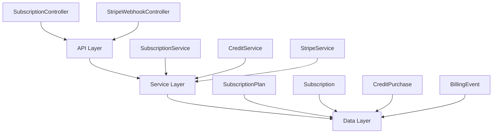

The Subscription Module implements a **freemium SaaS billing system** for PropWise CRM. Every organization has a subscription tied to one of four plan tiers. The module handles plan-based feature gating, resource limits, credit-based metering, dual seat types, and full Stripe integration.

<Info>
**Status:** Active — fully implemented  
**Module Path:** `src/modules/subscription/`  
**Payment Gateway:** Stripe
</Info>

## Overview

The Subscription Module provides comprehensive billing capabilities including:

- **Plan-based feature gating** — binary feature flags per tier
- **Resource limits** — caps on leads, contacts, deals, companies, and storage
- **Credit-based metering** — monthly AI and messaging allowances with purchasable top-ups
- **Dual seat types** — manager seats and agent seats with per-tier pricing; every user consumes a seat
- **Stripe integration** — checkout, subscription management, mid-cycle plan changes, webhooks, billing portal
- **Proration** — mid-cycle upgrades, downgrades, and seat changes are prorated to the day
- **Suspension flow** — 2-day grace period on payment failure, then org goes read-only

### Design Principles

<CardGroup cols={2}>
<Card title="Freemium Model" icon="gift">
Free plan with limited features; paid tiers unlock progressively
</Card>

<Card title="Per-Organization Billing" icon="building">
Billing is per organization; developer portal is free
</Card>

<Card title="Dual Seat Types" icon="users">
Manager seats (Owner, Admin) and agent seats (Basic, custom roles)
</Card>

<Card title="Feature Flags Over Tier Checks" icon="flag">
Gating uses `@RequiresFeature('flag')` on plan JSONB for flexible configuration
</Card>
</CardGroup>

<Note>
Seat type is automatically determined by the user's RBAC role — no explicit seat assignment required.
</Note>

## Architecture

### High-Level System Design



### Data Flow Patterns

<Tabs>
<Tab title="First-Time Checkout">
```
Frontend "Upgrade" button
  → POST /v1/subscriptions/checkout
    → SubscriptionService.createCheckoutSession()
      → StripeService.createCheckoutSession()
        → Stripe Checkout URL returned
          → User pays on Stripe's hosted page
            → checkout.session.completed webhook
              → SubscriptionService.activateSubscription()
                → Subscription entity updated to ACTIVE
```
</Tab>

<Tab title="Plan Change">
```
Frontend "Change Plan" button
  → POST /v1/subscriptions/change-plan
    → SubscriptionService.changePlan()
      → Validates seat overflow
      → StripeService.swapSubscriptionPrice() (prorated)
      → Reconciles seat line items
      → Updates local Subscription entity
```
</Tab>

<Tab title="Payment Failure">
```
Stripe charges renewal invoice
  ├─ invoice.paid → status stays ACTIVE
  └─ invoice.payment_failed → status → PAST_DUE
       └─ After 2 days of failed retries
            → customer.subscription.updated (status: unpaid)
              → status → SUSPENDED (read-only mode)
```
</Tab>
</Tabs>

## Plan Tiers & Pricing

<CardGroup cols={4}>
<Card title="Free" icon="hand-wave">
**$0/month**
- 1 Manager seat
- 0 Agent seats
- Basic features only
</Card>

<Card title="Starter" icon="rocket">
**$49/month**
- 2 Manager seats
- 3 Agent seats
- Core CRM features
</Card>

<Card title="Professional" icon="briefcase">
**$149/month**
- 5 Manager seats
- 15 Agent seats
- Advanced features
</Card>

<Card title="Business" icon="building-columns">
**$399/month**
- 10 Manager seats
- 40 Agent seats
- Enterprise features
</Card>
</CardGroup>

### Resource Limits by Tier

| Resource | Free | Starter | Professional | Business |
|---|---|---|---|---|
| Leads | 50 | 1,000 | 10,000 | Unlimited |
| Contacts | 50 | 1,000 | 10,000 | Unlimited |
| Deals | 20 | 500 | 5,000 | Unlimited |
| Companies | 10 | 200 | 2,000 | Unlimited |
| Storage | 500 MB | 5 GB | 25 GB | 100 GB |

### Monthly Credit Allowances

| Credit Type | Free | Starter | Professional | Business |
|---|---|---|---|---|
| AI credits | 20 | 200 | 1,000 | 5,000 |
| Messaging credits | 0 | 100 | 500 | 2,000 |

<Warning>
Annual plans receive approximately 20% discount off monthly pricing.
</Warning>

## Feature Gating Model

The module implements three distinct gating mechanisms:

### Type 1: Binary Feature Flags

Boolean flags stored in `SubscriptionPlan.features` (JSONB). Checked via `@RequiresFeature('flagName')` guard decorator.

<AccordionGroup>
<Accordion title="Core Features">
| Feature | Free | Starter | Pro | Business |
|---|---|---|---|---|
| `customPipelineStages` | ❌ | ✅ | ✅ | ✅ |
| `distributionEngine` | ❌ | ❌ | ✅ | ✅ |
| `escalationEngine` | ❌ | ❌ | ✅ | ✅ |
| `advancedAnalytics` | ❌ | ❌ | ✅ | ✅ |
</Accordion>

<Accordion title="Advanced Features">
| Feature | Free | Starter | Pro | Business |
|---|---|---|---|---|
| `apiAccess` | ❌ | ❌ | ✅ | ✅ |
| `commissionTracking` | ❌ | ❌ | ✅ | ✅ |
| `teamsAndHierarchy` | ❌ | ❌ | ✅ | ✅ |
| `customRoles` | ❌ | ❌ | ❌ | ✅ |
| `whiteLabel` | ❌ | ❌ | ❌ | ✅ |
</Accordion>

<Accordion title="Integration Limits">
| Feature | Free | Starter | Pro | Business |
|---|---|---|---|---|
| `maxMessagingChannels` | 0 | 1 | 3 | Unlimited |
| `maxEmailIntegrations` | 0 | 1 | 3 | Unlimited |
| `auditLogRetentionDays` | 0 | 0 | 30 | Unlimited |
</Accordion>
</AccordionGroup>

### Type 2: Credit-Based Features

Features available on the tier but with monthly budgets. Tracked in `SubscriptionUsage`.

<Note>
Consumption order: **monthly plan allowance first → purchased packs FIFO (oldest first)**
</Note>

### Type 3: Add-on Packs

<CardGroup cols={3}>
<Card title="Storage Pack" icon="database">
+10 GB recurring
Stripe subscription line item
</Card>

<Card title="AI Credit Pack" icon="brain">
+500 credits one-time
Stripe payment intent
</Card>

<Card title="Messaging Pack" icon="message">
+500 credits one-time
Stripe payment intent
</Card>
</CardGroup>

## Seat Management

### Seat Type Classification

Every user consumes exactly one seat based on their RBAC role:

<Tabs>
<Tab title="Manager Seats">
**Roles:** Owner, Admin

**Pricing varies by tier:**
- Starter: $25/month extra
- Professional: $20/month extra
- Business: $18/month extra
</Tab>

<Tab title="Agent Seats">
**Roles:** Basic, custom org roles

**Pricing varies by tier:**
- Starter: $12/month extra
- Professional: $10/month extra
- Business: $8/month extra
</Tab>
</Tabs>

<Check>
Seat type is **derived from RBAC roles** — no separate seat assignment table needed.
</Check>

### Enforcement Points

<Steps>
<Step title="Invitation Creation">
Before creating an invitation, the role determines seat type and availability is checked in `invitation.service.ts`.
</Step>

<Step title="Role Assignment">
When changing a user's role, `role-assignment-validation.service.ts` checks target seat availability.
</Step>

<Step title="Proration on Changes">
Adding or removing seats mid-cycle uses `proration_behavior: 'create_prorations'` for fair daily billing.
</Step>
</Steps>

## Credit System

### Consumption Flow

```typescript
SubscriptionService.consumeCredits(orgId, 'ai', 1)
  → CreditService.consumeCredits(subscription, AI, 1)
    → Check monthly allowance first
    → If insufficient, consume from purchased packs (FIFO)
    → Update SubscriptionUsage tracking
```

### Credit Types

<CardGroup cols={2}>
<Card title="AI Credits" icon="brain">
Used for AI-powered features like lead scoring, content generation, and predictive analytics.
</Card>

<Card title="Messaging Credits" icon="envelope">
Used for SMS, email campaigns, and automated messaging workflows.
</Card>
</CardGroup>

<Warning>
Credits expire at the end of each billing cycle for monthly allowances. Purchased packs do not expire but are consumed first-in-first-out.
</Warning>

## Entity Specifications

### Core Entities

<AccordionGroup>
<Accordion title="SubscriptionPlan">
```typescript
{
  id: string;
  name: string; // 'Free', 'Starter', etc.
  price: number; // USD cents
  features: Record<string, any>; // JSONB feature flags
  limits: {
    leads: number;
    contacts: number;
    deals: number;
    companies: number;
    storageBytes: number;
  };
  credits: {
    aiCredits: number;
    messagingCredits: number;
  };
  seating: {
    managersIncluded: number;
    agentsIncluded: number;
    extraManagerPrice: number;
    extraAgentPrice: number;
  };
}
```
</Accordion>

<Accordion title="Subscription">
```typescript
{
  id: string;
  organizationId: string;
  subscriptionPlanId: string;
  stripeSubscriptionId?: string;
  status: SubscriptionStatus;
  currentPeriodStart: Date;
  currentPeriodEnd: Date;
  trialEnd?: Date;
  cancelAtPeriodEnd: boolean;
}
```
</Accordion>

<Accordion title="SubscriptionUsage">
```typescript
{
  id: string;
  subscriptionId: string;
  periodStart: Date;
  periodEnd: Date;
  aiCreditsUsed: number;
  messagingCreditsUsed: number;
  storageUsed: number;
}
```
</Accordion>
</AccordionGroup>

## Stripe Integration

### Webhook Event Handling

<Info>
All Stripe events are logged in `BillingEvent` with unique `stripeEventId` to prevent duplicate processing.
</Info>

<AccordionGroup>
<Accordion title="Checkout Completion">
**Event:** `checkout.session.completed`
- Activates subscription from PENDING to ACTIVE
- Creates initial SubscriptionUsage record
- Updates organization's stripeCustomerId
</Accordion>

<Accordion title="Invoice Payment">
**Event:** `invoice.paid`
- Maintains ACTIVE status
- Updates subscription period dates
- Resets monthly usage counters
</Accordion>

<Accordion title="Payment Failure">
**Event:** `invoice.payment_failed`
- Changes status to PAST_DUE
- Triggers 2-day grace period
- Sends notification emails
</Accordion>

<Accordion title="Subscription Updates">
**Event:** `customer.subscription.updated`
- Handles plan changes
- Processes seat adjustments
- Manages suspension/reactivation
</Accordion>
</AccordionGroup>

### Checkout vs Plan Changes

<Tabs>
<Tab title="First-Time Checkout">
**Endpoint:** `POST /v1/subscriptions/checkout`

Used when upgrading from Free to any paid tier. Creates new Stripe subscription.

```typescript
// Rejects if org already has Stripe subscription
if (subscription.stripeSubscriptionId) {
  throw new ConflictException('Use change-plan endpoint instead');
}
```
</Tab>

<Tab title="Plan Changes">
**Endpoint:** `POST /v1/subscriptions/change-plan`

Used for switching between paid tiers. Modifies existing Stripe subscription with proration.

```typescript
// Validates seat overflow before change
const currentUsers = await this.getCurrentUserCount(orgId);
if (currentUsers.managers > newPlan.seating.managersIncluded) {
  throw new BadRequestException('Too many manager seats in use');
}
```
</Tab>
</Tabs>

## API Endpoints

<CodeGroup>
```typescript GET /v1/subscriptions/current
// Get current subscription details
{
  "subscription": {
    "id": "sub_123",
    "plan": {
      "name": "Professional",
      "price": 14900
    },
    "status": "ACTIVE",
    "seats": {
      "managers": { "used": 3, "included": 5 },
      "agents": { "used": 12, "included": 15 }
    },
    "credits": {
      "ai": { "used": 245, "available": 1000 },
      "messaging": { "used": 89, "available": 500 }
    }
  }
}
```

```typescript POST /v1/subscriptions/checkout
// Create checkout session for Free → Paid upgrade
{
  "planId": "plan_professional",
  "billingCycle": "monthly"
}

// Response:
{
  "checkoutUrl": "https://checkout.stripe.com/pay/cs_test_..."
}
```

```typescript POST /v1/subscriptions/change-plan
// Change between paid tiers
{
  "planId": "plan_business",
  "billingCycle": "annual"
}

// Response:
{
  "subscription": { /* updated subscription */ },
  "prorationAmount": 5000 // USD cents
}
```

```typescript POST /v1/subscriptions/purchase-credits
// Buy one-time credit pack
{
  "type": "ai", // or "messaging"
  "quantity": 1 // number of 500-credit packs
}

// Response:
{
  "paymentUrl": "https://checkout.stripe.com/pay/pi_..."
}
```
</CodeGroup>

## Guards & Decorators

### Feature Protection

```typescript
@RequiresFeature('advancedAnalytics')
@Get('/analytics/advanced')
async getAdvancedAnalytics() {
  // Only accessible on Professional+ plans
}
```

### Subscription Status Protection

```typescript
@UseGuards(SubscriptionActiveGuard)
@Post('/leads')
async createLead() {
  // Blocked if subscription is SUSPENDED
}
```

### Credit Consumption

```typescript
@ConsumeCredits('ai', 1)
@Post('/ai/score-lead')
async scoreLeadWithAI() {
  // Automatically consumes 1 AI credit
}
```

## Module Structure

```
src/modules/subscription/
├── controllers/
│   ├── subscription.controller.ts
│   └── stripe-webhook.controller.ts
├── services/
│   ├── subscription.service.ts
│   ├── credit.service.ts
│   └── stripe.service.ts
├── entities/
│   ├── subscription-plan.entity.ts
│   ├── subscription.entity.ts
│   ├── subscription-usage.entity.ts
│   ├── credit-purchase.entity.ts
│   └── billing-event.entity.ts
├── guards/
│   ├── subscription-active.guard.ts
│   └── requires-feature.guard.ts
├── decorators/
│   ├── requires-feature.decorator.ts
│   └── consume-credits.decorator.ts
├── enums/
│   ├── subscription-status.enum.ts
│   └── billing-cycle.enum.ts
└── seeders/
    └── subscription-plan.seeder.ts
```

## Environment Configuration

<CodeGroup>
```bash Required Variables
# Stripe Integration
STRIPE_SECRET_KEY=sk_test_...
STRIPE_WEBHOOK_SECRET=whsec_...
STRIPE_PUBLISHABLE_KEY=pk_test_...

# Application URLs
APP_BASE_URL=https://app.propwise.ai
BILLING_PORTAL_RETURN_URL=https://app.propwise.ai/settings/billing
```

```bash Optional Variables
# Grace period before suspension (default: 2 days)
SUBSCRIPTION_GRACE_PERIOD_DAYS=2

# Credit pack sizes (default: 500)
AI_CREDIT_PACK_SIZE=500
MESSAGING_CREDIT_PACK_SIZE=500

# Storage pack size (default: 10GB)
STORAGE_PACK_SIZE_GB=10
```
</CodeGroup>

<Warning>
If `STRIPE_SECRET_KEY` is not set, billing features are unavailable but the app still starts for development.
</Warning>

## Integration with Other Modules

### User Management Integration

<CardGroup cols={2}>
<Card title="Role Changes" icon="user-gear">
When a user's role changes, seat consumption is automatically recalculated and Stripe line items are updated.
</Card>

<Card title="User Removal" icon="user-minus">
Removing a user frees their seat and triggers prorated credit on the next invoice.
</Card>
</CardGroup>

### Organization Module

<CardGroup cols={2}>
<Card title="Organization Creation" icon="building">
Every new organization automatically gets a Free subscription with default usage tracking.
</Card>

<Card title="Suspension Mode" icon="pause">
Suspended organizations become read-only — users can view data but cannot create or modify records.
</Card>
</CardGroup>

### Audit Trail Integration

<Tip>
All subscription changes, credit consumption, and billing events are automatically logged to the audit trail for compliance and debugging.
</Tip>