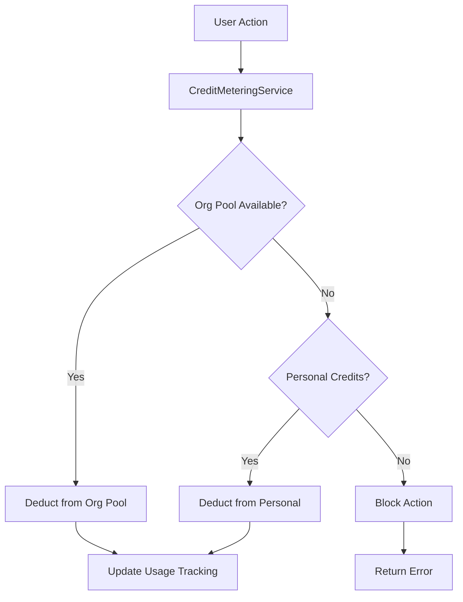

# Subscription Plan Rollout Specification

This document implements the subscription packaging rollout strategy with Free/Pro/Business tiers (AED), providing phase-by-phase implementation details for backend and frontend development.

<Note>
This specification is based on the propwise-crm-backend/Docs/SUBSCRIPTION_PACKAGING_STRATEGY.md strategy document and addresses all 12 identified gaps through structured phases.
</Note>

## Overview

The rollout implements a three-tier subscription model with unified credit wallet, seat management, and trial functionality. The implementation is backend-first, followed by frontend integration.

### Key Decisions

<AccordionGroup>
  <Accordion title="Tier Naming & Structure">
    - Keep internal tier ID `professional` but display as "Pro"
    - Retire Starter tier through data migration
    - Collapse manager/agent two-SKU seat model into single per-agent SKU
  </Accordion>

  <Accordion title="Credit Wallet System">
    - Unified wallet owned by subscription module via CreditMeteringService
    - Shared org pool with per-user ceilings (not reserved carve-outs)
    - Personal credits as fallback after org pool
    - Consolidate CreditType.MESSAGING into single CreditType.AI wallet
  </Accordion>

  <Accordion title="Entity Management">
    - Source-of-record: reuse Lead.leadSource === LeadSource.IMPORTED
    - New isImported boolean for Contact/Deal/Company
    - Cap counts non-imported AND isDeleted = false entities
    - Archived rows still count toward caps
  </Accordion>
</AccordionGroup>

## Implementation Phases

### Phase 0: Foundation Setup

<Steps>
  <Step title="Update Plan Definitions">
    Update aiCreditsPerMonth from 20 to 2000 for Free tier (~100x rebase)
  </Step>

  <Step title="Starter Tier Removal">
    - Create data migration to repoint Starter subscriptions to Professional
    - Delete PlanTier.STARTER from enum and PLAN_DEFINITIONS
    - Update PLAN_TIER_ORDER
  </Step>
</Steps>

### Phase 1: Webhook Enhancement

<Warning>
One-time credit-pack refunds/disputes (charge.refunded) are OUT OF SCOPE for v1.
</Warning>

<Steps>
  <Step title="Extend Webhook Routing">
    Enhance `routeEvent` to handle credit pack purchases beyond the current 5 subscription events
  </Step>

  <Step title="Update Checkout Handler">
    Modify `handleCheckoutCompleted` to process one-time purchases (not just subscription mode)
  </Step>
</Steps>

### Phase 2: Trial System Integration

<Steps>
  <Step title="Centralize Trial Logic">
    Derive TRIALING + trialEndsAt from Stripe subscription in `buildActivationParamsFromCheckoutMetadata`
  </Step>

  <Step title="Update Activation Flow">
    Ensure both webhook and checkout paths use shared `activateSubscription` logic
  </Step>

  <Step title="Add Trial Webhook">
    Implement `customer.subscription.trial_will_end` webhook handler
  </Step>
</Steps>

### Phase 3: Credit Metering Service

<Tip>
New gates must respect `isSubscriptionEnforcementEnabled()` like legacy gates.
</Tip>

<Steps>
  <Step title="Create CreditMeteringService">
    Implement facade wrapping CreditService + consolidated per-user allocation table + CreditPurchase
  </Step>

  <Step title="Consolidate Credit Stores">
    Merge AiUsageAccount and AiCreditUsage into single store behind the facade
  </Step>

  <Step title="Implement Enforcement Flag">
    Define balance/cost-map read behavior when enforcement is OFF
  </Step>
</Steps>

### Phase 4: Entity Cap System

<Steps>
  <Step title="Add isImported Fields">
    Add isImported boolean to Contact, Deal, and Company entities
  </Step>

  <Step title="Update Import Services">
    - Modify lead-import.service.ts to use existing LeadSource.IMPORTED
    - Update contact-import.service.ts to stamp auto-created companies as isImported = true
  </Step>

  <Step title="Implement Cap Enforcement">
    - Hard-block user-initiated creates with 403
    - Soft-degrade inbound WhatsApp/Meta auto-create
    - Skip bulk-import path entirely
  </Step>

  <Step title="Update Count Predicates">
    Count non-imported AND isDeleted = false entities (archived still count)
  </Step>
</Steps>

### Phase 5: AI Budget Integration

<Note>
Phase 5 depends on Phase 9's seat count implementation. Execute Phase 9 before Phase 5.4.
</Note>

<Steps>
  <Step title="Update SpendContext">
    Modify to avoid subscription module importing RBAC/messaging
  </Step>

  <Step title="Replace Existing Gates">
    Replace AiUsageGuardService.assertCanCallModel and AiAgentBudgetGuardService (behavior-equivalence risk)
  </Step>

  <Step title="Implement Unit Valuation">
    300 credits per valuation call, waive prompt charge when turn performs valuation
  </Step>

  <Step title="Add Per-Seat Allowance">
    Implement aiCreditsPerMonth × getSeatCount(orgId) calculation
  </Step>

  <Step title="Update Consumption Model">
    Org-first, then personal credits consumption pattern
  </Step>

  <Step title="Update AI Runtime Gates">
    Replace four SUBSCRIPTION_GATE block markers in ai-agent-runtime.service.ts
  </Step>
</Steps>

### Phase 6: Storage & Inventory Limits

<CodeGroup>
```typescript Storage Guard Implementation
class StorageGuard {
  async checkStorageLimit(orgId: string, uploadSize: number): Promise<void> {
    if (!isSubscriptionEnforcementEnabled()) {
      return; // Skip enforcement when disabled
    }
    
    const usage = await this.getStorageUsage(orgId);
    const limit = await this.getStorageLimit(orgId);
    
    if (usage + uploadSize > limit) {
      throw new StorageLimitExceededError();
    }
  }
}
```

```typescript Inventory Cap
interface PlanLimits {
  inventoryUnits: number; // 25 for Free, unlimited for Pro/Business
}
```
</CodeGroup>

<Steps>
  <Step title="Add Storage Guards">
    Implement storage limit enforcement with enforcement flag respect
  </Step>

  <Step title="Add Inventory Caps">
    25-unit cap on Free tier through new PlanLimits field
  </Step>

  <Step title="Update Documentation">
    Document streaming-chat exhaustion contract in AI_ASSISTANT_MODULE_SPECIFICATION.md
  </Step>
</Steps>

### Phase 7: Subscription Management API

<Steps>
  <Step title="Implement Plan Changes">
    Add upgrade/downgrade functionality with prorated billing
  </Step>

  <Step title="Add Seat Management">
    Implement add/remove seats with immediate billing adjustments
  </Step>

  <Step title="Create Credit Purchase">
    One-time credit pack purchase system
  </Step>

  <Step title="Add Trial Management">
    Trial extension and conversion handling
  </Step>
</Steps>

### Phase 8: Usage Tracking & Analytics

<Steps>
  <Step title="Enhanced Usage Metrics">
    Expand tracking for all plan features and limits
  </Step>

  <Step title="Credit Usage Analytics">
    Detailed credit consumption tracking and reporting
  </Step>

  <Step title="Billing Integration">
    Usage-based billing calculations and invoice generation
  </Step>
</Steps>

### Phase 9: Seat Count Consolidation

<Warning>
Execute this phase before Phase 5.4 due to forward dependency.
</Warning>

<Steps>
  <Step title="Consolidate Seat Counting">
    Replace `countSeatsByType` with single `getSeatCount` to avoid module-boundary violations
  </Step>

  <Step title="Repurpose Columns">
    Use agentSeats* as single seat counter, zero out managerSeats* columns
  </Step>

  <Step title="Backfill Existing Data">
    Backfill agentSeatsTotal = manager + agent for existing SubscriptionUsage rows
  </Step>

  <Step title="Update Stripe Integration">
    Replace dual seat line items with single seat SKU per tier
  </Step>
</Steps>

### Phase 10: Frontend Integration

<Tabs>
  <Tab title="Billing Routes">
    Consolidate to single `/settings/billing` route:
    - Adopt plan-billing's secondary-sidebar shell + design
    - Enrich with full billing functionality
    - Retire `/settings/plan-billing` with redirect
    - Gate to system.owner access
  </Tab>
  
  <Tab title="Credit Management">
    "My AI Credits" as tab under `/settings/account`:
    - Org credit balance and usage display
    - Personal credit purchase interface
    - Usage history and analytics
  </Tab>
</Tabs>

<Steps>
  <Step title="Plan Comparison UI">
    Interactive plan comparison with feature matrix
  </Step>

  <Step title="Trial Experience">
    - Countdown timer and banners
    - Top-up credit flows
    - Trial-to-paid conversion UI
  </Step>

  <Step title="Usage Dashboards">
    Real-time usage tracking and limit visualization
  </Step>

  <Step title="Seat Management Interface">
    Add/remove seats with billing preview
  </Step>
</Steps>

### Phase 11: Documentation & Testing

<CardGroup cols={2}>
  <Card title="Backend Documentation" href="#backend-specs">
    Update SUBSCRIPTION_MODULE_SPECIFICATION.md, AI_MODULE_SPECIFICATION.md, and AI_ASSISTANT_MODULE_SPECIFICATION.md
  </Card>
  <Card title="API Documentation" href="#api-docs">
    Complete OpenAPI specs for all new endpoints and webhook handlers
  </Card>
</CardGroup>

<Steps>
  <Step title="Backend Specifications">
    Update all module specifications with new credit and subscription logic
  </Step>

  <Step title="API Documentation">
    Complete OpenAPI specifications for new endpoints
  </Step>

  <Step title="Integration Testing">
    End-to-end testing of subscription flows and credit management
  </Step>

  <Step title="Performance Testing">
    Load testing for credit metering and usage tracking systems
  </Step>
</Steps>

## Technical Architecture

### Credit Flow Architecture



### Subscription State Management

<CodeGroup>
```typescript Subscription States
enum SubscriptionStatus {
  TRIALING = 'trialing',
  ACTIVE = 'active',
  PAST_DUE = 'past_due',
  CANCELED = 'canceled',
  UNPAID = 'unpaid'
}
```

```typescript Plan Limits
interface PlanLimits {
  aiCreditsPerMonth: number;
  storageGB: number;
  inventoryUnits: number;
  maxSeats?: number; // undefined = unlimited
}
```
</CodeGroup>

## Migration Strategy

<Steps>
  <Step title="Data Migration">
    - Migrate Starter tier subscriptions to Professional
    - Backfill isImported flags based on existing data patterns
    - Consolidate credit usage from multiple stores
  </Step>

  <Step title="Feature Flag Rollout">
    Use `isSubscriptionEnforcementEnabled()` for gradual rollout
  </Step>

  <Step title="Monitoring & Rollback">
    - Monitor credit consumption patterns
    - Track subscription conversion rates
    - Maintain rollback capabilities for each phase
  </Step>
</Steps>

## Success Metrics

<AccordionGroup>
  <Accordion title="Technical Metrics">
    - Credit system accuracy (99.9% target)
    - API response times (<200ms for credit checks)
    - Webhook processing reliability (99.95% target)
  </Accordion>

  <Accordion title="Business Metrics">
    - Trial-to-paid conversion rates
    - Plan upgrade frequency
    - Credit utilization patterns
    - Customer satisfaction scores
  </Accordion>
</AccordionGroup>

<Check>
Implementation should be completed in sequential phases with thorough testing at each stage. Monitor system performance and user feedback throughout the rollout process.
</Check>