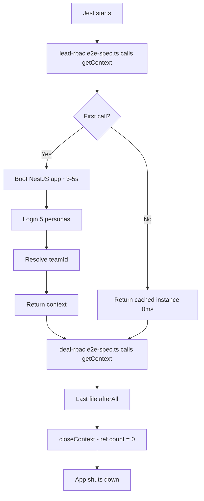

## Overview

The PropWise CRM backend test suite focuses on **RBAC (Role-Based Access Control) E2E testing** — verifying that every API endpoint enforces the correct permissions for every user role.

<Info>
**Stack:** Jest + supertest + `@nestjs/testing`
</Info>

### Key Design Decisions

<CardGroup cols={2}>
  <Card title="Singleton App Context" icon="server">
    The NestJS app boots once and is shared across all test files
  </Card>
  <Card title="Matrix-Driven Tests" icon="table">
    Declarative permission matrix defines expected HTTP status codes per persona × endpoint
  </Card>
  <Card title="API-Driven Seeding" icon="seedling">
    Test data created through actual API endpoints so all business logic executes naturally
  </Card>
  <Card title="Automated Test Generation" icon="wand-magic-sparkles">
    Runner generates `it()` blocks automatically from the permission matrix
  </Card>
</CardGroup>

---

## Directory Structure

```
test/
├── jest-e2e.json                        # Jest E2E config (core suites)
├── jest-e2e-queue.json                  # Jest live pg-boss queue config
├── TESTING_METHODOLOGY.md               # How to analyze controllers/DTOs
├── INTEGRATION_TEST_SCENARIOS.md        # Manual scenario catalog
├── mocks/
│   └── pg-boss.mock.js                  # pg-boss stub for Jest
├── helpers/
│   ├── rbac-personas.ts                 # Persona definitions
│   └── email-spy.ts                     # DB code reader for verification/reset
├── setup/
│   ├── seed-test-users.ts               # DB seeder for RBAC personas
│   ├── auth-context.ts                  # Auth test context
│   ├── cleanup-test-users.ts            # User cleanup utility
│   ├── rbac-context.ts                  # Singleton app bootstrapper
│   ├── rbac-test-data.ts                # Creates fixture entities via API
│   ├── rbac-matrix.ts                   # Barrel re-export of all matrices
│   ├── rbac-matrix-types.ts             # Shared types
│   ├── rbac-runner.ts                   # Matrix test generator
│   └── matrices/
│       ├── index.ts                     # Barrel export
│       ├── lead-matrix.ts              # Lead permission matrices
│       ├── deal-matrix.ts              # Deal permission matrices
│       ├── contact-matrix.ts           # Contact permission matrices
│       └── company-matrix.ts           # Company permission matrices
└── e2e/
    ├── auth/
    │   ├── auth-lifecycle.e2e-spec.ts   # Auth lifecycle tests
    │   └── org-lifecycle.e2e-spec.ts    # Org CRUD tests
    └── rbac/
        ├── lead-rbac.e2e-spec.ts        # Lead access control
        ├── deal-rbac.e2e-spec.ts        # Deal access control
        ├── contact-rbac.e2e-spec.ts     # Contact access control
        └── company-rbac.e2e-spec.ts     # Company access control
```

<Note>
The `jest-e2e.json` config excludes distribution + escalation queue folders' tests — use `jest-e2e-queue.json` for those specs.
</Note>

---

## Singleton Context

### How It Works

The app boots once for the entire test run. All test files share the same NestJS app instance, authenticated tokens, and resolved `teamId`.



### Implementation

The context is implemented in `test/setup/rbac-context.ts`:

```typescript
import { getContext, closeContext, RbacTestContext } from '../../setup/rbac-context';

let ctx: RbacTestContext;
beforeAll(async () => {
  ctx = await getContext();
}, 60000);
afterAll(async () => {
  await closeContext();
});
```

<Tip>
This pattern is equivalent to NestJS `TestSuite` (available in NestJS 11+), implemented manually for compatibility.
</Tip>

### Production Parity

The context replicates production config from `main.ts`:

- `ValidationPipe` with whitelist, transform, and implicit conversion
- URI versioning (`/v1/...`)
- Cookie parser middleware

---

## Matrix Runner

Instead of writing individual `it()` blocks, you define expectations declaratively in permission matrices.

### Matrix Definition

```typescript
{
  method: 'GET',
  path: '/v1/leads/:leadByBasicId',
  description: 'View lead detail',
  expectations: {
    OWNER: 200,
    ADMIN: 200,
    TEAM_LEADER: 403,
    AGENT: 403,
    BASIC: 200,
  },
}
```

### Execution Flow

The runner calls `runRbacMatrix()` which:

<Steps>
  <Step title="Iterate Endpoints">
    Loop through every endpoint defined in the matrix
  </Step>
  
  <Step title="Test All Personas">
    For each endpoint, test all 5 personas (OWNER, ADMIN, TEAM_LEADER, AGENT, BASIC)
  </Step>
  
  <Step title="Resolve Placeholders">
    Replace path variables like `:leadByBasicId` with actual UUIDs from test data
  </Step>
  
  <Step title="Execute Request">
    Make HTTP request with the persona's tenant token in Authorization header
  </Step>
  
  <Step title="Assert Status">
    Verify response status matches expected value from matrix
  </Step>
  
  <Step title="Report Results">
    Generate clear failure messages with actual response body on mismatch
  </Step>
</Steps>

<Check>
One matrix entry automatically generates 5 parameterized test cases — one per persona.
</Check>

---

## RBAC Personas

All personas are defined in `test/helpers/rbac-personas.ts` as a single source of truth.

### Persona Definitions

| Key | Email | Org Role | Team | Description |
|-----|-------|----------|------|-------------|
| `OWNER` | owner@propwise.com | Owner | Any | All permissions including `system.owner` |
| `ADMIN` | admin@propwise.com | Admin | Any | All non-sensitive permissions (includes `system.admin`) |
| `TEAM_LEADER` | teamleader@propwise.com | Basic | Team Leader in Test Sales Team | All team permissions (`team_crm.*`, `team_sales.*`, `team.admin`) |
| `AGENT` | agent@propwise.com | Basic | Agent in Test Sales Team | No team permissions by default |
| `BASIC` | basic@propwise.com | Basic | None | No permissions — relies entirely on stakeholder access |

### Permission Profiles

<AccordionGroup>
  <Accordion title="OWNER / ADMIN">
    Bypass resource-level checks via org permissions (`crm.view`, `crm.manage`, `sales.view`, `sales.manage`, etc.).
    
    Can access **any entity** in the organization regardless of stakeholder assignments.
  </Accordion>

  <Accordion title="TEAM_LEADER">
    No org-level permissions, but has `team_crm.manage` and `team_sales.manage` in their team.
    
    Can access entities where **the team is a stakeholder**.
  </Accordion>

  <Accordion title="AGENT">
    No org permissions, no team permissions.
    
    Can only access entities where **they are personally a stakeholder**. Used to test access level differentiation (READ vs WRITE vs FULL).
  </Accordion>

  <Accordion title="BASIC">
    Same as AGENT but **not a team member** at all.
    
    Access is purely stakeholder-based with no team affiliation.
  </Accordion>
</AccordionGroup>

### Login Flow

The context performs a two-step authentication for each persona:

<Steps>
  <Step title="Identity Authentication">
    `POST /v1/auth/login` → returns identity token
  </Step>
  
  <Step title="Organization Selection">
    `POST /v1/auth/select-organization` → returns tenant token (org-scoped JWT)
  </Step>
  
  <Step title="API Requests">
    All subsequent API calls use the tenant token in `Authorization: Bearer` header
  </Step>
</Steps>

---

## Permission Matrix

Matrices are split into per-entity files under `test/setup/matrices/`. The barrel at `test/setup/rbac-matrix.ts` re-exports everything.

### Lead Matrices

Defined in `matrices/lead-matrix.ts`:

| Matrix | Entity | Who Can Access | Tests |
|--------|--------|----------------|-------|
| `LEAD_BY_BASIC_MATRIX` | Lead created by BASIC | OWNER, ADMIN (via `crm.*`), BASIC (via FULL stakeholder) | View, update, stakeholders, activities, property interests |
| `LEAD_ON_TEAM_MATRIX` | Lead with team as stakeholder | OWNER, ADMIN, TEAM_LEADER (via `team_crm.*`) | View, update, stakeholders, activities |
| `LEAD_AGENT_READ_MATRIX` | Lead where AGENT has READ access | OWNER, ADMIN, AGENT (view only — modify denied) | View allowed, update denied, access level enforcement |
| `LEAD_IN_POOL_MATRIX` | Lead with no stakeholders | OWNER, ADMIN only (via `crm.*`) | View, update |
| `LEAD_ADMIN_ONLY_MATRIX` | Lead for admin-only ops | OWNER, ADMIN (via `system.admin`) | Delete |

### Deal Matrices

Defined in `matrices/deal-matrix.ts`:

| Matrix | Entity | Who Can Access |
|--------|--------|----------------|
| `DEAL_BY_OWNER_MATRIX` | Deal created by OWNER | OWNER, ADMIN only (via `sales.*`) |

### Contact Matrices

Defined in `matrices/contact-matrix.ts`:

| Matrix | Entity | Who Can Access |
|--------|--------|----------------|
| `CONTACT_BY_BASIC_MATRIX` | Contact created by BASIC | OWNER, ADMIN, BASIC |
| `CONTACT_BY_OWNER_MATRIX` | Contact created by OWNER | OWNER, ADMIN only |

### Company Matrices

Defined in `matrices/company-matrix.ts`:

| Matrix | Entity | Who Can Access |
|--------|--------|----------------|
| `COMPANY_BY_BASIC_MATRIX` | Company created by BASIC | OWNER, ADMIN, BASIC |
| `COMPANY_BY_OWNER_MATRIX` | Company created by OWNER | OWNER, ADMIN only |

### Access Mode Reference

The `@CheckAccess` decorator uses two modes:

<Tabs>
  <Tab title="OR Mode (default)">
    User has the required permission **OR** has stakeholder-level access on the resource → allowed.
    
    ```typescript
    @CheckAccess({
      action: ResourceAction.ACCESS,
      subject: 'Lead',
      mode: AccessCheckMode.OR // default
    })
    ```
  </Tab>
  
  <Tab title="AND Mode">
    User must have the permission **AND** stakeholder access → allowed.
    
    ```typescript
    @CheckAccess({
      action: ResourceAction.MODIFY,
      subject: 'Lead',
      mode: AccessCheckMode.AND
    })
    ```
  </Tab>
</Tabs>

### Resource Action Hierarchy

<Steps>
  <Step title="ACCESS">
    Granted by `READ`, `WRITE`, or `FULL` access level
  </Step>
  
  <Step title="MODIFY">
    Granted by `WRITE` or `FULL` access level only
  </Step>
  
  <Step title="DELETE">
    Granted by `FULL` access level only
  </Step>
</Steps>

---

## Test Data Seeding

### Step 1: Seed Users (One-Time Setup)

Run this command before executing tests for the first time:

```bash
pnpm test:seed-users
```

This runs `test/setup/seed-test-users.ts` which performs the following operations:

<Steps>
  <Step title="Create RBAC Personas">
    Creates the 5 RBAC test personas in the database (idempotent — skips if they exist)
  </Step>
  
  <Step title="Create Test Organization">
    Creates "Test Organization" with owner persona
  </Step>
  
  <Step title="Configure Subscription">
    Ensures **ACTIVE BUSINESS `subscription`** and **completed `organization_setup_progress`** on the test org
    
    <Note>
    Self-heals stale FREE / `LEAD_PIPELINE` rows from older seeds so Playwright and RBAC E2E skip onboarding and paid-plan gates.
    </Note>
  </Step>
  
  <Step title="Create Test Team">
    Creates "Test Sales Team" with team leader and agent members
  </Step>
  
  <Step title="Assign Roles">
    Assigns org roles (Owner, Admin, Basic) and team roles (Team Leader, Agent)
  </Step>
  
  <Step title="Persist Data">
    Uses RLS bypass to write directly via MikroORM
  </Step>
</Steps>

<Warning>
Requires subscription plans to exist. Run `pnpm test:init-data` once on a fresh database before `pnpm test:seed-users`.
</Warning>

### Step 2: Seed Test Data (Automatic)

Each test file calls `seedRbacTestData(app, personas, teamId)` in its `beforeAll` hook. Results are cached across files.

This creates entities through the API to ensure all business logic (guards, auto-assignment, stakeholder creation) executes naturally:

<Tabs>
  <Tab title="Leads">
    - **Lead by BASIC**: Auto-assigned as primary stakeholder with FULL access
    - **Lead by OWNER**: For admin-only tests
    - **Lead in pool**: Empty stakeholders array
    - **Lead with team**: OWNER creates, assigns team — TEAM_LEADER gets access
    - **Lead with AGENT READ**: OWNER creates, adds AGENT with `accessLevel: 'READ'`
  </Tab>
  
  <Tab title="Deals">
    - **Deal by OWNER**: For `sales.*` permission testing
  </Tab>
  
  <Tab title="Contacts">
    - **Contact by BASIC**: Auto-assigned as stakeholder
    - **Contact by OWNER**: For admin-only tests
  </Tab>
  
  <Tab title="Companies">
    - **Company by BASIC**: Auto-assigned as stakeholder
    - **Company by OWNER**: For admin-only tests
  </Tab>
</Tabs>

<Info>
All test data creation goes through the actual API endpoints, not direct database inserts. This ensures business rules, guards, and auto-assignment logic are properly tested.
</Info>

### Caching Behavior

```typescript
// First test file
await seedRbacTestData(app, personas, teamId);
// → Creates all entities via API (~2-3s)

// Second test file
await seedRbacTestData(app, personas, teamId);
// → Returns cached data instantly (0ms)
```

The cache persists for the entire test run and is cleared when `closeContext()` is called.

---

## Running Tests

### RBAC E2E Tests (Core Suite)

```bash
pnpm test:e2e
```

Runs tests defined in `jest-e2e.json` config. Excludes distribution and escalation queue tests.

### Queue Tests (Live pg-boss)

```bash
pnpm test:e2e:queue
```

Runs tests with live pg-boss queue processing using `jest-e2e-queue.json` config.

### Test Execution Timeout

<Note>
The `beforeAll` hook has a 60-second timeout to account for initial app bootstrapping.
</Note>

```typescript
beforeAll(async () => {
  ctx = await getContext();
}, 60000); // 60s timeout
```

### Cleanup

To remove test users from the database:

```bash
pnpm test:cleanup-users
```

This runs `test/setup/cleanup-test-users.ts` which deletes all users with `@propwise-test.com` email domain.

---

## Extending the Test Suite

### Adding a New Matrix

<Steps>
  <Step title="Create Matrix File">
    Create a new file in `test/setup/matrices/` (e.g., `property-matrix.ts`)
    
    ```typescript
    import { EndpointExpectation } from '../rbac-matrix-types';

    export const PROPERTY_BY_OWNER_MATRIX: EndpointExpectation[] = [
      {
        method: 'GET',
        path: '/v1/properties/:propertyId',
        description: 'View property detail',
        expectations: {
          OWNER: 200,
          ADMIN: 200,
          TEAM_LEADER: 403,
          AGENT: 403,
          BASIC: 403,
        },
      },
    ];
    ```
  </Step>
  
  <Step title="Export from Barrel">
    Add export to `test/setup/matrices/index.ts`:
    
    ```typescript
    export * from './property-matrix';
    ```
  </Step>
  
  <Step title="Create Test Data">
    Update `test/setup/rbac-test-data.ts` to create property fixtures:
    
    ```typescript
    // Create property by OWNER
    const propertyRes = await request(app.getHttpServer())
      .post('/v1/properties')
      .set('Authorization', `Bearer ${personas.OWNER.tenantToken}`)
      .send({ /* property data */ });
    
    testData.propertyByOwnerId = propertyRes.body.id;
    ```
  </Step>
  
  <Step title="Create Test File">
    Create `test/e2e/rbac/property-rbac.e2e-spec.ts`:
    
    ```typescript
    import { runRbacMatrix } from '../../setup/rbac-runner';
    import { PROPERTY_BY_OWNER_MATRIX } from '../../setup/matrices';

    describe('Property RBAC', () => {
      let ctx: RbacTestContext;
      
      beforeAll(async () => {
        ctx = await getContext();
        await seedRbacTestData(ctx.app, ctx.personas, ctx.teamId);
      }, 60000);
      
      afterAll(async () => {
        await closeContext();
      });

      runRbacMatrix('Property by OWNER', PROPERTY_BY_OWNER_MATRIX, () => ctx);
    });
    ```
  </Step>
</Steps>

### Adding a New Persona

<Steps>
  <Step title="Update Persona Definitions">
    Add the new persona to `test/helpers/rbac-personas.ts`:
    
    ```typescript
    export const RBAC_TEST_PERSONAS = {
      // ... existing personas
      VIEWER: {
        email: 'viewer@propwise-test.com',
        password: 'TestPass123!',
        firstName: 'View',
        lastName: 'Only',
        phone: '+1234567894',
      },
    };
    ```
  </Step>
  
  <Step title="Update Seeder">
    Add the persona to `test/setup/seed-test-users.ts` seeding logic
  </Step>
  
  <Step title="Update Context">
    Modify `test/setup/rbac-context.ts` to authenticate the new persona
  </Step>
  
  <Step title="Update Matrices">
    Add expectations for the new persona to all relevant matrices:
    
    ```typescript
    expectations: {
      OWNER: 200,
      ADMIN: 200,
      TEAM_LEADER: 403,
      AGENT: 403,
      BASIC: 403,
      VIEWER: 200, // New persona
    }
    ```
  </Step>
</Steps>

<Warning>
After adding a new persona, run `pnpm test:cleanup-users` and `pnpm test:seed-users` to regenerate the test database state.
</Warning>

---

## Methodology

### Test-First Approach

Before writing tests, analyze the controller and DTOs:

1. **Read `TESTING_METHODOLOGY.md`** for controller analysis guidelines
2. **Identify all endpoints** in the controller
3. **Map permission requirements** from `@CheckAccess` decorators
4. **Define expected status codes** per persona
5. **Create matrix entries** declaratively
6. **Let the runner generate tests** automatically

### Integration Test Scenarios

Manual scenario catalog is maintained in `test/INTEGRATION_TEST_SCENARIOS.md`:

- **LC-\***: Lead Capture scenarios
- **LOP-\***: Lead Operations scenarios
- **Additional modules**: Deal, Contact, Company, etc.

These scenarios complement the automated RBAC matrix tests and document complex multi-step workflows.

---

## CI/CD Integration

### GitHub Actions

The test suite integrates with CI/CD pipelines:

```yaml
- name: Run E2E Tests
  run: pnpm test:e2e
  
- name: Run Queue Tests
  run: pnpm test:e2e:queue
```

### Prerequisites

CI environment must:

<Steps>
  <Step title="Database Setup">
    Have a test database with subscription plans seeded (`pnpm test:init-data`)
  </Step>
  
  <Step title="User Seeding">
    Run `pnpm test:seed-users` before test execution
  </Step>
  
  <Step title="Environment Variables">
    Configure database connection and JWT secrets
  </Step>
  
  <Step title="pg-boss Queue">
    For queue tests, ensure pg-boss tables are initialized
  </Step>
</Steps>

### Performance Considerations

<CardGroup cols={2}>
  <Card title="Fast Execution" icon="bolt">
    Singleton context reduces startup time from ~15s to ~3-5s total
  </Card>
  <Card title="Parallel Safe" icon="gears">
    Each test file can run in parallel (Jest default)
  </Card>
  <Card title="Cached Data" icon="database">
    Test data seeding is cached across files
  </Card>
  <Card title="Minimal Overhead" icon="gauge">
    Matrix runner generates hundreds of tests with minimal code
  </Card>
</CardGroup>

---

## Best Practices

<AccordionGroup>
  <Accordion title="Use Descriptive Matrix Names">
    Name matrices to clearly indicate the access scenario being tested:
    
    ```typescript
    LEAD_AGENT_READ_MATRIX  // ✓ Clear
    LEAD_TEST_MATRIX        // ✗ Vague
    ```
  </Accordion>

  <Accordion title="Test All Permission Dimensions">
    Cover all permission dimensions in your matrices:
    - Org-level permissions (`crm.*`, `sales.*`)
    - Team-level permissions (`team_crm.*`, `team_sales.*`)
    - Stakeholder access levels (READ, WRITE, FULL)
    - Resource-specific actions (ACCESS, MODIFY, DELETE)
  </Accordion>

  <Accordion title="Keep Matrices Focused">
    One matrix per access scenario. Don't mix unrelated test cases:
    
    ```typescript
    // ✓ Good - focused on one scenario
    LEAD_BY_BASIC_MATRIX
    
    // ✗ Bad - mixing scenarios
    LEAD_ALL_SCENARIOS_MATRIX
    ```
  </Accordion>

  <Accordion title="Leverage API-Driven Seeding">
    Always create test data through API endpoints, not direct DB inserts:
    
    ```typescript
    // ✓ Good - tests business logic
    await request(app.getHttpServer())
      .post('/v1/leads')
      .send(leadData);
    
    // ✗ Bad - bypasses guards
    await em.persistAndFlush(new Lead(leadData));
    ```
  </Accordion>

  <Accordion title="Document Complex Scenarios">
    For multi-step workflows, add entries to `INTEGRATION_TEST_SCENARIOS.md` with scenario IDs (LC-*, LOP-*, etc.)
  </Accordion>
</AccordionGroup>

<Check>
Following these best practices ensures maintainable, comprehensive RBAC test coverage.
</Check>